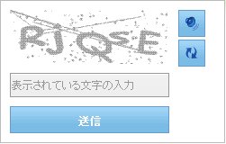

////

|metadata|
{
    "name": "webcaptcha-about-webcaptcha",
    "controlName": ["WebCaptcha"],
    "tags": ["Getting Started","How Do I","Validation"],
    "guid": "7b840355-2e69-4c72-ba7a-26526ebbc676",  
    "buildFlags": [],
    "createdOn": "2010-05-31T11:33:17.5256179Z"
}
|metadata|
////

= WebCaptcha について

WebCaptcha™ コントロールによって、自動化されたフォームの提出からアプリケーションを保護することができます。応答がスパムボットから生成されず、いくつかの保護モードを構成する自由をアプリケーション開発者に提供することを保証するために必要なものすべてを提供します。

WebCaptcha は以下の機能をサポートします。

* キャプチャ画像、自動的に生成される
* フォーム提出のために非表示のテキストボックス保護
* タイムアウト保護
* キャプチャ画像、辞書から生成される
* 画像だけの代わりに、数学のような論理的な質疑応答のキャプチャ
* エンドユーザーが画像を読み取ることができない場合、画像を再度生成するためのボタン
* 画像をスタイルする機能 - フォントの色、ひずみ、ワープのレベル、背景色、サイズ
* エラー メッセージとデフォルトの入力ボックス メッセージを構成する機能
* デフォルトの入力ボックスを非表示にして、検証として機能するフォーム上のもうひとつの入力ボックスをポイントする機能
* 検証エラー メッセージの表示
* 大文字と小文字の識別を構成する機能
* テキストの長さを構成する機能
* 文字だけでなく数字と文字のサポート
* オーディオのサポート
* 画像の認識 - 文字/数字を使用する代わりに、キャプチャはよく知られている項目を表示して、ユーザーにそれが何なのかを尋ねる、または項目のリストから選択するようにユーザーに求めることができます。

== 関連トピック

link:webcaptcha-getting-started-with-webcaptcha.html[WebCaptcha で開始]

link:webcaptcha-using-webcaptcha.html[WebCaptcha の使用]