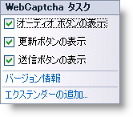

////

|metadata|
{
    "name": "webcaptcha-configuring-captcha-buttons",
    "controlName": ["WebCaptcha"],
    "tags": ["Design Environment","Styling","Validation"],
    "guid": "8ce07d53-7a00-4619-83a6-83c238590e37",  
    "buildFlags": [],
    "createdOn": "2010-05-31T13:04:23.9918633Z"
}
|metadata|
////

= キャプチャ ボタンの構成

デフォルトで、WebCaptcha™ コンポーネントは、[オーディオ] ボタン、[更新] ボタン、[送信] ボタンの 3 つのボタンを描画します。これらのボタンは各々、個別にスタイルできます。これらのボタンのデフォルトのマークアップがどのように表示されるのかは以下のとおりです。

*HTML の場合:*

----
<ig:WebCaptcha ID="WebCaptcha1" runat="server">
     <RefreshButton Visible="true"></RefreshButton>
     <SubmitButton runat="server" Text="Submit"Visible="true"></SubmitButton>
     <AudioButton Visible="true"></AudioButton>
</ig:WebCaptcha>
----

デフォルトで、 link:{ApiPlatform}web{ApiVersion}~infragistics.web.ui.framework.imageobject~visible.html[Visible] プロパティはすべてのボタンに True に設定されています。Visible プロパティを False に設定することによって、または WebCaptcha の SmartTag を使用するだけでボタンを簡単に非表示にできます。

以下は提供されるその他のプロパティのリストです。

* link:{ApiPlatform}web{ApiVersion}~infragistics.web.ui.framework.imageobject~alttext.html[AltText] - ImageUrl プロパティによって指定された画像が使用できない場合に表示する代替えテキストを指定します。
* link:{ApiPlatform}web{ApiVersion}~infragistics.web.ui.framework.imageobject~hoverimageurl.html[HoverImageUrl] - 画像の URL で、ボタンがホバーされる時に適用されます。
* link:{ApiPlatform}web{ApiVersion}~infragistics.web.ui.framework.imageobject~imageurl.html[ImageUrl] - 表示される画像の URL。
* link:{ApiPlatform}web{ApiVersion}~infragistics.web.ui.editorcontrols.captchaimagebutton~pressedimageurl.html[PressedImageUrl] - 画像の URL で、ボタンが押された時に適用されます。
* link:{ApiPlatform}web{ApiVersion}~infragistics.web.ui.framework.imageobject~tooltip.html[ToolTip] - ボタンがホバーされた時に小さい説明テキスト ウィンドウを表します。

== 関連トピック

link:webcaptcha-protection-modes.html[保護モード]

link:webcaptcha-dictionary-modes.html[辞書モード]

link:webcaptcha-captcha-validation.html[キャプチャの検証]

link:webcaptcha-configuring-captcha-image-properties.html[キャプチャ画像プロパティの構成]

link:webcaptcha-configuring-captcha-input-field.html[キャプチャ入力フィールドの構成]

link:webcaptcha-configuring-captcha-audio.html[キャプチャ オーディオの構成]