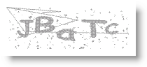
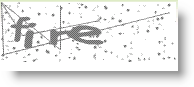
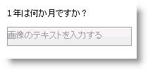

////

|metadata|
{
    "name": "webcaptcha-dictionary-modes",
    "controlName": ["WebCaptcha"],
    "tags": ["API","Validation"],
    "guid": "1f7676ea-9bd9-4f59-8318-41ca3dc09784",  
    "buildFlags": [],
    "createdOn": "2010-05-31T13:01:28.3608633Z"
}
|metadata|
////

= 辞書モード

ランダム文字生成の標準機能で、WebCaptcha™ コントロールはワードまたは論理的な質疑応答の 2 つのモードで使用できます。2 つのモードの中、使用したいモードを指定するには、 link:{ApiPlatform}web{ApiVersion}~infragistics.web.ui.editorcontrols.webcaptcha~captchadictionarymode.html[CaptchaDictionaryMode] プロパティが関係します。

* link:{ApiPlatform}web{ApiVersion}~infragistics.web.ui.editorcontrols.webcaptcha~captchadictionarymode.html[CaptchaDictionaryMode] を Off に設定 - これはデフォルト モードです。このモードでエンドユーザーはランダムに生成された文字を入力する必要があります。このモードでキャプチャ画像を構成する方法を確認するには、 link:webcaptcha-configuring-captcha-image-properties.html[「キャプチャ画像プロパティの構成」]トピックを参照してください。

* link:{ApiPlatform}web{ApiVersion}~infragistics.web.ui.editorcontrols.webcaptcha~captchadictionarymode.html[CaptchaDictionaryMode] を Words に設定 - このモードでコントロールは外部テキスト ファイルに事前に定義したワードを使用します。 link:{ApiPlatform}web{ApiVersion}~infragistics.web.ui.editorcontrols.webcaptcha~captchadictionarypath.html[CaptchaDictionaryPath] プロパティを使用することによって、.txt ファイルにパスを設定できます。このコントロールはこのテキスト ファイルのランダム行を取得して、ランダム行からキャプチャ画像を生成します。このため、1 ワードのみからキャプチャ画像を生成したい場合には、別個の行に置かなければなりません。

* link:{ApiPlatform}web{ApiVersion}~infragistics.web.ui.editorcontrols.webcaptcha~captchadictionarymode.html[CaptchaDictionaryMode] を LogicalQuestionAnswer に設定 - このモードでコントロールは外部テキスト ファイルに事前に定義した質疑応答を使用します。テキスト ファイルへのパスは、 link:{ApiPlatform}web{ApiVersion}~infragistics.web.ui.editorcontrols.webcaptcha~captchadictionarypath.html[CaptchaDictionaryPath] プロパティを設定することによって、Words モードの場合と同じように設定されます。コントロールは質疑応答のランダムな組み合わせを取得します。ただし、最初の行が質問で、次の行が回答であることを前提とします。空行は作らないでください。以下は論理的な質疑応答を含むテキスト ファイルの例です。

1 年は何ヶ月ですか?

12 ヶ月です。

1 週間は何日ですか?

7 日です。

1 時間は何分ですか?

60 分です。

== 関連トピック

link:webcaptcha-protection-modes.html[保護モード]

link:webcaptcha-captcha-validation.html[キャプチャの検証]

link:webcaptcha-configuring-captcha-buttons.html[キャプチャ ボタンの構成]

link:webcaptcha-configuring-captcha-image-properties.html[キャプチャ画像プロパティの構成]

link:webcaptcha-configuring-captcha-input-field.html[キャプチャ入力フィールドの構成]

link:webcaptcha-configuring-captcha-audio.html[キャプチャ オーディオの構成]