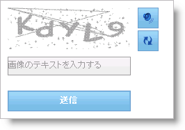

////

|metadata|
{
    "name": "webcaptcha-getting-started-with-webcaptcha",
    "controlName": ["WebCaptcha"],
    "tags": ["Getting Started","Validation"],
    "guid": "169f0356-69bb-43d8-8559-55685980be02",  
    "buildFlags": [],
    "createdOn": "2010-05-31T11:35:47.0645197Z"
}
|metadata|
////

= WebCaptcha で開始

WebCaptcha™ コンポーネントは自動化されたフォームの提出からの保護を簡単に使用することができます。WebCaptcha のインスタンスで WebForm を作成するためにしなければならないことは、 link:{ApiPlatform}web{ApiVersion}~infragistics.web.ui.webscriptmanager.html[WebScriptManager] および WebCaptcha コンポーネントを Visual Studio Toolbox からドラッグ アンド ドロップすることです。生成されたコードは以下のようになります。

*HTML の場合:*

----
<ig:WebScriptManager ID="WebScriptManager1" runat="server">
</ig:WebScriptManager>
<ig:WebCaptcha ID="WebCaptcha1" runat="server" Width="250px">
</ig:WebCaptcha>
----

*注：* WebCaptcha をフォームにドロップすることによって、コントロールは web.config ファイルで link:{ApiPlatform}web{ApiVersion}~infragistics.web.ui.editorcontrols.captchaimagehandler.html[CaptchaImageHandler] を自動的に登録します。ハンドラーには以下の定義があります。

----
<httpHandlers>
  <add path="WebCaptchaImage.axd" verb="GET,HEAD" type="Infragistics.Web.UI.EditorControls.CaptchaImageHandler"
validate="true" />
</httpHandlers>
----

== 関連トピック

link:webcaptcha-about-webcaptcha.html[WebCaptcha について]

link:webcaptcha-using-webcaptcha.html[WebCaptcha の使用]