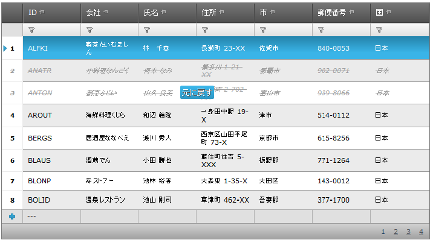

////

|metadata|
{
    "name": "webdatagird-batch-updating-overview",
    "controlName": ["WebDataGrid"],
    "tags": ["Drilldown","Editing","Getting Started","Grids","Performance"],
    "guid": "4aedfdce-8da3-4d2c-b23e-8501bb5d61e6",  
    "buildFlags": [],
    "createdOn": "2011-10-26T07:21:29.6404003Z"
}
|metadata|
////

= 概要

== はじめに

WebDataGrid™ コントロールの一括更新機能により、編集プロセス中に別の行に切り替える場合にサーバーを呼び出すことなく、行の変更、挿入、および削除ができます。つまり、行われた変更はクライアント側にのみ存在し、ポストバックが行われるまでサーバーには保存されていません。

以下の図は、一括更新が有効な状態の WebDataGrid を示しています。変更された行 (追加、更新、削除など) は特別なスタイルで示されています。削除された行にも、マウスをホバーすると表示される Undo ボタンがあります。最初のポストバックがサーバーに行われるまでこのスタイルのままになります。

== 一括更新の主な機能

以下は一括更新機能の主要な機能です。

* 変更がサーバーに保存される前に、数に制限なく行を変更する
* 変更がサーバーに保存される前に、Undo 機能を無制限に使用できる (行われたすべての変更を元に戻すことができます)
* 集計が有効な場合にクライントで動的な再計算をする
* クライアント側イベントのサポート
* 行の更新、追加、および削除に既存のサーバー イベントを使用する

== 関連トピック

link:webdatagrid-editting.html[WebDataGrid の編集]

link:webdatagrid-batch-updating-enabling.html#_enabling-batch-updating[一括更新を有効にする]

link:webdatagrid-batch-updating-events.html[WebDataGrid の一括更新イベント]

link:webdatagrid-batch-updating-summaries.html[WebDataGrid の一括更新集計]

link:known-issues-known-issues-and-breaking-changes-revision-history.html[既知の問題と重大な変更]

link:webdatagrid-accessibility-compliance.html[WebDataGrid アクセシビリティの遵守]