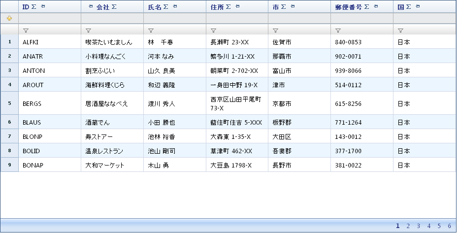

////
|metadata|
{
    "name": "webdatagrid-about-webdatagrid",
    "controlName": ["WebDataGrid"],
    "tags": ["Grids"],
    "guid": "{89790776-61A7-45F1-BC17-7993AA3DD5EB}",
    "buildFlags": [],
    "createdOn": "0001-01-01T00:00:00Z"
}
|metadata|
////

= WebDataGrid について

WebDataGrid™ は {ProductName} AJAX フレームワークの上に構築されます。効果的で拡張可能なグリッド　コントロールで、ネーティブの AJAX 機能を備えています。WebDataGrid は直感的で使いやすいデザインインタフェースを採用し、機能のあらゆる側面を簡単にカスタマイズすることができます。コントロールの多くの特性と機能は、Behaviors コレクションによってアクセスできます。必要な任意の動作を追加すると、その動作に必須のエレメントのみが生成されるので、不要なオーバーヘッドが排除されます。

すべての {ProductName} AJAX コントロールのように、WebDataGrid は Infragistics® Application Styling フレームワークにシームレスに統合します。CSS ベースのプロパティを使用すると、既存のスタイル シートを利用することによって、WebDataGrid コントロールを手動でカスタマイズできます。

柔軟で機能豊かなグリッド コントロールのすべての機能が WebDataGrid にあります。

各 {ProductName} Ajax コントロールを *UTF-8 文字エンコード*環境でテストし、同じエンコードで使用することをお勧めします。

WebDataGrid の機能の一部は以下のとおりです:

* *ハイパフォーマンス* - 軽量のマークアップと最適化されたコードがパフォーマンスを向上します。
* *標準への適合* - CSS 2 および XHTML 1.0 に準拠します。
* *多数のデータ ソースをサポート* - IEnumerable を実装している 標準的な Microsoft データ ソース コントロールおよびオブジェクトを含み、広範なバインド可能なデータ ソースをサポートします。
* *ネーティブの AJAX サポート* - {ProductName} AJAX コントロールは Microsoft® ASP.NET AJAX Extensions 上に構築されているので、ほとんどの WebDataGrid の機能は AJAX を使用して実行されます。これによりフルページ ポストバックの障害を削減します。

WebDataGrid の動作の一部を以下にリストします:

* *列のリサイズ* - 列を動的にリサイズします。
* *編集* - セルの編集、行の追加、行の削除、カスタマイズ可能な編集のための行編集テンプレート、ならびにデータ ソースへの自動更新。
* *フィルタリング* - カスタマイズ可能なフィルタ条件と値によって、ユーザーのニーズと仕様に応じてよりカスタマイズされたフィルタリングが可能となります。
* *ページング* - データをより小さい表示可能なデータのページに分割します。
* *行セレクタ* - 行を簡単に選択および操作するための動作です。
* *ソート* - より整理して表示するために WebDataGrid のデータをソートします。
* *テンプレート* - WebDataGrid のほとんどのエレメントは、最大限の柔軟性とカスタマイズを可能とするためにテンプレート化できます。

