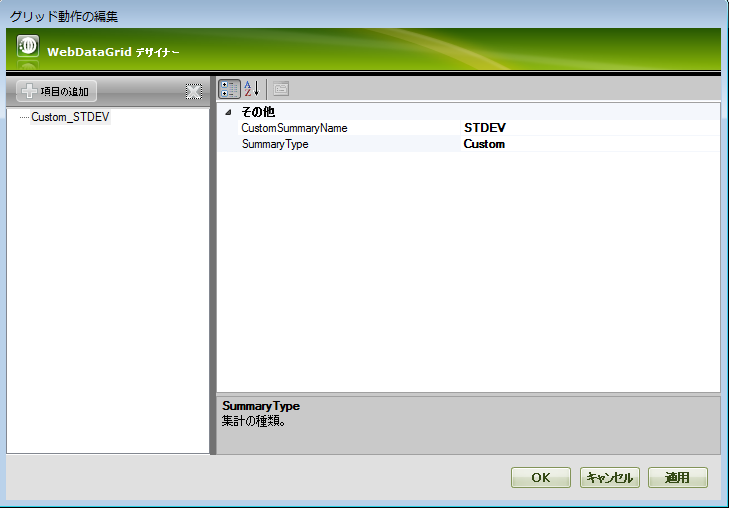
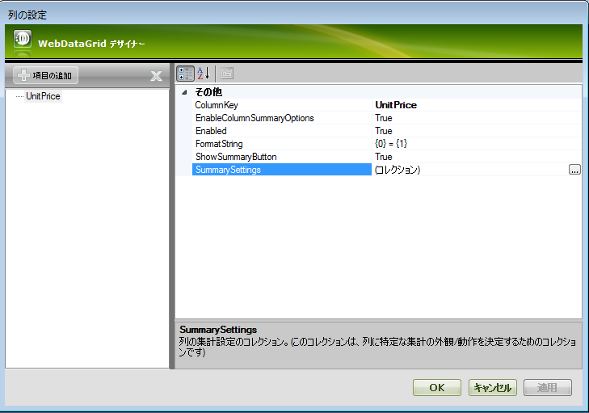
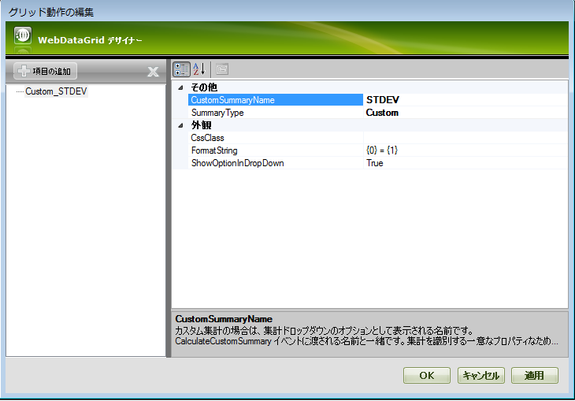

////

|metadata|
{
    "name": "webdatagrid-adding-custom-summary",
    "controlName": ["WebDataGrid"],
    "tags": ["Grids","Summaries"],
    "guid": "3dd729cf-3d42-466a-b9a4-e7c3d16674ef",  
    "buildFlags": [],
    "createdOn": "2010-09-29T11:02:00.6721245Z"
}
|metadata|
////

= カスタム集計の追加

== 始める前に

標準的な集計の他に、カスタム集計を追加して表示できます。

== 達成すること

カスタム集計を追加（集計ドロップダウンのオプションとして）および表示する方法を学習します。

== 次の手順を実行します

[start=1]
. link:webdatagrid-summary-row.html[「集計行」]トピックの 1 から 6 の手順に従います。
[start=2]
. [コレクション エディター] ダイアログで [追加] ボタンをクリックします。 link:{ApiPlatform}web{ApiVersion}~infragistics.web.ui.gridcontrols.summarytype.html[SummaryType] から Custom を選択し、CustomSummaryName に対して STDEV と入力します。カスタム集計値に対して集計行に link:{ApiPlatform}web{ApiVersion}~infragistics.web.ui.gridcontrols.summary~customsummaryname.html[CustomSummaryName] プロパティが表示されます。

[start=3]
. [グリッド動作を編集] ダイアログと [集計行プロパティ] ウィンドウから link:{ApiPlatform}web{ApiVersion}~infragistics.web.ui.gridcontrols.summaryrow~columnsettings.html[ColumnSettings] 省略記号 (…) をクリックして link:{ApiPlatform}web{ApiVersion}~infragistics.web.ui.gridcontrols.columnsetting.html[ColumnSetting] ダイアログを起動します。
[start=4]
. [列設定] ダイアログで、[項目の追加] ボタンをクリックします。 link:{ApiPlatform}web{ApiVersion}~infragistics.web.ui.gridcontrols.columnsetting~columnkey.html[ColumnKey] プロパティに対して UnitPrice を選択します。

[start=5]
. link:{ApiPlatform}web{ApiVersion}~infragistics.web.ui.gridcontrols.summarysettings.html[SummarySettings] 省略記号 (…) をクリックして [ link:{ApiPlatform}web{ApiVersion}~infragistics.web.ui.gridcontrols.summarysetting.html[SummarySetting] コレクション エディター] ダイアログを起動します。
[start=6]
. [追加] ボタンをクリックして、 link:{ApiPlatform}web{ApiVersion}~infragistics.web.ui.gridcontrols.summarysetting~summarytype.html[SummaryType] ドロップダウン から Custom を選択します。[集計選択] ドロップダウンに表示されている link:{ApiPlatform}web{ApiVersion}~infragistics.web.ui.gridcontrols.summarysetting~customsummaryname.html[CustomSummaryName] に対して Standard Deviation と入力します。

以下のマークアップが生成されるはずです。

*HTML の場合:*

----
<Behaviors>
    <ig:FooterSummaries AnimationType="Bounce">
        <ColumnSummaries>
            <ig:ColumnSummaryInfo ColumnKey="UnitPrice">
                <Summaries>
                <ig:Summary SummaryType="Custom" CustomSummaryName="STDEV" />
                </Summaries>
            </ig:ColumnSummaryInfo>
        </ColumnSummaries>
        <ColumnSettings>
            <ig:FooterSummariesSetting ColumnKey="UnitPrice">
                <SummarySettings>
                    <ig:SummarySetting CustomSummaryName="Standard Deviation" SummaryType="Custom" />
                </SummarySettings>
            </ig:FooterSummariesSetting>
        </ColumnSettings>
    </ig:FooterSummaries>
</Behaviors>
----

以下のコードはコード ビハインドからカスタム集計を追加する方法を示します。

*Visual Basic の場合：*

----
Dim unitPriceSetting As New FooterSummariesSetting(Me.WebDataGrid1, "UnitPrice")
Dim stdevSetting As New SummarySetting()
stdevSetting.SummaryType = SummaryType.[Custom]
stdevSetting.CustomSummaryName = "STDEV"
stdevSetting.FormatString = "STDEV = {1}"
unitPriceSetting.SummarySettings.Add(stdevSetting)
WebDataGrid1.Behaviors.FooterSummaries.ColumnSettings.Add(unitPriceSetting)
Dim stdevInfo As New ColumnSummaryInfo()
stdevInfo.ColumnKey = "UnitPrice"
Dim stdevSummary As New Summary()
stdevSummary.SummaryType = SummaryType.[Custom]
stdevSummary.CustomSummaryName = "STDEV"
stdevInfo.Summaries.Add(stdevSummary)
WebDataGrid1.Behaviors.FooterSummaries.ColumnSummaries.Add(stdevInfo)
----

*C# の場合：*

----
FooterSummariesSetting unitPriceSetting = new FooterSummariesSetting(this.WebDataGrid1, "UnitPrice");
SummarySetting stdevSetting = new SummarySetting();
stdevSetting.SummaryType = SummaryType.Custom;
stdevSetting.CustomSummaryName = "STDEV";
stdevSetting.FormatString = "STDEV = {1}";
unitPriceSetting.SummarySettings.Add(stdevSetting);
WebDataGrid1.Behaviors.FooterSummaries.ColumnSettings.Add(unitPriceSetting);
ColumnSummaryInfo stdevInfo = new ColumnSummaryInfo();
stdevInfo.ColumnKey = "UnitPrice";
Summary stdevSummary = new Summary();
stdevSummary.SummaryType = SummaryType.Custom;
stdevSummary.CustomSummaryName = "STDEV";
stdevInfo.Summaries.Add(stdevSummary);
WebDataGrid1.Behaviors.FooterSummaries.ColumnSummaries.Add(stdevInfo);
----

[start=7]
. カスタム集計を追加するためには、 link:{ApiPlatform}web{ApiVersion}~infragistics.web.ui.gridcontrols.summaryrow~calculatecustomsummary_ev.html[CalculateCustomSummary] イベントを処理する必要があります。イベントに付加した後で、次のコードを追加します。

*Visual Basic の場合：*

----
Protected Function WebDataGrid1_CalculateCustomSummary(sender As Object, e As CustomSummaryEventArgs) As Object
    '標準偏差集計を計算します
    If e.Summary.CustomSummaryName = "STDEV" Then
        'すべての値の集計を計算します
        Dim sum As Double = 0.0
        Dim n As Integer = 0
        For Each gr As GridRecord In Me.WebDataGrid1.Rows
            sum += Convert.ToDouble(gr.Items(2).Value)
            n += 1
        Next
        '偏差平方の集計を計算します
        Dim mean As Double = sum / n
        sum = 0
        For Each gr As GridRecord In Me.WebDataGrid1.Rows
            sum += Math.Pow(mean - Convert.ToDouble(gr.Items(2).Value), 2)
        Next
        sum = sum / (n - 1)
        Return Math.Round(Math.Sqrt(sum), 2)
    End If
    Return Nothing
End Function
----

*C# の場合：*

----
protected object WebDataGrid1_CalculateCustomSummary(object sender, CustomSummaryEventArgs e)
 {
     //標準偏差集計を計算します
     if (e.Summary.CustomSummaryName == "STDEV")
     {
         //すべての値の集計を計算します
         double sum = 0.0;
         int n = 0;
         foreach (GridRecord gr in this.WebDataGrid1.Rows)
         {
             sum += Convert.ToDouble(gr.Items[2].Value);
             ++n;
         }
         //偏差平方の集計を計算します
         double mean = sum / n;
         sum = 0;
         foreach (GridRecord gr in this.WebDataGrid1.Rows)
         {
             sum += Math.Pow(mean - Convert.ToDouble(gr.Items[2].Value), 2);
         }
         sum = sum / (n - 1);
         return Math.Round(Math.Sqrt(sum), 2);
     }
     return null;
 }
----

[start=8]
. アプリケーションを保存して実行します。UnitPrice 列のフッターに STDEV 集計が表示されます。

image::images/WebDataGrid_Custom_Summary_Row_04.png[]