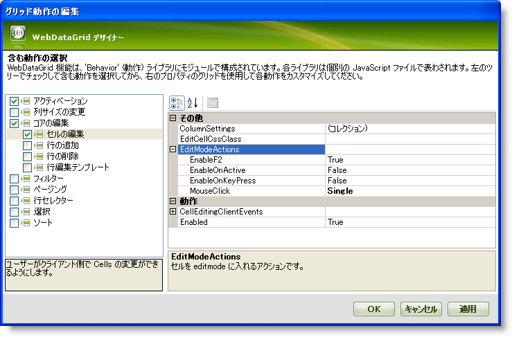

////

|metadata|
{
    "name": "webdatagrid-cell-editing",
    "controlName": ["WebDataGrid"],
    "tags": ["Editing","Grids"],
    "guid": "{C552E743-3057-412E-AB7B-D1C4137A47BF}",  
    "buildFlags": [],
    "createdOn": "0001-01-01T00:00:00Z"
}
|metadata|
////

= セル編集

pick:[asp-net="link:{ApiPlatform}web{ApiVersion}~infragistics.web.ui.gridcontrols.behaviors~editingcore.html[EditingCore]"]  および   pick:[asp-net="link:{ApiPlatform}web{ApiVersion}~infragistics.web.ui.gridcontrols.cellediting.html[CellEditing]"]  動作は WebDataGrid™ でのセル編集に不可欠です。UI またはコードの使用によってセルを編集できます。

== 始める前に

WebDataGrid™ でデータ編集を有効にするには、 pick:[asp-net="link:{ApiPlatform}web{ApiVersion}~infragistics.web.ui.gridcontrols.cellediting.html[CellEditing]"]  動作を  pick:[asp-net="link:{ApiPlatform}web{ApiVersion}~infragistics.web.ui.gridcontrols.behaviors.html[Behaviors]"]  コレクションに追加します。CellEditing 動作の  pick:[asp-net="link:{ApiPlatform}web{ApiVersion}~infragistics.web.ui.gridcontrols.editablebehaviorbase~editmodeactions.html[EditModeActions]"]  プロパティによって、どのアクションによってセルが編集モードになるかを決定することができます。

pick:[asp-net="link:{ApiPlatform}web{ApiVersion}~infragistics.web.ui.gridcontrols.editingcore~rowupdating_ev.html[RowUpdating]"]  イベントを処理した場合、編集された行でフォーカスを失うと変更が直ちにデータ ソースにコミットします。行がフォーカスを取得またはフォーカスを失うには、 pick:[asp-net="link:{ApiPlatform}web{ApiVersion}~infragistics.web.ui.gridcontrols.behaviors~activation.html[Activation]"]  動作を有効にする必要があります。Activation 動作の詳細は、 link:webdatagrid-activation.html[アクティブ化]を参照してください。

*注：* この種類の自動的な更新に対してサポートされるデータ ソースを発生させる必要があります。この機能を活用できるデータ ソースのリストについては、 link:webdatagrid-supported-data-sources.html[サポートされるデータ ソース]を参照してください。データ ソースが WebDataGrid によって自動的に更新できない場合、更新イベントを処理してデータを手動で更新する必要があります。

== 達成すること

WebDataGrid コントロールを SqlDataSource コンポーネントにバインドして Customers テーブルからデータを更新する方法を学習します。

== 次の手順を実行します

[start=1]
. WebDataGrid を SqlDataSource コンポーネントにバインドして、Customers テーブルからデータを取得します。実行についての詳細は、 link:webdatagrid-getting-started-with-webdatagrid.html[WebDataGrid で開始]を参照してください。
[start=2]
. WebDataGrid の Microsoft® Visual Studio™ プロパティ ウィンドウで、WebDataGrid での変更がデータ ソースに更新できるように  pick:[asp-net="link:{ApiPlatform}web{ApiVersion}~infragistics.web.ui.framework.data.flatdataboundcontrol~datakeyfields.html[DataKeyFields]"]  プロパティを CustomerID に設定します。
[start=3]
. 同じウィンドウで、Behaviors プロパティを指定して、省略記号 (...) ボタンをクリックし、[動作エディター] ダイアログを起動します。
[start=4]
. この動作を追加して有効にするには、左のリストからセル編集の隣りのチェックボックスをチェックします。 pick:[asp-net="link:{ApiPlatform}web{ApiVersion}~infragistics.web.ui.gridcontrols.behaviors~editingcore.html[EditingCore]"]  動作も追加されていることに注意してください。
[start=5]
. Cell Editing プロパティの下の EditModeActions プロパティ セクションで、 pick:[asp-net="link:{ApiPlatform}web{ApiVersion}~infragistics.web.ui.gridcontrols.editmodeactions~mouseclick.html[MouseClick]"]  プロパティを Single に設定します。これはシングル クリックでセルが編集モードになるように指定します。

[start=6]
. [適用]、そして [OK] をクリックします。以下のマークアップが生成されるはずです。 

*HTML の場合:*

----
<Behaviors>
    <ig:EditingCore>
        <Behaviors>
            <ig:CellEditing>
                    <EditModeActions MouseClick="Single" />
             </ig:CellEditing>
        </Behaviors>
    </ig:EditingCore>
</Behaviors>
----

コード ビハインドからセル編集動作を追加するには、以下のコードを追加します。

*Visual Basic の場合:*

[source,vb]
----
WebDataGrid1.Behaviors.CreateBehavior(Of Infragistics.Web.UI.GridControls.EditingCore)()
WebDataGrid1.Behaviors.EditingCore.Behaviors.CreateBehavior(Of Infragistics.Web.UI.GridControls.CellEditing)()
WebDataGrid1.Behaviors.EditingCore.Behaviors.CellEditing.EditModeActions.MouseClick = Infragistics.Web.UI.GridControls.EditMouseClickAction.Single
----

*C# の場合:*

----
WebDataGrid1.Behaviors.CreateBehavior<Infragistics.Web.UI.GridControls.EditingCore>();
WebDataGrid1.Behaviors.EditingCore.Behaviors.CreateBehavior<Infragistics.Web.UI.GridControls.CellEditing>();
WebDataGrid1.Behaviors.EditingCore.Behaviors.CellEditing.EditModeActions.MouseClick = Infragistics.Web.UI.GridControls.EditMouseClickAction.Single;
----

[start=7]
. WebDataGrid のプロパティ ウィンドウのイベント表示に移動して、RowUpdating イベントを処理します。コードをイベント ハンドラに追加する必要はありません。
[start=8]
. WebDataGrid のプロパティ ウィンドウで  pick:[asp-net="link:{ApiPlatform}web{ApiVersion}~infragistics.web.ui.gridcontrols.webdatagrid~enableajax.html[EnableAjax]"]  が True であることをチェックします。そうでない場合は、True に設定します。
[start=9]
. アプリケーションを実行します。セルをクリックすると、セルは編集モードになりデータを変更できます。編集したばかりのセルをクリックして放すと、AJAX を介してデータ ソースに変更がコミットされます。

CellEditing を有効にすると、以下のコードを使用して編集モードにすることができます。

*JavaScript の場合：*

----
var grid = $find("WebDataGrid1");
// 編集するセルを取得します
var cell = grid.get_rows().get_row(0).get_cell(0);
// CellEditing 動作を取得して enterEditMode メソッドを呼び出します
grid.get_behaviors().get_editingCore().get_behaviors().get_cellEditing().enterEditMode(cell);
----

== *セルへのアクセスと編集*

WebDataGrid™ でセル値を編集することはクライアント側のみに限られています。そのセルへの参照を取得し、その設定値メソッドを呼び出すことによってセルの値を編集できます。

サーバー側で、セル値は読み取り専用です。ただし、データ検証などの操作のための値を取得することができます。サーバー側とクライアント側の両方でセルの値を取得できます。

以下のコードは WebDataGrid のセル値を取得および編集する方法を示します。

[NOTE]
====
*注：* プログラムによってセルを編集するために必要なのは  pick:[asp-net="link:{ApiPlatform}web{ApiVersion}~infragistics.web.ui.gridcontrols.behaviors~editingcore.html[EditingCore]"]  動作を有効にすることだけです。
====

*Visual Basic の場合：*

----
' コントロールの最初の項目のセル値 
Dim cellValue As String = Me.WebDataGrid1.Rows(0).Items(0).Value.ToString()
----

*C# の場合：*

----
// コントロールの最初の項目のセル値
string cellValue = this.WebDataGrid1.Rows[0].Items[0].Value.ToString();
----

*JavaScript の場合*

----
var grid = $find("WebDataGrid1");
var oldValue = grid.get_rows().get_row(0).get_cell(0).get_value();
grid.get_rows().get_row(0).get_cell(0).set_value("new string value");
----

== 関連トピック

link:webdatagrid-enabling-row-deleting.html[行削除]

link:webdatagrid-row-adding.html[行追加]

link:webdatagrid-row-editing-template.html[行編集テンプレート]