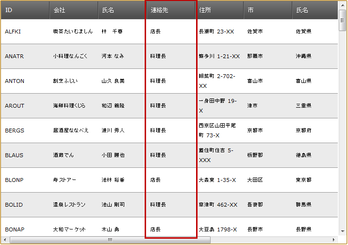
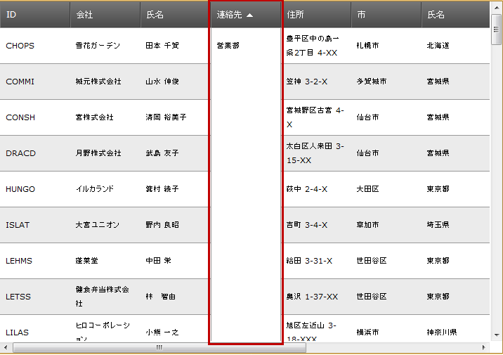

////
|metadata|
{
    "name": "webdatagrid-cell-merging-overview",
    "controlName": ["WebDataGrid"],
    "tags": ["Grids","Grouping"],
    "guid": "aebb359b-1821-4008-8b11-542992ebef3c",
    "buildFlags": [],
    "createdOn": "2012-04-16T16:38:23.035163Z"
}
|metadata|
////

= セル結合の概要

=== 目的

このトピックでは、 _WebDataGrid_™ のセル結合機能の概要について説明します。

=== 前提条件

以下の表に、このトピックを理解するための前提条件として求められる素材をリストします。

[options="header", cols="a,a"]
|====
|トピック|目的

| link:webdatagrid-sorting.html[並べ替え]
|このトピックでは、コード例を示して、 _WebDataGrid_ のユーザーが並べ替えを行うことができるようにする方法について説明します。

|====

== セル結合の概要

=== セル結合の概要

セル結合は、ユーザーが、同じ値を持つグリッド セルを結合できる機能です。セルは視覚的にのみ結合されます。つまり、グリッド構造は、ユーザーの結合操作によって影響を受けません。セル結合は link:webdatagrid-sorting.html[並べ替え]において機能します。

以下の 2 つの図は、結合前の値 (左) と、結合後の値 (右) を持つ列を示しています。

[cols="a,a"]
|====
||

|====

デフォルトでは、セル結合は無効になっています。これを有効にする方法の詳細は、 link:webdatagrid-enabling-cell-merging.html[セル結合の有効化] トピックを参照してください。

クライアント側の描画に対してグリッドを構成した場合、セル結合はクライアント上で実行されます。(デフォルトはサーバ上です。)詳細は、 link:webdatagrid-enabling-cell-merging.html[セル結合の有効化] を参照してください。

== 関連内容

=== トピック

以下のトピックでは、このトピックに関連する情報を提供しています。

* *link:webdatagrid-enabling-cell-merging.html[セル結合の有効化]*

* *link:webdatagrid-sorting.html[並べ替え]*

=== サンプル

以下のサンプルでは、このトピックに関連する情報を提供しています。

[options="header", cols="a,a"]
|====
|サンプル|目的

| link:{SamplesURL}/samples/webdatagrid/organization/sortingcellmerging/default.aspx?cn=data-grid&sid=bc564381-8ac9-4bb6-84e1-7c36e8010857[セルの結合と並べ替え]
|このサンプルでは、WebDataGrid™ の並べ替え動作のセルの結合機能を紹介します。

|====