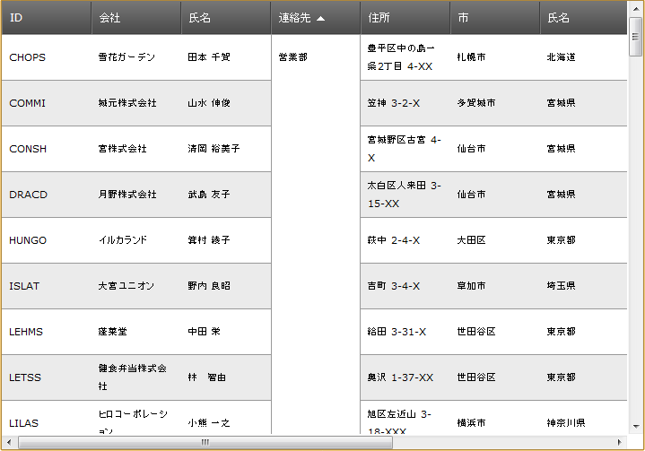

////

|metadata|
{
    "name": "webdatagrid-cell-merging",
    "controlName": ["WebDataGrid"],
    "tags": ["Grids","Grouping"],
    "guid": "7e4bec9d-c837-429c-8abd-9d65d2f41e27",  
    "buildFlags": [],
    "createdOn": "2012-04-12T18:51:24.5806894Z"
}
|metadata|
////

= セルの結合

=== 概要

WebDataGrid™ コントロールのセルの結合機能を使用すると、値が同じセルを視覚的に結合できます。

=== トピック

セルの結合に関する詳細は、以下のトピックで説明します。

* link:webdatagrid-cell-merging-overview.html[概要]
* link:webdatagrid-enabling-cell-merging.html[セル結合を有効にする]

== 関連内容

以下のトピックでは、このトピックに関連する情報を提供しています。

[options="header", cols="a,a"]
|====
|トピック|目的

| link:webdatagrid-sorting.html[並べ替え]
|WebDataGrid™ の並べ替えを有効にする方法。

|====

=== サンプル

以下のサンプルでは、このトピックに関連する情報を提供しています。

[options="header", cols="a,a"]
|====
|サンプル|目的

| link:{SamplesURL}/samples/webdatagrid/organization/sortingcellmerging/default.aspx?cn=data-grid&sid=bc564381-8ac9-4bb6-84e1-7c36e8010857[セルの結合と並べ替え]
|このサンプルでは、WebDataGrid™ の並べ替え動作のセルの結合機能を紹介します。

|====