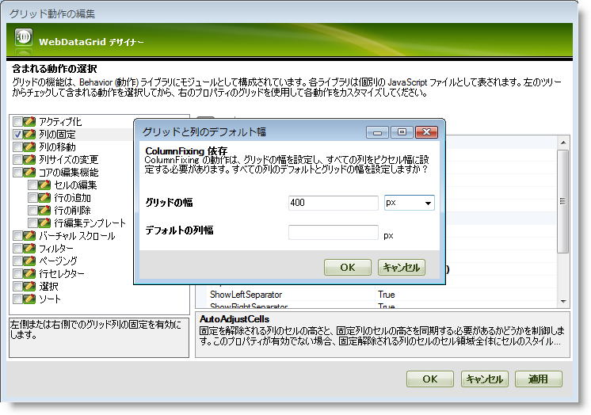
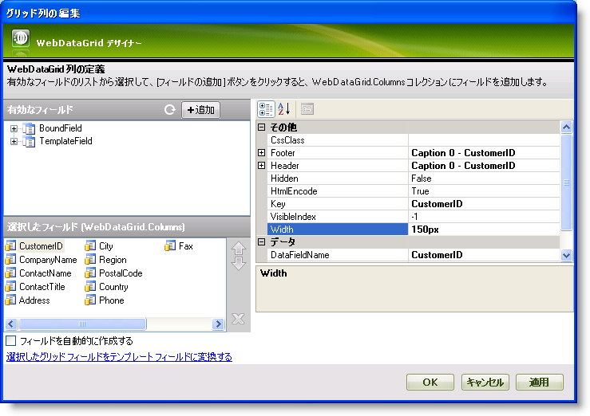
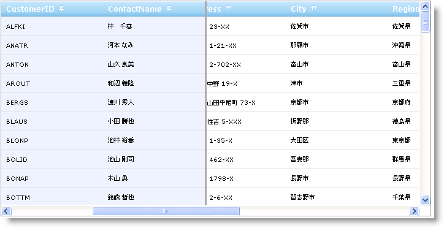

////
|metadata|
{
    "name": "webdatagrid-column-fixing",
    "controlName": ["WebDataGrid"],
    "tags": ["Grids"],
    "guid": "{366097E9-C5F8-4C8B-802D-2DD10F0295B2}",
    "buildFlags": [],
    "createdOn": "2009-08-06T10:22:31Z"
}
|metadata|
////

= 列固定

WebDataGrid™ によって、エンドユーザーはグリッド領域内で列を固定できます。この操作はクライアントで実行されます。エンドユーザーがグリッドを水平にスクロールしても、固定された列は常にグリッド内で表示されたままです。

*注：* 列固定動作を使用するために、すべての列だけでなくグリッドで幅を設定する必要があります。

デザイナーを介して、または Microsoft® Visual Studio® [プロパティ] ウィンドウを使用する、または以下のコードを使用して WebDataGrid で列固定動作を有効にできます。

*Visual Basic の場合：*

----
WebDataGrid1.Behaviors.CreateBehavior(Of Infragistics.Web.UI.GridControls.ColumnFixing)()
----

*C# の場合：*

----
WebDataGrid1.Behaviors.CreateBehavior<Infragistics.Web.UI.GridControls.ColumnFixing>();
----

WebDataGrid は列固定が有効な時に以下のカスタマイズ オプションを提供します。

* すべての列または個々の列で列ヘッダー上のプッシュピン ボタンを非表示/表示します。
* ボタンをキャプションの左または右に配列します。
* ボタンをキャプションの左または右に配列します。

*注：*列の移動動作も有効な場合、列移動は固有の固定/非固定列領域内で実行できます。たとえば、エンドユーザーは固定領域から非固定領域に列を移動したり、非固定領域から固定領域に列を移動できません。ただし、列移動は固定領域または非固定領域内で実行できます。

== キーボードで列を固定:

WebDataGrid によってキーボード ショートカットで列を固定、固定を解除することができます。この機能をサポートするためには、 pick:[asp-net="link:{ApiPlatform}web{ApiVersion}~infragistics.web.ui.gridcontrols.behaviors~columnfixing.html[ColumnFixing]"]  および  pick:[asp-net="link:{ApiPlatform}web{ApiVersion}~infragistics.web.ui.gridcontrols.behaviors~activation.html[Activation]"]   pick:[asp-net="link:{ApiPlatform}web{ApiVersion}~infragistics.web.ui.gridcontrols.webdatagrid~behaviors.html[動作]"] を有効にする必要があります。有効にしたら、エンドユーザーは固定または固定を解除したい列でセルをアクティブにして、Ctrl+Shift+F キーを押すだけです。

== *列固定を有効にします*

WebDataGrid デザイナーを使用することによって列固定を有効にするために、次の手順を実行します。

[start=1]
. Microsoft® Visual Studio® ツールボックスから、ScriptManager コンポーネントと WebDataGrid コントロールをフォームにドラッグ アンド ドロップします。
[start=2]
. WebDataGrid を SqlDataSource コンポーネントにバインドして、Customers テーブルからデータを取得するように構成します。実行についての詳細は、 link:webdatagrid-getting-started-with-webdatagrid.html[WebDataGrid を SQL データ ソースにバインド]を参照してください。
[start=3]
. [プロパティ] ウィンドウで、 pick:[asp-net="link:{ApiPlatform}web{ApiVersion}~infragistics.web.ui.gridcontrols.webdatagrid~behaviors.html[Behaviors]"]  プロパティを指定して、省略記号 (...) ボタンをクリックし、[動作の編集] ダイアログを起動します。
[start=4]
. [列固定動作] をチェックして有効にすると、以下の画像のようにデザイン タイムにグリッドと列の幅を設定するオプションを提供するデフォルトのグリッドと列幅のダイアログが表示されます。

注：列固定動作を使用するために、すべての列だけでなくグリッドで幅を設定する必要があります。

[start=5]
. [グリッドの幅] を 700px に、[デフォルトの列幅] を 150px に設定して、[OK] をクリックして GridWidthColumnWidthDialog を閉じます。

ただし、以下の手順に従ってグリッドと列の幅を設定することも可能です（列に異なる幅を設定したい場合）:

** link:http://msdn.microsoft.com/query/dev10.query?appId=Dev10IDEF1&l=EN-US&k=k(System.Web.UI.WebControls.WebControl.Width)&rd=true[Width] プロパティを設定することによって、CurrencyManager でグリッドの ActiveRow を設定します。
** プロパティ ウィンドウで、 pick:[asp-net="link:{ApiPlatform}web{ApiVersion}~infragistics.web.ui.gridcontrols.webdatagrid~columns.html[Columns]"]  プロパティを指定して、省略記号 (...) ボタンをクリックし、[グリッド列の編集] ダイアログを起動します。
** [選択したフィールド]（WebDataGrid.Columns）セクションから、各フィールドを選択し、以下の画像で示すように  pick:[asp-net="link:{ApiPlatform}web{ApiVersion}~infragistics.web.ui.gridcontrols.gridfield~width.html[Width]"]  プロパティを 150px に設定します:

** [適用] と [OK] をクリックしてデザイナーを閉じます。

[start=6]
. アプリケーションを保存して実行します。CustomerID 列と ContactName 列の横にあるピン アイコンをクリックして列を固定します。ピン アイコンを再度クリックすると列の固定が解除されます。以下の画像のように、データを水平方向にスクロールすると固定された列が常に表示されるのを確認します。

プログラムによって列を固定するには、CustomerID 列と CompanyName 列をグリッドの左側と右側にそれぞれ固定するために以下のコードを追加します。

*Visual Basic の場合：*

----
            Dim behavior As ColumnFixing = Me.WebDataGrid1.Behaviors.GetBehavior(Of ColumnFixing)()
            If behavior Is Nothing Then
                behavior = Me.WebDataGrid1.Behaviors.CreateBehavior(Of ColumnFixing)()
            End If
            '左に CustomerID 列を固定します
            behavior.FixedColumns.Add(New FixedColumnInfo("CustomerID", FixLocation.Left))
            '右に CompanyName 列を固定します
            behavior.FixedColumns.Add(New FixedColumnInfo("CompanyName", FixLocation.Right))
----

*C# の場合：*

----
            ColumnFixing behavior = this.WebDataGrid1.Behaviors.GetBehavior<ColumnFixing>();
            if(behavior == null)
            {
                behavior = this.WebDataGrid1.Behaviors.CreateBehavior<ColumnFixing>();
            }
            //左に CustomerID 列を固定します
            behavior.FixedColumns.Add(new FixedColumnInfo("CustomerID", FixLocation.Left));
            //右に CompanyName 列を固定します
            behavior.FixedColumns.Add(new FixedColumnInfo("CompanyName" , FixLocation.Right));
----

*注：* クライアント側のコードを使用して列を固定するには、サーバー側で列固定機能を有効にする必要があります。

*JavaScript の場合：*

----
             var grid = $find("WebDataGrid1");
            //Column Fixing behavior オブジェクトを取得します
            var columnFixing = grid.get_behaviors().get_columnFixing();
            if (columnFixing != null) {
                //左に CustomerID 列を固定します
                columnFixing.fixColumnByKey("CustomerID", $IG.FixLocation.Left);
                //右に CompanyName 列を固定します
                columnFixing.fixColumnByKey("CompanyName", $IG.FixLocation.Right);
      }
----