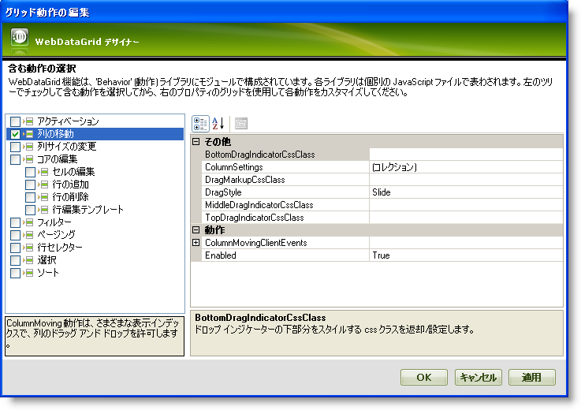
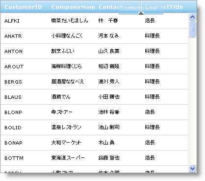

////

|metadata|
{
    "name": "webdatagrid-column-moving",
    "controlName": ["WebDataGrid"],
    "tags": ["Editing","Grids"],
    "guid": "{21891AF0-4A52-4526-9973-8D886AB678DC}",  
    "buildFlags": [],
    "createdOn": "0001-01-01T00:00:00Z"
}
|metadata|
////

= 列の移動

WebDataGrid™ によって列を移動できます。列を移動するには、エンドユーザーはマウスを左クリックしてヘッダーを希望の位置にドラッグします。エンドユーザーが列をドラッグするとドラッグインジケータが表示して、マウスクリックが放されると直ちに列は新しい位置に移動します。列が最後の表示可能な列の上を左または右に移動するとグリッドは列をスクロールして表示します。

デザイナーを介して、または Microsoft® Visual Studio® [プロパティ] ウィンドウを使用する、または以下のコードを使用して WebDataGrid で列の移動の動作を有効にできます:

*Visual Basic の場合：*

----
WebDataGrid1.Behaviors.CreateBehavior(Of Infragistics.Web.UI.GridControls.ColumnMoving)()
----

*C# の場合：*

----
WebDataGrid1.Behaviors.CreateBehavior<Infragistics.Web.UI.GridControls.ColumnMoving>();
----

== ドラッグ スタイル

以下の 2 つの異なるスタイルで列をドラッグできます。

* Slide -- ドラッグ マークアップは Y 軸に固定されたままです。
* Follow -- ドラッグ マークアップはマウスについていきます。

デザイナーまたは [プロパティ] ウィンドウを介して、または以下のコードを介してドラッグ スタイルを設定できます:

*Visual Basic の場合：*

----
WebDataGrid1.Behaviors.ColumnMoving.DragStyle = Infragistics.Web.UI.GridControls.HeaderDragStyle.Follow
----

*C# の場合：*

----
WebDataGrid1.Behaviors.ColumnMoving.DragStyle = Infragistics.Web.UI.GridControls.HeaderDragStyle.Follow;
----

== 列の移動を有効にします

WebDataGrid デザイナーを使用することによって列固定を有効にするために、次の手順を実行します。

[start=1]
. Visual Studio™ ツールボックスから、ScriptManager コンポーネントと WebDataGrid コントロールをフォームにドラッグ アンド ドロップします。
[start=2]
. WebDataGrid を SqlDataSource コンポーネントにバインドして、Customers テーブルからデータを取得します。CustomerID、CompanyName、ContactName、および ContactTitle データを取得します。実行についての詳細は、 link:webdatagrid-getting-started-with-webdatagrid.html[WebDataGrid で開始]を参照してください。
[start=3]
. [プロパティ] ウィンドウで、 pick:[asp-net="link:{ApiPlatform}web{ApiVersion}~infragistics.web.ui.gridcontrols.webdatagrid~behaviors.html[Behaviors]"]  プロパティを指定して、省略記号 (...) ボタンをクリックし、[動作の編集] ダイアログを起動します。
[start=4]
. 列の移動の動作をチェックして以下の画像に示すように有効にします:

[start=5]
. [適用] と [OK] をクリックして [グリッド動作の編集] ダイアログを閉じます。
[start=6]
. アプリケーションを保存して実行します。列 CompanyName のヘッダーをドラッグすると WebDataGrid は以下の画像のようになります:

