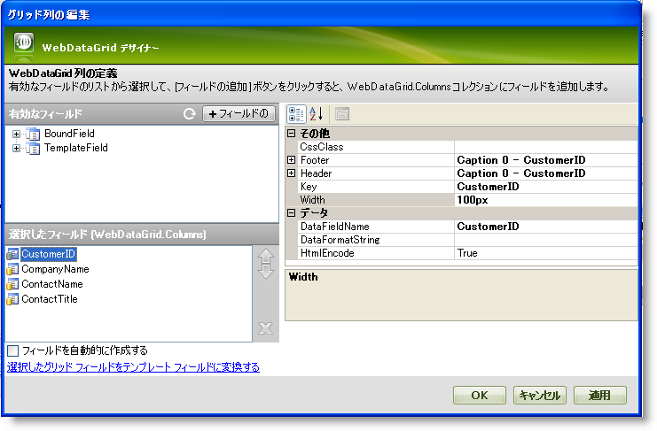
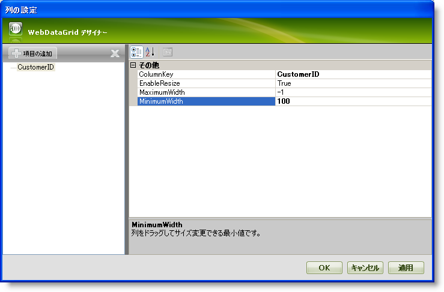
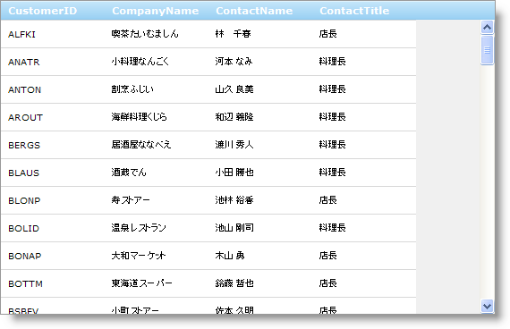

////

|metadata|
{
    "name": "webdatagrid-column-resizing",
    "controlName": ["WebDataGrid"],
    "tags": ["Grids"],
    "guid": "{6B581D24-F9CB-4B11-BE20-C7508722882C}",  
    "buildFlags": [],
    "createdOn": "2008-10-09T15:36:32Z"
}
|metadata|
////

= 列のリサイズ

WebDataGrid™ によって列をリサイズできます。列をリサイズするには、エンド ユーザーは列のヘッダーの右端をクリックしてドラッグします。ドラッグの間列の端を示すために線が表示します。ストップをドラッグする間だけ列が列自身をリサイズします。

デザイナーを介して、または Microsoft® Visual Studio® [プロパティ] ウィンドウを使用する、または以下のコードを使用して WebDataGrid で列のリサイズの動作を追加できます:

*Visual Basic の場合:*

[source,vb]
----
WebDataGrid1.Behaviors.CreateBehavior(Of Infragistics.Web.UI.GridControls.ColumnResizing)()
----

*C# の場合:*

----
WebDataGrid1.Behaviors.CreateBehavior<Infragistics.Web.UI.GridControls.ColumnResizing>();
----

リサイズの動作方法は WebDataGrid の列の幅に対して何が設定されているかによって異なります。設定できるサイズはピクセルとパーセントの 2 タイプあります。デフォルトで、WebDataGrid の列の幅は空で、パーセントのサイズ設定に相当します。

== パーセントベースのリサイズ

WebDataGrid の列すべてがパーセント幅の場合、すべての列がコントロール内に収まるようにリサイズが行われます。エンド ユーザーがひとつの列をリサイズすると、すべてのその他の列もサイズが変わり、必要な比率で収まります。

たとえば、5 列あり、各列が WebDataGrid の幅の 20% を使用します。エンド ユーザーがひとつの列のサイズを 30 % の幅に変更します。WebDataGrid の合計幅の残りの 70 % が比率の値に基づいてその他の列で均等に分割されます。したがって 4 列ありそれぞれの幅が等しくなり、70/4 の幅つまり約 17% が指定され、使用される幅の合計が 100% になります。

== ピクセルベースのリサイズ

ピクセル サイズの場合、ひとつの列のサイズが変わっても残りの列は幅を保持します。列幅の合計がコントロールの幅を超える場合、スクロールバーが表示します。

*注：* 列のリサイズを有効にした時に、パーセント幅とピクセル幅を一緒に使用することは推奨しません。列が予想外にリサイズされるためです。その時点で、リサイズが発生すると各列の幅を決定するのはブラウザ次第です。

== 最小幅/最大幅

列で最小幅と最大幅を設定できます。これはこれらの値を超えてリサイズされることを制限します。列の幅を制限するには  pick:[asp-net="link:{ApiPlatform}web{ApiVersion}~infragistics.web.ui.gridcontrols.columnresizing.html[ColumnResizing]"]  動作の pick:[asp-net="link:{ApiPlatform}web{ApiVersion}~infragistics.web.ui.gridcontrols.columnresizesetting.html[列のリサイズ設定]"] を追加することが必要です。列のリサイズ設定には、列に最小値または最大値をそれぞれ設定できる  pick:[asp-net="link:{ApiPlatform}web{ApiVersion}~infragistics.web.ui.gridcontrols.columnresizesetting~minimumwidth.html[MinimumWidth]"]  および  pick:[asp-net="link:{ApiPlatform}web{ApiVersion}~infragistics.web.ui.gridcontrols.columnresizesetting~maximumwidth.html[MaximumWidth]"]  プロパティがあります。

*注：* パーセントの最小値と最大値を設定できません。さらに、パーセント列は最小/最大の制限を無視します。

== 複数列のリサイズ

一度に複数の列をリサイズできます。複数列を選択して、ひとつの列をドラッグしてリサイズすることができます。その列のリサイズが完了すると、すべての選択された列を同じ幅にリサイズできます。選択されたひとつの列をリサイズするだけですべての選択された列がリサイズされます。選択されていない列をリサイズすると、その列のみをリサイズします。

*注：* 複数列のリサイズには、複数列の  pick:[asp-net="link:{ApiPlatform}web{ApiVersion}~infragistics.web.ui.gridcontrols.behaviors~selection.html[Selection]"]  動作を有効にする必要があります。これを実行する詳細は、 link:webdatagrid-selection.html[選択]を参照してください。

== *列のリサイズを有効化*

== 始める前に

WebDataGrid™ コントロールの列はリサイズ可能です。列のリサイズを可能にするには、 pick:[asp-net="link:{ApiPlatform}web{ApiVersion}~infragistics.web.ui.gridcontrols.columnresizing.html[ColumnResizing]"]  動作を可能にする必要があります。列幅はデフォルトで空であるため、列のリサイズのみを有効すると、WebDataGrid はパーセントを使用してリサイズします。

== 達成すること

WebDataGrid のすべての列でピクセルベースの列のリサイズを有効にする方法を学習します。さらに、主要なキー列に最小サイズを設定します。

== 次の手順を実行します

[start=1]
. WebDataGrid を SqlDataSource コンポーネントにバインドして、Customers テーブルからデータを取得します。CustomerID、CompanyName、ContactName、および ContactTitle データを取得します。実行についての詳細は、 link:webdatagrid-getting-started-with-webdatagrid.html[WebDataGrid で開始]を参照してください。
[start=2]
. Microsoft® Visual Studio™ プロパティ ウィンドウで、 pick:[asp-net="link:{ApiPlatform}web{ApiVersion}~infragistics.web.ui.gridcontrols.webdatagrid~columns.html[Columns]"]  プロパティを指定して、省略記号 (...) ボタンをクリックして、[列エディタ] ダイアログを起動します。
[start=3]
. コントロールの列ごとにピクセル幅を設定します。これによってピクセルベースでリサイズすることが可能となります。

.. [選択されたフィールド] 領域から CustomerID 列を選択します。
.. プロパティで、[幅] を 100px に設定します。
.. 列 CompanyName、ContactName および ContactTitle で手順 a と b を繰り返します。

[start=4]
. [OK] をクリックしてこのダイアログを閉じます。
[start=5]
. pick:[asp-net="link:{ApiPlatform}web{ApiVersion}~infragistics.web.ui.gridcontrols.behaviors.html[Behaviors]"]  プロパティを指定して、省略記号 (...) ボタンをクリックし、[動作エディタ] ダイアログを起動します。
[start=6]
. 列リサイズ動作をチェックして有効にします。
[start=7]
. 動作のプロパティで、 pick:[asp-net="link:{ApiPlatform}web{ApiVersion}~infragistics.web.ui.gridcontrols.columnresizing~columnsettings.html[ColumnSettings]"]  プロパティを指定して、省略記号 (...) ボタンをクリックし列設定デザイナを起動します。
[start=8]
. [追加] をクリックして列設定を追加します。
[start=9]
. pick:[asp-net="link:{ApiPlatform}web{ApiVersion}~infragistics.web.ui.gridcontrols.columnsetting~columnkey.html[ColumnKey]"]  プロパティを CustomerID に設定します。
[start=10]
.   pick:[asp-net="link:{ApiPlatform}web{ApiVersion}~infragistics.web.ui.gridcontrols.columnresizesetting~minimumwidth.html[MinimumWidth]"]  プロパティを 100 に設定します。これは列が 100 ピクセル未満にリサイズされることを制限します。 pick:[asp-net="link:{ApiPlatform}web{ApiVersion}~infragistics.web.ui.gridcontrols.columnresizesetting~maximumwidth.html[MaximumWidth]"]  プロパティを -1 のままにすることができ、エンド ユーザーは列を任意のサイズに拡張することができます。

[start=11]
. [適用]、そして [OK] をクリックします。
[start=12]
. [適用]、そして [OK] をクリックして変更を認めてダイアログを閉じます。
[start=13]
. アプリケーションを実行します。WebDataGrid は 4 列それぞれを 100 ピクセルで表示します。CustomerID 列は最小幅を 100 ピクセルに制限されますがすべての列はリサイズ可能です。

