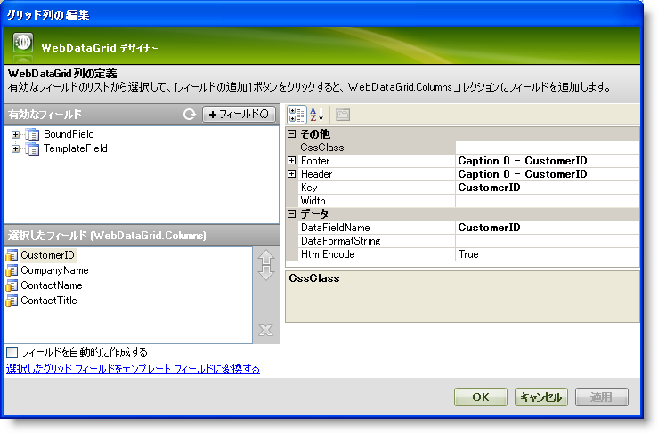

////

|metadata|
{
    "name": "webdatagrid-columns",
    "controlName": ["WebDataGrid"],
    "tags": ["Grids"],
    "guid": "{D6522128-71A8-4942-9527-7B732C3A002D}",  
    "buildFlags": [],
    "createdOn": "2008-10-09T11:16:46Z"
}
|metadata|
////

= 列

WebDataGrid™ コントロールの列は、バインド、非バインドおよび両方のチェック ボックス バリアントおよびテンプレートに存在できます。バインド列は、元となるデータ ソースから生成され、非バインド列はコードで定義されます。

各列は WebDataGrid の初期の列スキーマを表し、そのスキーマを仕様に変更できます。列をカスタマイズしたり変更することなく、データ ソースからデフォルト スキーマだけがほしい場合、これを実現するためのシンプルな方法はデザイナー ユーザー インターフェイスからすべての列を手動で削除して、[自動生成] チェック ボックスを選択することです。これを実行することによって、デフォルトのプロパティ設定を使用して WebDataGrid は元となるデータ ソースからすべての列を描画します。任意の種類の非バインド列をデザイナーから追加できます。

== 列デザイナー

WebDataGrid の Columns プロパティの省略ボタン（...）をクリックすると、列デザイナーが起動します。

左上のセクションには、 pick:[asp-net="link:{ApiPlatform}web{ApiVersion}~infragistics.web.ui.gridcontrols.boundcheckboxfield.html[BoundCheckBoxField]"] 、 pick:[asp-net="link:{ApiPlatform}web{ApiVersion}~infragistics.web.ui.gridcontrols.bounddatafield.html[BoundField]"] 、 pick:[asp-net="link:{ApiPlatform}web{ApiVersion}~infragistics.web.ui.gridcontrols.unboundcheckboxfield.html[UnboundCheckBoxField]"] 、 pick:[asp-net="link:{ApiPlatform}web{ApiVersion}~infragistics.web.ui.gridcontrols.unboundfield.html[UnboundField]"]  および  pick:[asp-net="link:{ApiPlatform}web{ApiVersion}~infragistics.web.ui.gridcontrols.templatedatafield.html[TemplateField]"]  ノードがあります。これらのノード内のネストされた列は、WebDataGrid コントロールに使用可能な列です。これらの列のいずれかを選択して、*[追加]* ボタンをクリックし、列を列コレクションに追加すると、グリッドに列を表示します。

[選択されたフィールド] セクションにグリッドで現在定義されている列を表示します。これはコントロールに必要な列スキーマを設定できるセクションです。

フィールドを自動生成、またはフィールドをテンプレート フィールドに変換するためのオプションが選択されたフィールドの下にあります。フィールドを自動生成するためのチェック ボックスを選択すると、[選択されたフィールド] セクションで定義した列に加えてデータ ソースに基づいてすべての列が生成されます。「変換」オプションは選択されたフィールドをテンプレート フィールドに変換する、またはすでにテンプレートの場合にはバインドされたフィールドに戻します。

右側に選択された列に関連付けられたすべてのプロパティがあります。ここで列の書式文字列、ヘッダー/フッター プロパティ、キー、 pick:[asp-net="link:{ApiPlatform}web{ApiVersion}~infragistics.web.ui.gridcontrols.bounddatafield~datafieldname.html[DataFieldName]"] 、幅などのオプションを設定できます。DataFieldName プロパティは元となるデータ ソース内のどのフィールド名が選択列と関連付けられているのかを指定します。ヘッダーおよびフッター プロパティによって、ヘッダーおよびフッターのテキストなどプロパティを設定できます。

*注:* テンプレート フィールドの場合、列ヘッダーにキャプションを表示したい場合にはヘッダー テキストを必ず設定してください。

== バインドされたフィールド

バインドされたフィールドはデータ ソースから生成された列です。データ ソースから取得されたすべての使用可能なフィールドは、列デザイナーの BoundField の下にグループ化されます。バインドされたフィールドを選択し、グリッドに追加して表示することができます。

== バインドされたチェック ボックス フィールド

バインドされたチェック ボックス フィールドは、チェック ボックスとして描画されるデータ ソースから生成されるフィールドです。バインドされたチェック ボックス フィールドは任意の種類のデータを表すことができます。ただし、 pick:[asp-net="link:{ApiPlatform}web{ApiVersion}~infragistics.web.ui.gridcontrols.ibooleanconverter.html[IBooleanConverter]"]  インターフェイスを実装するコンバーター クラスを使用して、非ブール値データを変換する必要があります。

== 非バインド フィールド

非バインド フィールドは、ユーザーがコードで値を設定する必要があるフィールドです。データ ソースにバインドされていないため、その値をランタイムに変更しても、データ バインド イベントをトリガーすることになりません。

== 非バインド チェック ボックス フィールド

非バインド チェック ボックス フィールドは、ユーザーがコードで値を設定する必要があり、チェック ボックスとして描画されるフィールドです。これは null 許容のブール値データのみを表します。列のヘッダーはチェックボックス自体にすることができ、チェック/チェック解除操作をすべての行に一度に適用できます。

== テンプレート フィールド

テンプレート フィールドは、テンプレートを適用するまでブランクのフィールドです。使用可能なテンプレート フィールドは列デザイナーの TemplateField の下にグループ化されます。バインドされたフィールドの追加と同じ方法でテンプレート フィールドを追加できます。

== 関連トピック

link:webdatagrid-add-or-remove-a-column.html[列を追加または削除]

link:webdatagrid-setting-column-settings-for-a-behavior.html[動作の列設定の設定]