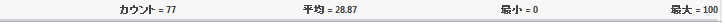
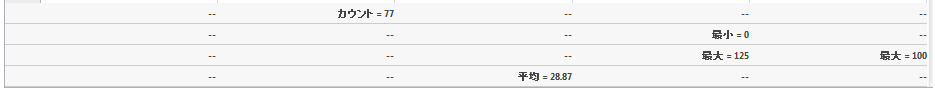
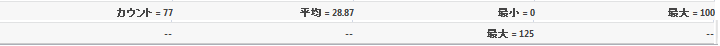
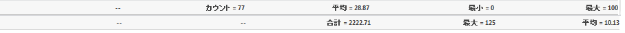
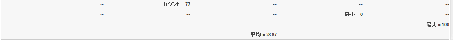

////

|metadata|
{
    "name": "webdatagrid-compact-rendering",
    "controlName": ["WebDataGrid"],
    "tags": ["Grids","Summaries"],
    "guid": "53f66f97-8743-49f4-922e-bf2c9534c1f0",  
    "buildFlags": [],
    "createdOn": "2010-09-29T13:03:13.3829338Z"
}
|metadata|
////

= コンパクトな描画

集計行動作には link:{ApiPlatform}web{ApiVersion}~infragistics.web.ui.gridcontrols.summaryrow~compactrendering.html[CompactRendering] と呼ばれるプロパティがあります。このプロパティは集計が描画される方法を指定します。使用可能なオプションは以下の 3 つです。

* Auto（デフォルト） - 集計の最大数が 1 以下の場合、集計はコンパクトに描画されます。そうでない場合、各集計は個別の行に描画されます。

* On - 集計のコンパクトな表示され、タイプの異なる集計を同じ行に混在表示させることもできます。

* Off - 各集計タイプは個別の行に描画されます。

== 集計行とフィルタリング動作

集計行とフィルタリング動作が有効の時、フィルタリングされたデータの集計値を計算できます。 link:{ApiPlatform}web{ApiVersion}~infragistics.web.ui.gridcontrols.summaryrow~enablesummariesfilter.html[EnableSummariesFilter] と呼ばれるプロパティがあり、集計が計算される方法を指定します。

* EnableSummariesFilter が設定されると（デフォルト）、フィルタリングされたデータの集計が計算されます
* EnableSummariesFilter が設定されると、フィルタリング条件は無視されデータ全体に対して集計が計算されます。

*注：* フィルタリングされたデータまたは編集されたデータを除き、データ全体の集計が常に計算されます。つまり、グリッドでデータを編集（CRUD）またはフィルタリングすると、フィルタリングまたは編集されたデータの集計値が計算されます。その他の動作（ページング、スクロールなど）では、計算された集計値はデータ全体に対するものです。
