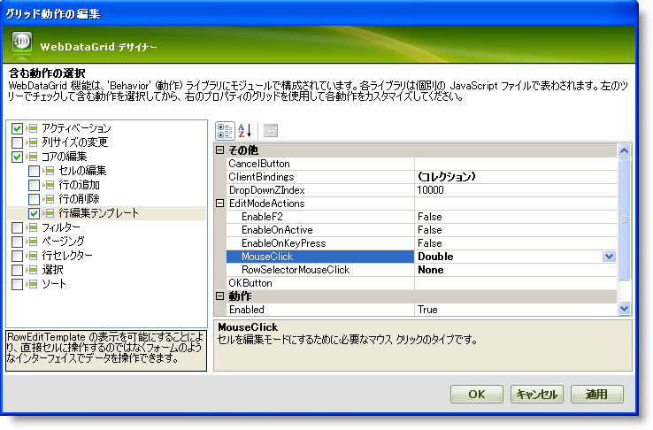
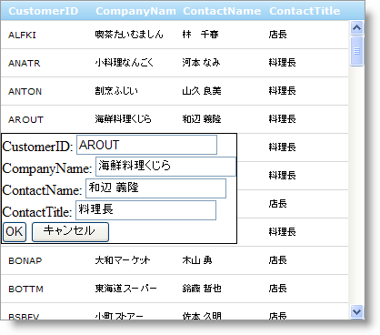

////

|metadata|
{
    "name": "webdatagrid-enabling-row-editing-template",
    "controlName": ["WebDataGrid"],
    "tags": ["Editing","Grouping"],
    "guid": "{631A773D-749C-4F31-9291-C5F16E6F1E34}",  
    "buildFlags": [],
    "createdOn": "2008-12-08T16:15:52Z"
}
|metadata|
////

= 行編集テンプレートを有効

== 始める前に

WebDataGrid™ でデータ編集のためのカスタム テンプレートをエンド ユーザーに提供するには、 pick:[asp-net="link:{ApiPlatform}web{ApiVersion}~infragistics.web.ui.gridcontrols.roweditingtemplate.html[Row Editing Template]"]  動作を有効にします。テンプレートによってエンドユーザーは任意のコントロールを含むことができるポップアップを通して行のデータを編集できます。テンプレートで発生する変更はデータ ソースに戻して適用されます。

== 達成すること

WebDataGrid でデータ編集するために行編集テンプレートを設定します。

== 次の手順を実行します

[start=1]
. WebDataGrid を SqlDataSource コンポーネントにバインドして、Customers テーブルからデータを取得します。実行についての詳細は、 link:webdatagrid-getting-started-with-webdatagrid.html[WebDataGrid で開始]を参照してください。
[start=2]
. WebDataGrid の Microsoft® Visual Studio™ プロパティ ウィンドウで、WebDataGrid での変更がデータ ソースに更新できるように  pick:[asp-net="link:{ApiPlatform}web{ApiVersion}~infragistics.web.ui.framework.data.flatdataboundcontrol~datakeyfields.html[DataKeyFields]"]  プロパティを CustomerID に設定します。
[start=3]
. 同じウィンドウで、 pick:[asp-net="link:{ApiPlatform}web{ApiVersion}~infragistics.web.ui.gridcontrols.behaviors.html[Behaviors]"]  プロパティを指定して、省略記号 (...) ボタンをクリックし、[動作エディタ] ダイアログを起動します。
[start=4]
. この動作を追加して有効にするには、左のリストから行編集テンプレートの隣りのチェックボックスをチェックします。 pick:[asp-net="link:{ApiPlatform}web{ApiVersion}~infragistics.web.ui.gridcontrols.behaviors~editingcore.html[EditingCore]"]  動作も追加されていることに注意してください。
[start=5]
. 行編集テンプレートのプロパティで、テンプレートをポップアップするアクションを設定します。

..  pick:[asp-net="link:{ApiPlatform}web{ApiVersion}~infragistics.web.ui.gridcontrols.roweditingtemplate~editmodeactions.html[EditModeActions]"]  を展開して  pick:[asp-net="link:{ApiPlatform}web{ApiVersion}~infragistics.web.ui.gridcontrols.roweditmodeactions~rowselectormouseclick.html[RowSelectorMouseClick]"]  を None に設定します。この時点で行セレクタを持っていないので、このアクションを有効にする必要はありません。
..  pick:[asp-net="link:{ApiPlatform}web{ApiVersion}~infragistics.web.ui.gridcontrols.roweditmodeactions~mouseclick.html[MouseClick]"]  を Double に設定します。これにより、エンド ユーザーが WebDataGrid でセルをダブルクリックするとテンプレートが表示されます。

*注：* 行を編集した直後に更新を保持したい場合、 pick:[asp-net="link:{ApiPlatform}web{ApiVersion}~infragistics.web.ui.gridcontrols.behaviors~activation.html[Activation]"]  動作を有効にするだけでなく、WebDataGrid の  pick:[asp-net="link:{ApiPlatform}web{ApiVersion}~infragistics.web.ui.gridcontrols.editingcore~rowupdating_ev.html[RowUpdating]"]  サーバー側イベントを処理する必要があります。WebDataGrid でのデータ編集の詳細は link:webdatagrid-editting.html[編集]を参照してください。

[start=6]
. [適用]、そして [OK] をクリックします。
[start=7]
. WebDataGrid を右クリックします。コンテキスト メニューの [編集テンプレート] を強調表示して、[行編集テンプレート] を選択します。デフォルトのコントロールをテンプレートに移植するためのプロンプトが表示します。

*注：* 複数の動作テンプレートを使用している場合、編集テンプレートのサブメニューのセクションとして動作テンプレートが表示されます。

[start=8]
. [OK] をクリックしてテンプレートを自動的に移植します。

*注：* 自分でプロンプトをキャンセルしてコントロールを追加することもできます。ただし、これには WebDataGrid のフィールドにテンプレートのコントロールを手動でバインディングすることが必要になります。詳細は、「行編集テンプレートでのコントロールのバインド」を参照してください。

[start=9]
. テンプレート ビューを右クリックして、[テンプレート編集の終了] を選択します。デザイナで普通のグリッド ビューに戻ります。
[start=10]
. アプリケーションを実行します。WebDataGrid のセルをダブルクリックして、その行の行編集テンプレートを表示できます。[OK] をクリックして、テンプレートから WebDataGrid のセルに変更をコミットします。

== 関連トピック

link:webdatagrid-using-client-bindings.html[クライアント バインディングの使用]