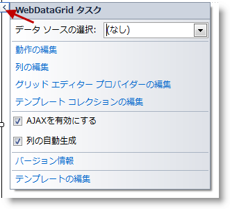
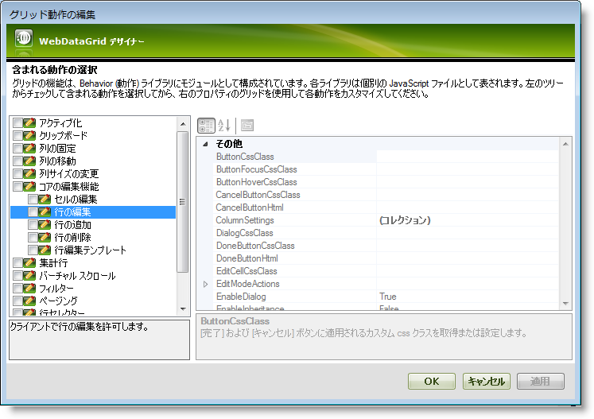
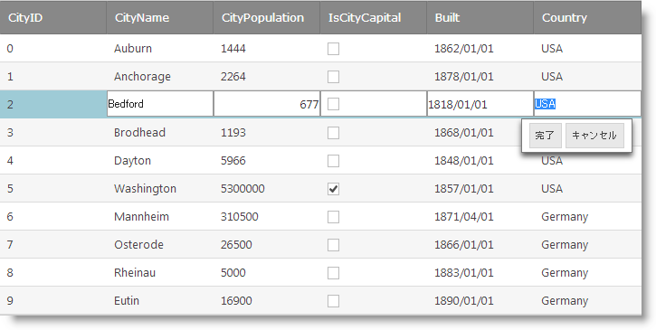

////
|metadata|
{
    "name": "webdatagrid-enabling-row-editing",
    "controlName": [],
    "tags": [],
    "guid": "0d1d6751-8792-4f4e-ad69-c54c4efe0cde",
    "buildFlags": [],
    "createdOn": "2014-03-10T16:14:34.4765316Z"
}
|metadata|
////

= 行編集を有効にする

== トピックの概要

=== 目的

このトピックは、 _WebDataGrid_   __™__  で行編集動作を有効にする方法を説明します。

=== 前提条件

このトピックをより理解するために、以下のトピックを参照することをお勧めします。

[options="header", cols="a,a"]
|====
|トピック|目的

| link:webdatagrid-row-editing-overview.html[行編集の概要 ( _WebDataGrid_ )]
|このトピックでは、 _WebDataGrid_ の行編集動作の機能の概要を提供します。

| link:webdatagrid-getting-started-with-webdatagrid.html[ _WebDataGrid_ を使用した作業の開始]
|このトピックでは、SqlDataSource にバインドされる基本 _WebDataGrid_ を作成する方法を紹介します。

|====

=== このトピックの内容

このトピックは、以下のセクションで構成されます。

* <<_Ref382246037, はじめに >>

** <<OLE_LINK236,行編集の有効化の概要>>
** <<_Ref382246047,行編集の有効化の概要表>>

* <<_Ref381995172, WebDataGrid デザイナーで行編集の有効化 >>

** <<_Ref382246110,はじめに>>
** <<OLE_LINK77,プレビュー>>
** <<OLE_LINK41,前提条件>>
** <<OLE_LINK63,概要>>
** <<_Ref382246140,手順>>

* <<_Ref381993876, ASPX マークアップで行編集の有効化 >>

** <<_Ref382246150,はじめに>>
** <<_Ref382246154,プレビュー>>
** <<_Ref382246161,前提条件>>
** <<_Ref382246165,概要>>
** <<_Ref382246175,手順>>

* <<_Ref381993884, コード ビハインドで行編集の有効化 >>

** <<_Ref382246188,はじめに>>
** <<_Ref382246198,プレビュー>>
** <<_Ref382246207,前提条件>>
** <<_Ref382246212,概要>>
** <<_Ref382246217,手順>>

* <<_Ref382204263, 関連コンテンツ >>

** <<_Ref382246241,トピック>>
** <<_Ref382246245,サンプル>>

[[_Ref382246037]]
== はじめに

デフォルトで、行編集は無効に設定されています。 _WebDataGrid_   デザイナー、ASPX マークアップ、またはコード ビハインドで有効できます。以下で詳細を説明します。

[[_Ref382246047]]

=== 行編集の有効化の概要表

以下の表は、 _WebDataGrid_   の行編集を有効にする方法の概要を提供します。詳細手順は表の下に説明されます。

=== デザイナーで行編集の有効化

_WebDataGrid_   のスマート タグからデザイナーを起動し、行の編集および編集コアの動作を有効にします。

=== ASPX マークアップで行編集の有効化

Web フォームに ASPX マークアップを追加し、行の編集および編集コアの動作を有効にします。

=== コード ビハインドで行編集の有効化

コード ビハインドで作成し、行の編集および編集コアの動作を有効にします。

[[_Ref381993851]]

[[_Ref381995172]]
== _WebDataGrid_  デザイナーで行編集の有効化

[[_Ref382246110]]

=== はじめに

この手順は、 _WebDataGrid_   コントロールのデザイナーで行の編集および編集コアの動作を有効にします。 _WebDataGrid_   のスマート タグからデザイナーを起動し、この動作を有効にします。

=== プレビュー

以下の画像は結果のプレビューです。 _WebDataGrid_   の行編集は有効化されます。ユーザー操作により行が編集モードに入りました。

image::Images/Enabling_Row_Editing_(WebDataGrid)_1.png[]

=== 前提条件

この手順を実行するには、以下が必要です。

* ASP.NET Visual Studio® web サイトまたは web アプリケーション
* Web フォームに追加した ScriptManager または  _WebScriptManager_™
* Web フォームに追加したデータ ソースにバインドした  _WebDataGrid_  

以下はプロセスの概要です。

*1.動作オプションにアクセス*

*2.*  *オプションで行編集の有効化*

*3.*  _(オプション)_    *結果の検証*

[[_Ref382246140]]

=== 手順

以下の手順では、デザイナーで行編集の動作を有効にする方法を示します。

=== 1.動作オプションにアクセスします。

*1.*   *_WebDataGrid_*   *のスマート タグ*  *を開きます。*

スマート タブ ボタンをクリックすると、 _WebDataGrid_   のデザイナーを開きます。

 
*2.[動作の編集] をクリックします。*  

_WebDataGrid_   の動作のデザイナーを開きます。

=== 2.オプションで行編集を有効にします。

*1.*  行編集の動作 *のボックスをチェックします。*

*2.*  OK をクリックすると、変更を保存してデザイナー ウィンドウを閉じます。行編集の動作は編集コアに依存関係があるため、その動作は自動的にチェックされます。

=== 3.(オプション) 結果を確認します。

**結果を確認するには、** *プロジェクトを実行し、行をダブルクリックします。* 行編集の動作が表示されます。

[[_Ref381993876]]
== ASPX マークアップで行編集の有効化

[[_Ref382246150]]

=== はじめに

Web フォームに ASPX マークアップを追加し、行の編集および編集コアの動作を有効にします。このマークアップは、デザイナーの使用で生成されたマークアップと同じです。(<<_Ref381995172,WebDataGrid デザイナーで行編集の有効化>>を参照してください。)行編集の動作は EditingCore の動作が必要ため、その動作も追加します。

[[_Ref382246154]]

=== プレビュー

以下のスクリーンショットは最終結果のプレビューです。

[[_Ref382246161]]

=== 前提条件

この手順を実行するには、以下が必要です。

* ASP.NET Visual Studio web サイトまたは web アプリケーション
* Web フォームに追加したデータ ソースにバインドした  _WebDataGrid_  
* プロジェクトに含まれて、 _web.config_   ファイルで構成された  _ig_res_   フォルダーおよびスタイルセット
* フォームで  _Infragistics.Web.UI_   および  _Infragistics.Web.UI.GridControls_   名前空間を `ig` タグ プレフィックスと登録します

[[_Ref382246165]]

=== 概要

以下はプロセスの概要です。

*1.EditingCore 動作の追加*

*2.RowEditing 動作の追加*

*3.*  _(オプション)_    *結果の検証*

[[_Ref382246175]]

=== 手順

以下の手順では、ASPX マークアップで行編集の動作を有効にする方法を示します。

=== 1.EditingCore 動作を追加します。

*EditingCore 動作を*   *_WebDataGrid_*   *の動作コレクションに追加します。*

`Behaviors` タグは `WebDataGrid` タグの中に追加します。その他の動作が定義された場合、EditingCore 動作は `Behaviors` タグで動作の兄弟として追加されます。

*ASPX の場合:*

[source,html]
----
<ig:WebDataGrid ID="WebDataGrid1" runat="server">
    <Behaviors>
        <ig:EditingCore>
        </ig:EditingCore>
    </Behaviors>
</ig:WebDataGrid>
----

=== 2.行編集の動作を追加します。

*RowEditing 動作を EditingCore の動作コレクションに追加します。* EditingCore 動作はグリッドのような `Behaviors` コレクションがあります。RowEditing 動作は `EditingCore` タグの `Behaviors` タブに定義されます。

*ASPX の場合:*

[source,html]
----
<ig:EditingCore>
    <Behaviors>
        <ig:RowEditing></ig:RowEditing>
    </Behaviors>
</ig:EditingCore>
----

=== 3.(オプション) 結果を検証します。

**結果を確認するには、**プロジェクトを保存して実行し、行をダブルクリックします。 行編集の動作が表示されます。

1. *ページの ASPX ファイルを保存します。*

コードおよびグリッドは以下のコード要素および機能があります。

*ASPX の場合:*

[source,html]
----
<ig:WebDataGrid ID="WebDataGrid1" runat="server">
    <Behaviors>
        <ig:EditingCore>
            <Behaviors>
                <ig:RowEditing></ig:RowEditing>
            </Behaviors>
        </ig:EditingCore>
    </Behaviors>
</ig:WebDataGrid>
----

*2.プロジェクトを実行して、行をダブル クリックします。行編集の動作が表示されます。*

[[_Ref381993884]]
== コード ビハインドで行編集の有効化

[[_Ref382246188]]

=== はじめに

この手順は、ランタイムにコード ビハインドで  _WebDataGrid_   に RowEditing 動作を追加します。この方法は、条件付きで動作を追加する場合に便利です。RowEditing 動作は EditingCore 動作の Behaviors コレクションに追加されます。つまり、ランタイムに EditingCore 動作も追加します。ページのライフサイクルで動作を追加するためにページの init またはページの load イベントを使用できます。この例はページの load イベントを使用します。

[[_Ref382246198]]

=== プレビュー

以下のスクリーンショットは最終結果のプレビューです。

[[_Ref382246207]]

=== 前提条件

この手順を実行するには、以下が必要です。

* ASP.NET Visual Studio web サイトまたは web アプリケーション
* Web フォームに追加したデータ ソースにバインドした  _WebDataGrid_  
* プロジェクトに含まれて、 _web.config_   ファイルで構成された  _ig_res_   フォルダーおよびスタイルセット
*  _Infragistics.Web.UI.GridControls_   名前空間の using ステートメント

[[_Ref382246212]]

=== 概要

以下はプロセスの概要です。

*1.EditingCore 動作の追加*

*2.RowEditing 動作の追加*

*3.*  _(オプション)_    *結果の検証*

[[_Ref382246217]]

=== 手順

以下の手順では、コード ビハインドで行編集の動作を有効にする方法を示します。

=== 1.コード ビハインドで行編集を有効にします。

*EditingCore 動作を*   *_WebDataGrid_*   *の動作コレクションに追加します。*

EditingCore 動作は、 link:{ApiPlatform}web{ApiVersion}~infragistics.web.ui.gridcontrols.gridbehaviorcollection~createbehavior.html[CreateBehavior] メソッドを使用して直接に  _WebDataGrid_   の `Behaviors` コレクションに追加されます。

*C# の場合:*

[source,csharp]
----
protected void Page_Load(object sender, EventArgs e)
{
    WebDataGrid1.Behaviors.CreateBehavior<EditingCore>();
}
----

=== 2.行編集の動作を追加します。

*RowEditing 動作を EditingCore の動作コレクションに追加します。* EditingCore 動作はグリッドのような `Behaviors` コレクションがあります。RowEditing 動作は `EditingCore` タグの `Behaviors` に追加されます。

*C# の場合:*

[source,csharp]
----
WebDataGrid1.Behaviors.EditingCore.Behaviors.CreateBehavior<RowEditing>();
----

=== 3.(オプション) 結果を確認します。

**結果を確認するには、**プロジェクトを保存して実行し、行をダブルクリックします。行編集の動作が表示されます。

*1.コード ビハインド ファイルを保存します。*

この時点でコードに以下を含む必要があります。

*C# の場合:*

[source,csharp]
----
using Infragistics.Web.UI.GridControls;
protected void Page_Load(object sender, EventArgs e)
{
    WebDataGrid1.Behaviors.CreateBehavior<EditingCore>();
    WebDataGrid1.Behaviors.EditingCore.Behaviors.CreateBehavior<RowEditing>();
}
----

*2.プロジェクトを実行して、行をダブル クリックします。行編集の動作が表示されます。*

[[_Ref382204263]]

== 関連コンテンツ

[[_Ref382246241]]

=== トピック

このトピックの追加情報については、以下のトピックも合わせてご参照ください。

[options="header", cols="a,a"]
|====
|トピック|目的

| link:webdatagrid-editting.html[編集動作の概要]
|このトピックでは、 _WebDataGrid_ の編集機能 (`EditingCore` 動作) の概要を提供します。

| link:whdg-enabling-row-editing.html[行編集を有効にする]
|このトピックは、 _WebHierarchicalDataGrid_™ で行編集動作を有効にする方法を説明します。

|====

[[_Ref382246245]]

=== サンプル

このトピックについては、以下のサンプルも参照してください。

[options="header", cols="a,a"]
|====
|サンプル|目的

| link:{SamplesURL}/samples/webhierarchicaldatagrid/editingandselection/roweditingbands/default.aspx?cn=hierarchical-data-grid&sid=3e12caf0-e13c-41b2-8ea4-9aaae176dc46[行の編集動作]
|このサンプルでは、[完了]/[キャンセル] ボタンを使用する行編集動作を表示し、編集中の行の各セルにエディターを表示します。

| link:{SamplesURL}/samples/webdatagrid/style/customizedroweditingappearance/default.aspx?cn=data-grid&sid=68662f24-5cde-4ccf-8bed-4b9c4b0b12d2[カスタム行編集の外観]
|[完了]/[キャンセル] ボタンを非表示、またはボタンのカスタム HTML および CSS クラスを提供して、行編集動作の外観をカスタマイズできます。

| link:{SamplesURL}/samples/webdatagrid/editingandselection/roweditingclientevents/default.aspx?cn=data-grid&sid=ab92894d-bd30-4f45-9462-51b6500cb1e9[行編集のクライアント イベント]
|このサンプルでは、行編集動作をカスタマイズするために `EnteringEditMode` および `ExitingEditMode` イベントを使用する方法を紹介します。

|====