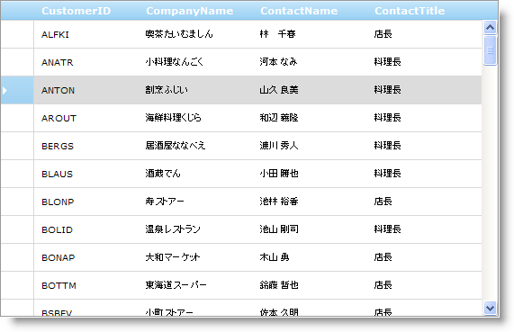

////
|metadata|
{
    "name": "webdatagrid-enabling-row-selectors",
    "controlName": ["WebDataGrid"],
    "tags": ["Grids","Selection"],
    "guid": "{26B63148-9B2D-44FE-9C18-97BA21728177}",
    "buildFlags": [],
    "createdOn": "0001-01-01T00:00:00Z"
}
|metadata|
////

= 行セレクターを有効にする

== 始める前に

行セレクターは WebDataGrid™ で各行の前に現れる要素です。行セレクターは行を選択またはアクティブ化するために主に使用されます。ところが、行セレクターをクリックすると、行セレクターのさまざまなイベントを処理することによって、その行でカスタム アクションを実行できます。行セレクターで行番号を表示することもできます。行セレクターを有効にするには、 pick:[asp-net="link:{ApiPlatform}web{ApiVersion}~infragistics.web.ui.gridcontrols.behaviors~rowselectors.html[RowSelectors]"]  動作を有効にします。

クリックした時に行を自動的に選択するように行セレクターを構成するには、 pick:[asp-net="link:{ApiPlatform}web{ApiVersion}~infragistics.web.ui.gridcontrols.behaviors~selection.html[Selection]"]  動作を有効にする必要があります。これについての詳細は、 link:webdatagrid-selection.html[選択]を参照してください。行セレクターに加えて  pick:[asp-net="link:{ApiPlatform}web{ApiVersion}~infragistics.web.ui.gridcontrols.behaviors~activation.html[Activation]"]  動作を追加することによって自動アクティブ化を有効にすることもできます。行のアクティブ化についての詳細は、 link:webdatagrid-activation.html[アクティブ化]を参照してください。

== 達成すること

行セレクターを有効にして WebDataGrid で行を選択する方法を学習します。

== 次の手順を実行します

[start=1]
. WebDataGrid を SqlDataSource コンポーネントにバインドして、Customers テーブルからデータを取得します。これを実行する詳細は、 link:webdatagrid-getting-started-with-webdatagrid.html[「WebDataGrid を使用した作業の開始」]を参照してください。
[start=2]
. WebDataGrid の Microsoft® Visual Studio™ プロパティ ウィンドウで、 pick:[asp-net="link:{ApiPlatform}web{ApiVersion}~infragistics.web.ui.gridcontrols.behaviors.html[Behaviors]"]  プロパティを指定して、省略記号 (...) ボタンをクリックし、[動作エディター] ダイアログを起動します。
[start=3]
. この動作を追加して有効にするには、左側のリストで行セレクターの隣りのチェックボックスをチェックします。Selection にも同じことを実行します。

注: 現時点で、 pick:[asp-net="link:{ApiPlatform}web{ApiVersion}~infragistics.web.ui.gridcontrols.rowselectors~rownumbering.html[RowNumbering]"]  を True に設定することによって行の番号設定を有効にする、または  pick:[asp-net="link:{ApiPlatform}web{ApiVersion}~infragistics.web.ui.gridcontrols.rowselectors~rowselectorclientevents.html[RowSelectorClientEvents]"]  の下の行セレクターのさまざまなイベントのひとつを処理してカスタムの機能を追加することができます。

以下のマークアップが生成されます。

*HTML の場合:*

[source]
----
<Behaviors>
<ig:Selection>
    </ig:Selection>
    <ig:RowSelectors>
    </ig:RowSelectors>
 </Behaviors>
----

コード ビハインドから行選択動作を追加するには、以下のコードを追加します。

*Visual Basic の場合:*

----
WebDataGrid1.Behaviors.CreateBehavior(Of Infragistics.Web.UI.GridControls.RowSelectors)()
WebDataGrid1.Behaviors.CreateBehavior(Of Infragistics.Web.UI.GridControls.Selection)()
----

*C# の場合：*

----
WebDataGrid1.Behaviors.CreateBehavior<Infragistics.Web.UI.GridControls.RowSelectors>();
WebDataGrid1.Behaviors.CreateBehavior<Infragistics.Web.UI.GridControls.Selection>();
----

[start=4]
. [OK] をクリックしてこのダイアログ ウィンドウを閉じます。WebDataGrid で行を選択するには、エンド ユーザーが行セレクターをクリックするだけです。

== 関連トピック

link:webdatagrid-selection.html[選択]