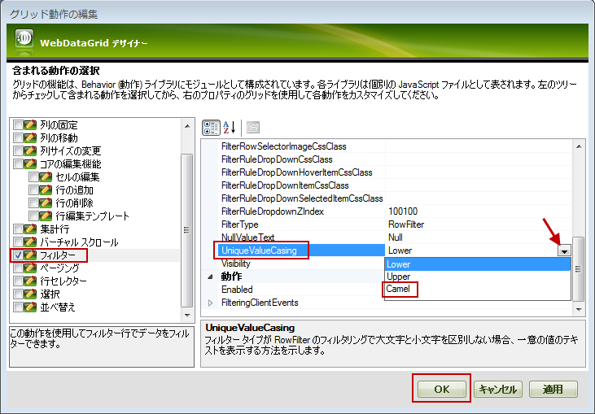
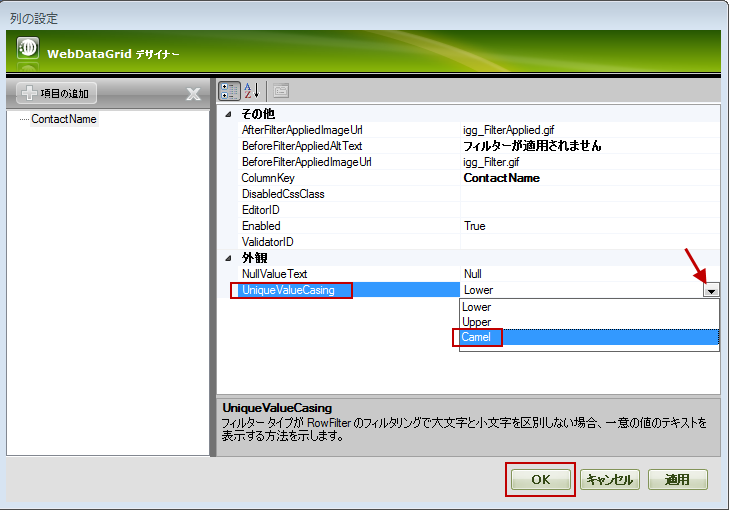
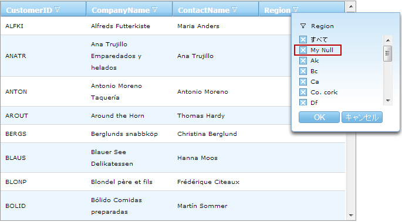
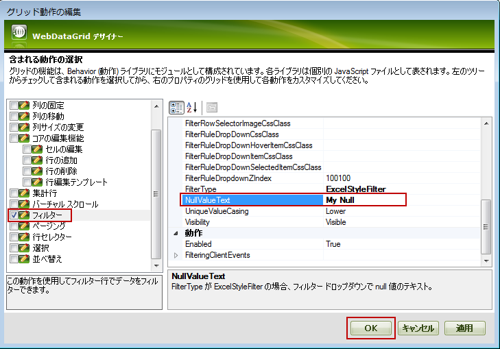

////
|metadata|
{
    "name": "webdatagrid-excelstylefiltering-configuring",
    "controlName": ["WebDataGrid"],
    "tags": ["Filtering","Grids"],
    "guid": "e6fc414c-deb0-4aaf-8746-bad2e2bf5d51",
    "buildFlags": [],
    "createdOn": "2012-07-16T12:50:19.9299654Z"
}
|metadata|
////

= Excel フィルタリングの設定

== トピックの概要

=== 目的

このトピックでは、 _WebDataGrid_™ コントロールの link:webdatagrid-excelstylefiltering-landingpage.html[Excel フィルタリング] オプションを構成する方法を説明します。

=== 前提条件

このトピックの本題に入る前に、以下のトピックをお読みください。

[options="header", cols="a,a"]
|====
|トピック|目的

| link:webdatagrid-getting-started-with-webdatagrid.html[WebDataGrid で開始]
|このトピックでは、 _WebDataGrid_ をページに追加し、Northwind データベースの Customers テーブルを取得する方法を紹介します。

| link:webdatagrid-excelstylefiltering-overview.html[Excel フィルタリングの概要]
|このトピックでは、 _WebDataGrid_ コントロールの Excel フィルタリング機能について紹介します。

| link:webdatagrid-excelstylefiltering-enabling.html[Excel フィルタリングの有効化]
|このトピックは、 _WebDataGrid_ コントロールの Excel フィルタリング機能のプロパティについての情報を提供します。

|====

=== このトピックの内容

このトピックは以下のセクションからなります。

* <<_Ref336019679,Excel フィルタリングの構成概要>>
* <<_Ref336019695,フィルタリング ドロップダウンで一意の値の大文字化の構成>>

* <<_Ref329857486,概要>>
* <<_Ref329857490,プロパティ設定>>
* <<_Ref329857547,前提条件>>
* <<_Ref336019721,デザイナーで一意の値の大文字化の構成>>
* <<_Ref336022251,ASPX マークアップで一意の値の大文字化の構成>>

* <<_Ref329857565,コード ビハインドで一意の値の大文字化の構成>>

* <<_Ref329857572,フィルタリング ドロップダウンで Null 値のテキストの構成>>

* <<_Ref329857580,概要>>
* <<_Ref329857590,プロパティ設定>>
* <<_Ref329857593,前提条件>>
* <<_Ref329857597,デザイナーで Null 値のテキストの構成>>
* <<_Ref336022322,ASPX マークアップで Null 値のテキストの構成>>
* <<_Ref329857603,コード ビハインドで Null 値のテキストの構成>>

* <<_Ref336022386,関連コンテンツ>>

* <<_Ref336022394,トピック>>
* <<_Ref336022398,サンプル>>

[[_Ref329857460]]
[[_Ref336019679]]
== Excel フィルタリングの構成概要

=== Excel フィルタリングの構成概要表

以下の表は  _WebDataGrid_   コントロールの Excel フィルタリング機能の構成可能な要素を表示します。

[options="header", cols="a,a,a"]
|====
|構成可能な要素|詳細|プロパティ

|<<_Ref336019695,フィルタリング ドロップダウンで一意の値の大文字化の構成>>
|フィルタリング ドロップダウンの値の大文字化を指定できます。利用可能なオプションは: 小文字、大文字、および camelcase です。
|
* link:{ApiPlatform}web{ApiVersion}~infragistics.web.ui.gridcontrols.columnfilteringsetting~uniquevaluecasing.html[UniqueValueCasing] 

|<<_Ref329857572,フィルタリング ドロップダウンで Null 値のテキストの構成>>
|フィルタリング ドロップダウンで Null 値のカスタム テキストを指定できます。
|
* link:{ApiPlatform}web{ApiVersion}~infragistics.web.ui.gridcontrols.columnfilteringsetting~nullvaluetext.html[NullValueText] 

|====

[[_Ref329857481]]
[[_Ref336019695]]
== フィルタリング ドロップダウンで一意の値の大文字化の構成

[[_Ref329857486]]

=== 概要

一意の値の大文字化オプションは:

*  *Lowercase*  (デフォルト) – 項目は小文字で表示されます
*  *Uppercase*  – 項目は大文字で表示されます
*  *Camelcase*  – 項目は英語の文字の大文字化で表示されます。項目の最初の文字のみは大文字で表示されます。

大文字化は link:{ApiPlatform}web{ApiVersion}~infragistics.web.ui.gridcontrols.filtering~uniquevaluecasing.html[UniqueValueCasing] プロパティによって処理されます。

一意の値の大文字化は列ごとまたはグリッド全体に設定できます。グリッドまたは列のプロパティを設定できます。列ごとの設定は優先があります。

[[_Ref329857490]]

=== プロパティ設定

以下の表は、プロパティ設定の大文字化の構成を示しています。

[options="header", cols="a,a,a"]
|====
|目的:|使用するプロパティ:|設定の選択肢:

|フィルタリング ドロップダウンの項目を小文字に設定します。
| link:{ApiPlatform}web{ApiVersion}~infragistics.web.ui.gridcontrols.filtering~uniquevaluecasing.html[UniqueValueCasing]
| _Lower_ 

|フィルタリング ドロップダウンの項目を大文字に設定します。
| link:{ApiPlatform}web{ApiVersion}~infragistics.web.ui.gridcontrols.filtering~uniquevaluecasing.html[UniqueValueCasing]
| _Upper_ 

|フィルタリング ドロップダウンの項目の最初の文字を大文字に設定します。
| link:{ApiPlatform}web{ApiVersion}~infragistics.web.ui.gridcontrols.filtering~uniquevaluecasing.html[UniqueValueCasing]
| _Camel_ 

|特定の列の大文字化の構成
|列名

|====

[[_Ref329857547]]

=== 前提条件

この手順を実行するには、以下のリソースが必要です。

* Web ページで初期化された  _WebDataGrid_   を含む ASP.NET Web プロジェクト

* Northwind データベースの  _Customers_   テーブルの  _CustomerID_  、 _CompanyName_  、 _ContactName_  、および  _ContactTitle_   フィールドを取得する SqlDataSource コンポーネントにバインドされる  _WebDataGrid_  。詳細は、 link:webdatagrid-getting-started-with-webdatagrid.html[WebDataGrid を使用した作業の開始]トピックを参照してください.  

[[_Ref336019721]]

=== デザイナーで一意の値の大文字化の構成

==== グリッド レベルの大文字化の構成

デザイナーでグリッド レベルの link:{ApiPlatform}web{ApiVersion}~infragistics.web.ui.gridcontrols.columnfilteringsetting~uniquevaluecasing.html[UniqueValueCasing] プロパティを  _Camel_   に設定するために:

*1.*  _WebDataGrid_   のスマート タグから WebDataGrid デザイナーを開きます。

*2.* 左側のペインで、フィルタリング動作を選択します。

*3.* 右側のペインで、 link:{ApiPlatform}web{ApiVersion}~infragistics.web.ui.gridcontrols.columnfilteringsetting~uniquevaluecasing.html[UniqueValueCasing] プロパティを  _Camel_   に設定します。

*4.* [OK] ボタンをクリックします。

==== 列レベルの大文字化の構成

この例で、設定は  _ContactName_   キーの列に適用されます。 _ContactName_    __列が追加された_  必要があります。_ 列を追加する方法については、 link:webdatagrid-excelstylefiltering-enabling.html[Excel フィルタリングの有効化] を参照してください。

列レベルの link:{ApiPlatform}web{ApiVersion}~infragistics.web.ui.gridcontrols.columnfilteringsetting~uniquevaluecasing.html[UniqueValueCasing] プロパティを  _Camel_   に設定するために:

*1.*  _WebDataGrid_   のスマート タグから WebDataGrid デザイナーを開きます。

*2.* 左側のペインで、フィルタリング動作を選択します。

*3.* 左側のペインで、 link:{ApiPlatform}web{ApiVersion}~infragistics.web.ui.gridcontrols.filtering~columnsettings.html[ColumnSettings] プロパティの省略記号ボタン (…) をクリックします。列設定ダイアログが開きます。

列設定のドロップダウンから ContactName 列を選択します。

外観セクションの link:{ApiPlatform}web{ApiVersion}~infragistics.web.ui.gridcontrols.columnfilteringsetting~uniquevaluecasing.html[UniqueValueCasing] プロパティのドロップダウンから  _Camel_   を選択します。

*4.* [OK] ボタンをクリックします。

[[_Ref329857558]]

=== ASPX マークアップで一意の値の大文字化の構成

==== グリッド レベルの大文字化の構成

以下のコードは、ASPX マークアップでグリッドレベルに link:{ApiPlatform}web{ApiVersion}~infragistics.web.ui.gridcontrols.filtering~uniquevaluecasing.html[UniqueValueCasing] プロパティを  _Camel_   に設定する方法を紹介します。

*ASPX の場合:*

[source,html]
----
<Behaviors>
    <ig:Filtering FilterType="ExcelStyleFilter" UniqueValueCasing="Camel">
    </ig:Filtering>
</Behaviors>
----

==== 列レベルの大文字化の構成

以下のコードは、ASPX マークアップでグリッドレベルに link:{ApiPlatform}web{ApiVersion}~infragistics.web.ui.gridcontrols.filtering~uniquevaluecasing.html[UniqueValueCasing] プロパティを  _Camel_   に設定する方法を紹介します。設定は  _“_   _ContactName_   _”_   キーの列に適用されます。

*ASPX の場合:*

[source,html]
----
<Behaviors>
    <ig:Filtering FilterType="ExcelStyleFilter">
        <ColumnSettings>
            <ig:ColumnFilteringSetting ColumnKey="ContactName" UniqueValueCasing="Camel" />
        </ColumnSettings>
    </ig:Filtering>
</Behaviors>
----

[[_Ref329857565]]

=== コード ビハインドで一意の値の大文字化の構成

==== グリッド レベルの大文字化の構成

以下のコードは、コード ビハインドでグリッドレベルに link:{ApiPlatform}web{ApiVersion}~infragistics.web.ui.gridcontrols.filtering~uniquevaluecasing.html[UniqueValueCasing] プロパティを  _Camel_   に設定する方法を紹介します。

*C# の場合:*

[source,csharp]
----
//Create a Filtering Behavior
this.WebDataGrid2.Behaviors.CreateBehavior<Filtering>();
//Set Filtering Behavior to Excel Style Filter
this.WebDataGrid2.Behaviors.Filtering.FilterType = 
    Infragistics.Web.UI.GridControls.FilteringType.ExcelStyleFilter;
//Set the UniqueValueCasing to Camel on Grid level
this.WebDataGrid2.Behaviors.Filtering.UniqueValueCasing = UniqueValueCasing.Camel;
----

==== 列レベルの大文字化の構成

以下のコードは、コード ビハインドでグリッドレベルに link:{ApiPlatform}web{ApiVersion}~infragistics.web.ui.gridcontrols.filtering~uniquevaluecasing.html[UniqueValueCasing] プロパティを  _Camel_   に設定する方法を紹介します。設定は  _“_   _ContactName_   _”_   キーの列に適用されます。

*C# の場合:*

[source,csharp]
----
//Create a Filtering Behavior
this.WebDataGrid2.Behaviors.CreateBehavior<Filtering>();
//Set Filtering Behavior to Excel Style Filter
this.WebDataGrid2.Behaviors.Filtering.FilterType = 
    Infragistics.Web.UI.GridControls.FilteringType.ExcelStyleFilter;
//Create a ColumnFilteringSetting 
ColumnFilteringSetting settingColumn = new ColumnFilteringSetting();
//Set the ColumnKey
settingColumn.ColumnKey = "ContactName";
//Set the UniqueValueCasing to Camel on column level
settingColumn.UniqueValueCasing = UniqueValueCasing.Camel;
//Add the created ColumnSetting
this.WebDataGrid2.Behaviors.Filtering.ColumnSettings.Add(settingColumn);
----

[[_Ref329857572]]
== フィルタリング ドロップダウンで Null 値のテキストの構成

[[_Ref329857580]]

=== 概要

null 値テキストを設定すると、フィルター ドロップダウンの項目のテキストを変更できます。このテキストは、データソース / データベースで Null 値を持つ項目のために表示されます。 link:{ApiPlatform}web{ApiVersion}~infragistics.web.ui.gridcontrols.filtering~nullvaluetext.html[NullValueText] プロパティは String 型で、デフォルトの値は  _Null_   です。

=== プレビュー

以下は link:{ApiPlatform}web{ApiVersion}~infragistics.web.ui.gridcontrols.columnfilteringsetting~nullvaluetext.html[NullValueText] プロパティを  _My Null_   に設定した後の結果です。

[[_Ref329857590]]

=== プロパティ設定

以下の表は、 link:{ApiPlatform}web{ApiVersion}~infragistics.web.ui.gridcontrols.filtering~nullvaluetext.html[NullValueText] プロパティ設定を構成にマップしています。

[options="header", cols="a,a,a"]
|====
|目的:|使用するプロパティ:|設定の選択肢:

|null 値の項目のテキストを _My Null_ に設定します
| link:{ApiPlatform}web{ApiVersion}~infragistics.web.ui.gridcontrols.filtering~nullvaluetext.html[NullValueText]
| _My Null_ 

|====

[[_Ref329857593]]

=== 前提条件

この手順を実行するには、以下のリソースが必要です。

* Web ページで初期化された  _WebDataGrid_   を含む ASP.NET Web プロジェクト
* Northwind データベースの  _Customers_   テーブルの  _CustomerID_  、 _CompanyName_  、 _ContactName_  、および  _ContactTitle_   フィールドを取得する SqlDataSource コンポーネントにバインドされる  _WebDataGrid_  。詳細は、 link:webdatagrid-getting-started-with-webdatagrid.html[WebDataGrid を使用した作業の開始]トピックを参照してください. 

[[_Ref329857597]]

=== デザイナーで Null 値のテキストの構成

デザイナーで  _WebDataGrid_   の link:{ApiPlatform}web{ApiVersion}~infragistics.web.ui.gridcontrols.filtering~nullvaluetext.html[NullValueText] を  _My Null_   に設定するには:

*1.* WebDataGrid のスマート タグから WebDataGrid デザイナーを開きます。

*2.* 左側のペインで、フィルタリング動作を選択します。

*3.* 右側のペインで、 link:{ApiPlatform}web{ApiVersion}~infragistics.web.ui.gridcontrols.filtering~nullvaluetext.html[NullValueText] プロパティを  _My Null_   に設定します。

*4.* [OK] ボタンをクリックします。

[[_Ref329857600]]

=== ASPX マークアップで Null 値のテキストの構成

以下のコードはマークアップで  _WebDataGrid_   の link:{ApiPlatform}web{ApiVersion}~infragistics.web.ui.gridcontrols.filtering~nullvaluetext.html[NullValueText] を  _“My Null”_   に設定する方法を紹介します。

*ASPX の場合:*

[source,html]
----
<Behaviors>
    <ig:Filtering FilterType="ExcelStyleFilter" NullValueText="My Null">
    </ig:Filtering>
</Behaviors>
----

[[_Ref329857603]]

=== コード ビハインドで Null 値のテキストの構成

以下のコードはコード ビハインドで  _WebDataGrid_   の link:{ApiPlatform}web{ApiVersion}~infragistics.web.ui.gridcontrols.filtering~nullvaluetext.html[NullValueText] を  _“My Null”_   に設定する方法を紹介します。

*C# の場合:*

[source,csharp]
----
//Create a Filtering Behavior
this.WebDataGrid2.Behaviors.CreateBehavior<Filtering>();
//Set Filtering Behavior to Excel Style Filter
this.WebDataGrid2.Behaviors.Filtering.FilterType = 
    Infragistics.Web.UI.GridControls.FilteringType.ExcelStyleFilter;
//Set the NullValueText property to "My Null"
this.WebDataGrid2.Behaviors.Filtering.NullValueText = "My Null";
----

[[_Ref336022386]]
== 関連コンテンツ

[[_Ref336022394]]

=== トピック

このトピックについては、以下のトピックも参照してください。

[options="header", cols="a,a"]
|====
|トピック|目的

| link:webdatagrid-excelstylefiltering-propertyreference.html[Excel フィルタリングのプロパティ リファレンス]
|このトピックは、 _WebDataGrid_ コントロールの Excel フィルタリング機能のプロパティについての情報を提供します。

|====

[[_Ref336022398]]

=== サンプル

このトピックについては、以下のサンプルも参照してください。

[options="header", cols="a,a"]
|====
|サンプル|目的

|[[_Hlk335939592]] 

link:{SamplesURL}/samples/webdatagrid/organization/excelstylefilteringuniquevaluecasing/default.aspx?cn=data-grid&sid=bb8281e9-bb9a-422d-84f7-acc6b1342e77[Excel フィルタリングで一意値の大文字/小文字指定]
|このサンプルでは、Excel フィルタリングの `UniqueValueCasing` プロパティの使用を紹介します。

| link:{SamplesURL}/samples/webdatagrid/organization/excelstylefilteringboundunboudfields/default.aspx?cn=data-grid&sid=d9ad02bb-87ef-4440-9b4e-0fe51cdb7a38[Excel フィルタリング - バインド/非バインド フィールド]
|このサンプルでは、バインドおよび非バインド フィールドで Excel フィルタリングおよびチェックボックスを使用する方法を紹介します。

| link:{SamplesURL}/samples/webdatagrid/organization/excelstylefilteringnullvaluetext/default.aspx?cn=data-grid&sid=a1a23f0a-8f1f-4846-b780-0c7d28cc464d[Excel フィルタリングのドロップダウンの Null 値テキスト]
|このサンプルでは、Excel フィルタリングの `NullValueText` プロパティを _Null_ に設定する方法を紹介します。

| link:{SamplesURL}/samples/webdatagrid/organization/excelstylefilteringcrud/default.aspx?cn=data-grid&sid=a182b7c6-738e-4db9-b531-705dc05be0b7[CRUD 機能が有効な Excel フィルタリング]
|このサンプルでは、編集と Excel フィルタリングを紹介します。

|====