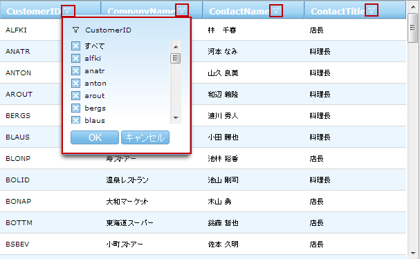
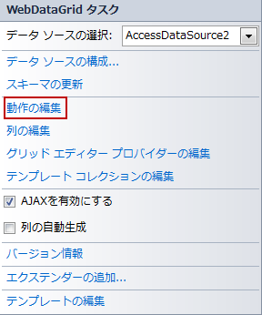
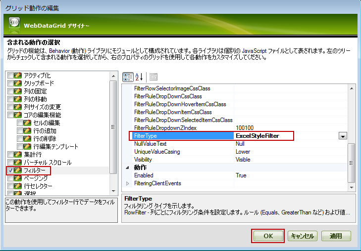
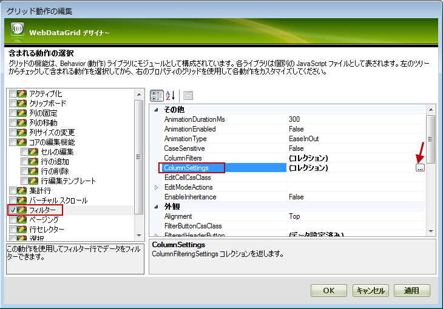
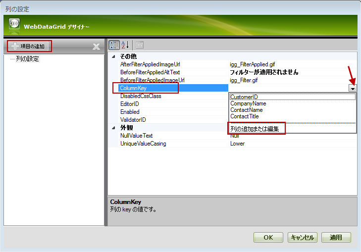
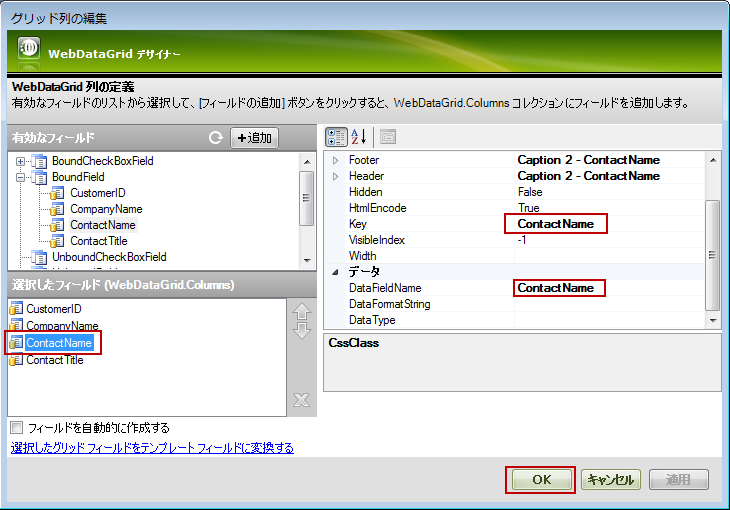
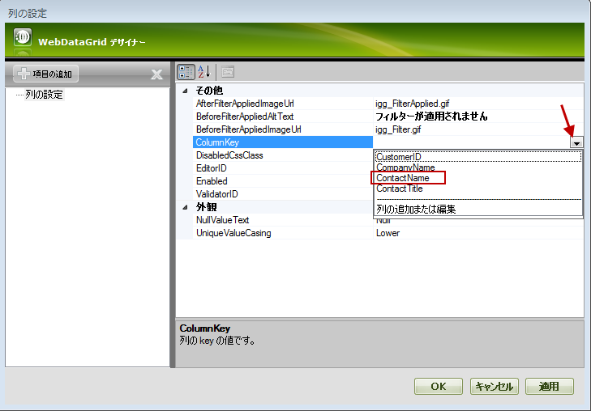

////
|metadata|
{
    "name": "webdatagrid-excelstylefiltering-enabling",
    "controlName": ["WebDataGrid"],
    "tags": ["Filtering","Grids"],
    "guid": "fe0bce49-a414-4446-9dce-5bc8299dfb78",
    "buildFlags": [],
    "createdOn": "2012-07-16T12:48:13.2953032Z"
}
|metadata|
////

= Excel フィルタリングの有効化

== トピックの概要

=== 目的

このトピックでは、 _WebDataGrid_™ コントロールの link:webdatagrid-excelstylefiltering-landingpage.html[Excel フィルタリング]機能を有効にする方法を説明します。

=== 前提条件

このトピックの本題に入る前に、以下のトピックをお読みください。

[options="header", cols="a,a"]
|====
|トピック|目的

| link:webdatagrid-getting-started-with-webdatagrid.html[ _WebDataGrid_ を使用した作業の開始]
|このトピックでは、 _WebDataGrid_ をページに追加し、Northwind データベースの Customers テーブルを取得する方法を紹介します。

| link:webdatagrid-excelstylefiltering-overview.html[Excel フィルタリングの概要]
|このトピックでは、 _WebDataGrid_ コントロールの Excel フィルタリング機能について紹介します。

|====

=== このトピックの内容

このトピックは以下のセクションからなります。

* <<_Ref329698612,はじめに>>

** <<_Ref336016015,Excel フィルタリングの有効化の概要>>

** <<_Ref336016195,Excel フィルタリングの有効化のプロパティ設定>>

* <<_Ref329698680,デザイナーで Excel フィルタリングの有効化>>

** <<_Ref329698685,はじめに>>
** <<OLE_LINK77,プレビュー>>
** <<OLE_LINK41,前提条件>>
** <<OLE_LINK63,概要>>
** <<_Ref329698700,手順>>

* <<_Ref336016234,ASPX マークアップで Excel フィルタリングの有効化>>

** <<_Ref329698642,概要>>
** <<_Ref336016255,コード>>

* <<_Ref329698661,コード ビハインドで Excel フィルタリングの有効化>>

** <<_Ref329698667,概要>>
** <<_Ref336016304,コード>>

* <<_Ref329858114,関連コンテンツ>>

** <<_Ref329858121,トピック>>
** <<_Ref329858125,サンプル>>

[[_Ref329698612]]
== はじめに

[[_Ref336016015]]

=== Excel フィルタリングの有効化の概要

デフォルトでは、 _WebDataGrid_   の規格の (Excel 以外) フィルタリングが有効されます。Excel フィルタリング機能を有効にするには、 _WebDataGrid_   の link:{ApiPlatform}web{ApiVersion}~infragistics.web.ui.gridcontrols.filtering~filtertype.html[FilterType] プロパティを  _ExcelStyleFilter_   に設定します。Excel フィルタリングをすべての列で有効にしますが、列ごとで無効にするには、 link:{ApiPlatform}web{ApiVersion}~infragistics.web.ui.gridcontrols.filtering~columnsettings.html[ColumnFilteringSetting] プロパティを設定できます。

以下のセクションは、1 つの列以外のすべての列で Excel フィルタリングを有効にし、その列のフィルタリングを無効にする方法を紹介します。

* <<_Ref329698680,デザイナーで Excel フィルタリングの有効化>>
* <<_Ref336016234,ASPX マークアップで Excel フィルタリングの有効化>>
* <<_Ref329698661,コード ビハインドで Excel フィルタリングの有効化>>

*注:*
Excel スタイル フィルタリングは、フィルターされたデータ セットを作成するために、各フィルター処理で  _WebDataGrid_   にデータ ソース全体をバインドする必要があります。そのため、アプリケーションのパフォーマンスに影響する場合があります。

[[_Ref336016195]]

=== Excel フィルタリングの有効化のプロパティ設定

以下の表では、フィルタリング動作をプロパティ設定にマップします。

[options="header", cols="a,a,a"]
|====
|目的:|使用するプロパティ:|設定の選択肢:

|Excel フィルタリングを有効にする
| link:{ApiPlatform}web{ApiVersion}~infragistics.web.ui.gridcontrols.filtering~filtertype.html[FilterType]
|_ExcelStyleFilter_

|列のフィルタリングを無効にする
| link:{ApiPlatform}web{ApiVersion}~infragistics.web.ui.gridcontrols.filtering~columnsettings.html[(ColumnSetting の) Enable]
| _False_ 

|====

[[_Ref329698635]]

[[_Ref329698680]]
== デザイナーで Excel フィルタリングの有効化

[[_Ref329698685]]

=== はじめに

この例では、デザイナーで ContactName 以外のすべての列で Excel フィルタリングを有効にし、その列でフィルタリングを無効にする方法を紹介します。

=== プレビュー

以下のスクリーンショットは最終結果のプレビューです。

=== 前提条件

この手順を完了させるには、以下の作業を行う必要があります。

* Web ページで初期化された  _WebDataGrid_   を含む ASP.NET Web プロジェクト
* Northwind データベースの  _Customers_   テーブルの  _CustomerID_  、 _CompanyName_  、 _ContactName_  、および  _ContactTitle_   フィールドを取得する SqlDataSource コンポーネントにバインドされる  _WebDataGrid_  。詳細は、 link:webdatagrid-getting-started-with-webdatagrid.html[WebDataGrid を使用した作業の開始]トピックを参照してください.  

=== 概要

以下はプロセスの概念的概要です。 

*1.Excel フィルタリングを有効にする* 

*2.  1 つの列のフィルタリングを無効にする*

*3. (オプション) *結果を確認します*

[[_Ref329698700]]

=== 手順

以下の手順は  _WebDataGrid_   で Excel フィルタリング機能を有効にし、ContactName 列のフィルタリングを無効にする方法を紹介します。

=== 1.Excel フィルタリングを有効にします。

*1. 動作の編集ダイアログを起動します。*

_WebDataGrid_   のスマート タッグをクリックして、*動作の編集* **オプション** **を選択します** 。

WebDataGrid デザイナー ダイアログが開かれます。

*2.フィルタリングを有効にします* 。

A. WebDataGrid デザイナー ダイアログの左側のパネルで、 **フィルターを**  チェックします。

B. 右側のパネルで、FilterType  *プロパティを*  ExcelStyleFilter  **に設定します** *。*

C. [適用]  *ボタンを*  *クリックします* 。

=== 2.1 つの列のフィルタリングを無効にします。

*1.　新規列を追加します。*

A. 列設定 ダイアログを起動します。

左側のペインのフィルター ボックスをチェックし、 link:{ApiPlatform}web{ApiVersion}~infragistics.web.ui.gridcontrols.filtering~columnsettings.html[ColumnSettings]  *プロパティの*  *省略記号 (...) ボタンをクリックします* 。

*列設定* ダイアログが開きます。

B. 新規列設定を追加します。

a. 左側のペインで  *[項目の追加] オプションをクリックします* 。新しい列設定は列設定コレクションに表示されます。

b. 右側のペインの ColumnKey ドロップダウンから 列の追加/修正 *を選択します*  。

グリッド列の編集 ダイアログが開かれます。

C. ContactName 列を定義します。

a. グリッド列の編集ダイアログの利用可能なフィールド パネルで BoundField  *を選択します* 。

b. フィールドの追加 *ボタン*  *をクリックします* 。新しく追加したフィールドは 選択したフィールド パネルに表示されます。デフォルトでは、列名は  _BoundColumn_0_   です。

c. 選択したフィールド パネルで追加した *列を選択します* 。

d. 右側のパネルで、DataFieldName  *プロパティを*   _ContactName_    **に設定します** *。*

e. 右側のパネルで、Key  *プロパティを*   _ContactName_    **に設定します** *。*

f. OK  *をクリックします* 。

D. 新しく作成した列を ColumnKey プロパティに割り当てます。

ColumnKey ドロップダウンで ContactName  *列*  *を選択します*  。

*2.* 新しい列のフィルターを無効にします。

Enabled  *プロパティを*   _False_    *に設定して*  OK ボタンをクリックします。

image::images/WDG_ExcelStyleFiltering_Enabling_8.png[]

=== 3.(オプション) 結果を確認します。

結果を確認するには、プロパティを保存して実行し、 _WebDataGrid_   のフィルタリング動作を確認します。

[[_Ref336016234]]
== ASPX マークアップで Excel フィルタリングの有効化

[[_Ref329698642]]

=== 概要

この例では、ASPX マークアップで ContactName 以外のすべての列で Excel フィルタリングを有効にし、その列でフィルタリングを無効にする方法を紹介します。

[[_Ref336016255]]

=== コード

*ASPX の場合:*

[source,html]
----
<Behaviors>
    <ig:Filtering FilterType="ExcelStyleFilter">
        <ColumnSettings>
            <ig:ColumnFilteringSetting ColumnKey="ContactName" Enabled=" />
        </ColumnSettings>
    </ig:Filtering>
</Behaviors>
----

[[_Ref329698661]]
== コード ビハインドで Excel フィルタリングの有効化

[[_Ref329698667]]

=== 概要

この例では、コード ビハインドで ContactName 以外のすべての列で Excel フィルタリングを有効にし、その列でフィルタリングを無効にする方法を紹介します。

[[_Ref336016304]]

=== コード

このコードは ASP.NET web ページの `Page_Load` イベントに追加します。

*C# の場合:*

[source,csharp]
----
//Create a Filtering Behavior
this.WebDataGrid2.Behaviors.CreateBehavior<Filtering>();
//Set Filtering Behavior to Excel Style Filter
this.WebDataGrid2.Behaviors.Filtering.FilterType = Infragistics.Web.UI.GridControls.FilteringType.ExcelStyleFilter;
//Create a ColumnFilteringSetting 
ColumnFilteringSetting settingColumn = new ColumnFilteringSetting();
//Set the ColumnKey
settingColumn.ColumnKey = "ContactName";
//Set Enabled property to false
settingColumn.Enabled = false;
//Add the created ColumnSetting
this.WebDataGrid2.Behaviors.Filtering.ColumnSettings.Add(settingColumn);
----

[[_Ref329858114]]
== 関連コンテンツ

[[_Ref329858121]]

=== トピック

このトピックについては、以下のトピックも参照してください。

[options="header", cols="a,a"]
|====
|トピック|目的

| link:webdatagrid-excelstylefiltering-configuring.html[Excel フィルタリングの構成]
|このトピックでは、 _WebDataGrid_ コントロールの Excel フィルタリング オプションを構成する方法を説明します。

| link:webdatagrid-excelstylefiltering-propertyreference.html[Excel フィルタリングのプロパティ リファレンス]
|このトピックは、 _WebDataGrid_ コントロールの Excel フィルタリング機能のプロパティについての情報を提供します。

|====

[[_Ref329858125]]

=== サンプル

このトピックについては、以下のサンプルも参照してください。

[options="header", cols="a,a"]
|====
|サンプル|目的

| link:{SamplesURL}/samples/webdatagrid/organization/excelstylefilteringuniquevaluecasing/default.aspx?cn=data-grid&sid=bb8281e9-bb9a-422d-84f7-acc6b1342e77[Excel フィルタリングで一意値の大文字/小文字指定]
|このサンプルでは、Excel フィルタリングの `` link:{ApiPlatform}web{ApiVersion}~infragistics.web.ui.gridcontrols.columnfilteringsetting~uniquevaluecasing.html[UniqueValueCasing]`` プロパティを紹介します。

| link:{SamplesURL}/samples/webdatagrid/organization/excelstylefilteringboundunboudfields/default.aspx?cn=data-grid&sid=d9ad02bb-87ef-4440-9b4e-0fe51cdb7a38[Excel フィルタリング - バインド/非バインド フィールド]
|このサンプルでは、バインドおよび非バインド フィールドで Excel フィルタリングおよびチェックボックスを使用する方法を紹介します。

| link:{SamplesURL}/samples/webdatagrid/organization/excelstylefilteringnullvaluetext/default.aspx?cn=data-grid&sid=a1a23f0a-8f1f-4846-b780-0c7d28cc464d[Excel フィルタリングのドロップダウンの Null 値テキスト]
|このサンプルでは、Excel フィルタリングの `` link:{ApiPlatform}web{ApiVersion}~infragistics.web.ui.gridcontrols.columnfilteringsetting~nullvaluetext.html[NullValueText]`` プロパティを _Null_ に設定する方法を紹介します。

| link:{SamplesURL}/samples/webdatagrid/organization/excelstylefilteringcrud/default.aspx?cn=data-grid&sid=a182b7c6-738e-4db9-b531-705dc05be0b7[CRUD 機能が有効な Excel フィルタリング]
|このサンプルでは、編集と Excel フィルタリングを紹介します。

|====