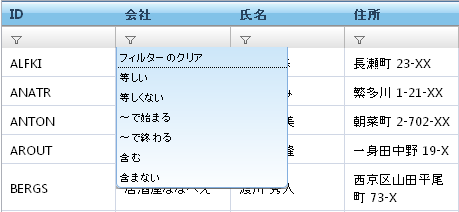
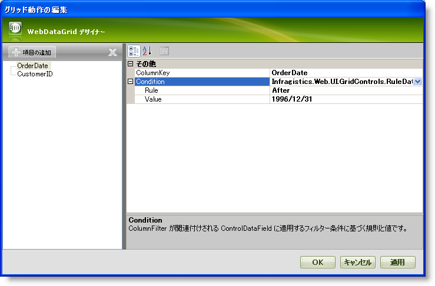
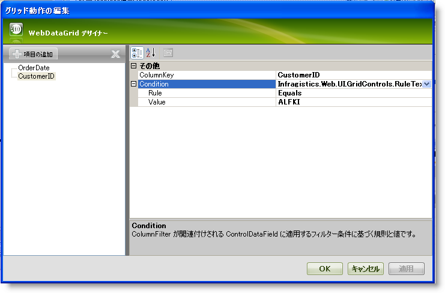
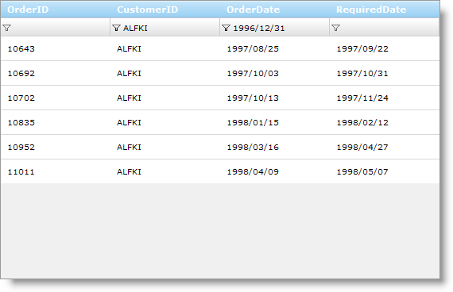

////

|metadata|
{
    "name": "webdatagrid-filtering",
    "controlName": ["WebDataGrid"],
    "tags": ["Filtering","Grids"],
    "guid": "{66932F5B-9110-4EBE-84A5-654AD78E3231}",  
    "buildFlags": [],
    "createdOn": "2008-12-09T16:31:33Z"
}
|metadata|
////

= フィルタリング

WebDataGrid™ はバインドされるデータをフィルタリングする機能を持っています。フィルタリングによってフィルタリング基準に一致するより小さいサブセットにデータが分割されて表示されます。これによってデータはエンド ユーザーにより見やすくまた管理しやすくなります。AJAX が有効な場合、WebDataGrid は非同期でフィルタリングを実行します。WebDataGrid に提供された API またはフィルター行 UI によってフィルタリングできます。

== フィルター行

フィルター行には列のデータ タイプに基づいて自動的に選択したエディター プロバイダーと各列のドロップダウン リストが含まれています。エンド ユーザーはフィルター値を TextBox に入力することが許可され、ドロップダウン リストのフィルター規則に基づいて、WebDataGrid はデータをそれに応じてフィルタリングします。

WebDataGrid の上または下にフィルター行を配置することができ、スクロールするしないにかかわらずそこに残ります。

== フィルター規則

フィルター規則は列挙体で表されます。列のフィルター規則はその列のデータ タイプによって異なります。データ タイプのフィルター規則の詳細は以下のとおりです。

[NOTE]
====
*注：* 指定されない場合にはフィルター規則はデフォルトで All で、列のすべての値を表示します。
====

*ブール値のフィルター規則* - ブール値列に適用されます。

*  pick:[asp-net="link:{ApiPlatform}web{ApiVersion}~infragistics.web.ui.gridcontrols.booleanfilterrules.html[BooleanFilterRules]"] .True - 値は True です。
* BooleanFilterRules.False - 値は False です。

*日時のフィルター規則* - DateTime 列に適用されます。

*  pick:[asp-net="link:{ApiPlatform}web{ApiVersion}~infragistics.web.ui.gridcontrols.datetimefilterrules.html[DateTimeFilterRules]"] .Equals - 値は提供された値に等しいです。
* DateTimeFilterRules.Before - 値は今日の日付の前に来ます。
* DateTimeFilterRules.After - 値は今日の日付の後に来ます。
* DateTimeFilterRules.Tomorrow - 値は明日の日付に等しいです。
* DateTimeFilterRules.Today - 値は今日の日付に等しいです。
* DateTimeFilterRules.Yesterday - 値は昨日の日付に等しいです。
* DateTimeFilterRules.NextWeek - 値は次週の日付の範囲です。
* DateTimeFilterRules.ThisWeek - 値は今週の日付の範囲です。
* DateTimeFilterRules.LastWeek - 値は先週の日付の範囲です。
* DateTimeFilterRules.NextMonth - 値は次月の日付の範囲です。
* DateTimeFilterRules.ThisMonth - 値は今月の日付の範囲です。
* DateTimeFilterRules.LastMonth - 値は前月の日付の範囲です。
* DateTimeFilterRules.NextQuarter - 値は次の四半期の日付の範囲です。
* DateTimeFilterRules.ThisQuarter - 値は今四半期の日付の範囲です。
* DateTimeFilterRules.LastQuarter - 値は前四半期の日付の範囲です。
* DateTimeFilterRules.NextYear - 値は次年の日付の範囲です。
* DateTimeFilterRules.ThisYear - 値は今年の日付の範囲です。
* DateTimeFilterRules.LastYear - 値は先年の日付の範囲です。
* DateTimeFilterRules.YearToDate - 値は Year-To-Date の日付の範囲です。

*数値のフィルター規則* - 数値列に適用されます。

*  pick:[asp-net="link:{ApiPlatform}web{ApiVersion}~infragistics.web.ui.gridcontrols.numericfilterrules.html[NumericFilterRules]"] .Equals - セル値は提供された値に等しいです。
* NumericFilterRules.DoesNotEqual - セル値は提供された値に等しくありません。
* NumericFilterRules.GreaterThan - セル値は提供された値より大きいです。
* NumericFilterRules.GreaterThanOrEqualTo - セル値は提供された値以上です。
* NumericFilterRules.LessThan - セル値は提供された値より小さいです。
* NumericFilterRules.LessThanOrEqualTo - セル値は提供された値以下です。

*テキストのフィルター規則* - 文字列の列に適用されます。

*  pick:[asp-net="link:{ApiPlatform}web{ApiVersion}~infragistics.web.ui.gridcontrols.textfilterrules.html[TextFilterRules]"] .Equals - セル値は提供された値に完全に等しいです。
* TextFilterRules.DoesNotEqual - セル値は提供された値に等しくありません。
* TextFilterRules.BeginsWith - セル値は提供された値で始まります。
* TextFilterRules.EndsWith - セル値は提供された値で終わります。
* TextFilterRules.Contains - セル値は提供された値を含みます。
* TextFilterRules.DoesNotContain - セル値は提供された値を含みません。

== フィルター値

任意の値をフィルター行の TextBox に入力できます。フィルター値と一緒にフィルター規則にすることでフィルター条件が構成されます。フィルター条件に一致する任意のレコードが返され、WebDataGrid に表示します。エンドユーザーが入力する値が存在しない、またはフィルター条件が一致しない場合、レコードが返され空の WebDataGrid が表示されます。

== フィルター条件

フィルター条件を表すクラスは以下のとおりです:

[options="header", cols="a,a"]
|====
|クラス|フィルターのデータ タイプ

| pick:[asp-net="link:{ApiPlatform}web{ApiVersion}~infragistics.web.ui.gridcontrols.ruleboolnode.html[RuleBoolNode]"] 
|Boolean

| pick:[asp-net="link:{ApiPlatform}web{ApiVersion}~infragistics.web.ui.gridcontrols.ruledatenode.html[RuleDateNode]"] 
|DateTime

| pick:[asp-net="link:{ApiPlatform}web{ApiVersion}~infragistics.web.ui.gridcontrols.rulenumbernode.html[RuleNumberNode]"] 
|Numeric

| pick:[asp-net="link:{ApiPlatform}web{ApiVersion}~infragistics.web.ui.gridcontrols.ruletextnode.html[RuleTextNode]"] 
|Text

|====

== フィルターの互換性

フィルタリングは、ソートやページングなどの機能と一緒に動作します。フィルタリングは、これらの機能が有効な時にデータのセット全体に行われます。ソートはデータ全体に適用され、行のみでフィルタリングは実行されません。ページングは行でのフィルタリングによってページのみを表示するために調整します。

== フィルタリングを有効にします

[start=1]
. WebDataGrid を SqlDataSource コンポーネントにバインドして、Orders テーブルからデータを取得します。OrderID、CustomerID、OrderDate、および RequiredDate フィールドのみを取得します。実行についての詳細は、 link:webdatagrid-getting-started-with-webdatagrid.html[WebDataGrid で開始]を参照してください。
[start=2]
. Microsoft® Visual Studio™ プロパティ ウィンドウで、 pick:[asp-net="link:{ApiPlatform}web{ApiVersion}~infragistics.web.ui.gridcontrols.behaviors.html[Behaviors]"]  プロパティを指定して、省略記号 (...) ボタンをクリックして、[動作エディタ] ダイアログを起動します。
[start=3]
. 有効にするには左のリストの Filtering 動作のチェックボックスをチェックします。
[start=4]
. WebDataGrid が特定の日にち内の日にちのみフィルタリングするように初期のフィルタリング条件を設定します。

..  pick:[asp-net="link:{ApiPlatform}web{ApiVersion}~infragistics.web.ui.gridcontrols.filtering~columnfilters.html[ColumnFilters]"]  プロパティを指定して、省略記号 (...) ボタンをクリックし、[列フィルタリング] ダイアログを起動します。
.. [項目の追加] ボタンをクリックすることで 2 つの列フィルタを追加します。
.. ひとつのフィルタの  pick:[asp-net="link:{ApiPlatform}web{ApiVersion}~infragistics.web.ui.gridcontrols.columnfilter~columnkey.html[ColumnKey]"]  プロパティを OrderDate としてもうひとつのフィルタを CustomerID として設定し、フィルタリングする列を指定します。
.. OrderDate 列の  pick:[asp-net="link:{ApiPlatform}web{ApiVersion}~infragistics.web.ui.gridcontrols.columnfilter~condition.html[Condition]"]  プロパティの展開インジケータをクリックします。Rule および Value プロパティが表示します。
.. Rule を After に、Value を 12/31/1996 に設定します。

.. CustomerID 列の Condition プロパティの展開インジケータをクリックします。Rule および Value プロパティが表示します。
.. Rule を Equals に、Value を “ALFKI” に設定します。WebDataGrid は 1996 年以降の発注日で顧客 ALFKI のデータのみを表示します。

.. [適用] 、次に [OK] をクリックして、[列フィルタリング エディタ] ダイアログを閉じます。
.. [適用] 、次に [OK] をクリックして、[動作エディタ] ダイアログを閉じます。

*以下のコードを使用して上記の手順を実行することも可能です。*

[NOTE]
====
*注：* : すべてのケースで、フィルタを適用するためのメソッドを呼び出す必要があります。呼び出さないと、次のポストバックまで WebDataGrid はフィルタリングを実行しません。クライアント側で、複数のフィルタを追加する時、add_columnFilterRange メソッドを使用してフィルタの配列として追加する必要があります。
====

*Visual Basic の場合：*

----
Me.WebDataGrid1.Behaviors.CreateBehavior(Of Filtering)()
' OrderDate 列のために列フィルタを設定します。 
Dim dateTimeCondition As New RuleDateNode(DateTimeFilterRules.After, New DateTime(1996, 12, 31)) 
Dim columnFilter1 As New ColumnFilter() 
columnFilter1.ColumnKey = "OrderDate" 
columnFilter1.Condition = dateTimeCondition 
' CustomerID 列のために列フィルタを設定します。 
Dim textCondition As New RuleTextNode(TextFilterRules.Equals, "ALFKI") 
Dim columnFilter2 As New ColumnFilter() 
columnFilter2.ColumnKey = "CustomerID" 
columnFilter2.Condition = textCondition 
Me.WebDataGrid1.Behaviors.Filtering.ColumnFilters.Add(columnFilter1) 
Me.WebDataGrid1.Behaviors.Filtering.ColumnFilters.Add(columnFilter2) 
' 結果が表示される前にフィルタを適用する必要があります。 
Me.WebDataGrid1.Behaviors.Filtering.ApplyFilter()
----

*C# の場合：*

----
this.WebDataGrid1.Behaviors.CreateBehavior();
// OrderDate 列のために列フィルタを設定します。
RuleDateNode dateTimeCondition = new RuleDateNode(DateTimeFilterRules.After, new DateTime(1996, 12, 31));
ColumnFilter columnFilter1 = new ColumnFilter();
columnFilter1.ColumnKey = "OrderDate";
columnFilter1.Condition = dateTimeCondition;
// CustomerID 列のために列フィルタを設定します。
RuleTextNode textCondition = new RuleTextNode(TextFilterRules.Equals, "ALFKI");
ColumnFilter columnFilter2 = new ColumnFilter();
columnFilter2.ColumnKey = "CustomerID";
columnFilter2.Condition = textCondition;
this.WebDataGrid1.Behaviors.Filtering.ColumnFilters.Add(columnFilter1);
this.WebDataGrid1.Behaviors.Filtering.ColumnFilters.Add(columnFilter2);
// 結果が表示される前にフィルタを適用する必要があります。
this.WebDataGrid1.Behaviors.Filtering.ApplyFilter();
----

*JavaScript の場合*

----
var grid = $find("WebDataGrid1");
// OrderDate 列のために列フィルタを設定します。
var columnFilter = grid.get_behaviors().get_filtering().create_columnFilter("OrderDate");
var condition = columnFilter.get_condition();
condition.set_rule($IG.DateTimeFilterRules.After);
condition.set_value("12/31/1996");
// CustomerID 列のために列フィルタを設定します。
var columnFilter2 = grid.get_behaviors().get_filtering().create_columnFilter("CustomerID");
var condition2 = columnFilter2.get_condition();
condition2.set_rule($IG.TextFilterRules.Equals);
condition2.set_value("ALFKI");
// 2 つのフィルタの配列を作成します。
var columnFilters = new Array(columnFilter, columnFilter2);
// フィルタの配列を追加します。
grid.get_behaviors().get_filtering().add_columnFilterRange(columnFilters);
// 適用フィルタを呼び出します。
grid.get_behaviors().get_filtering().applyFilters();
----

[start=5]
. アプリケーションを実行します。WebDataGrid は 1996 年の発注日以降顧客 ALFKI のレコードを表示します。列のひとつのドロップダウン リストをクリックし、条件を選択して値を入力することにより、さらにデータをフィルタリングできます。WebDataGrid は既存のデータをフィルタリングします。

