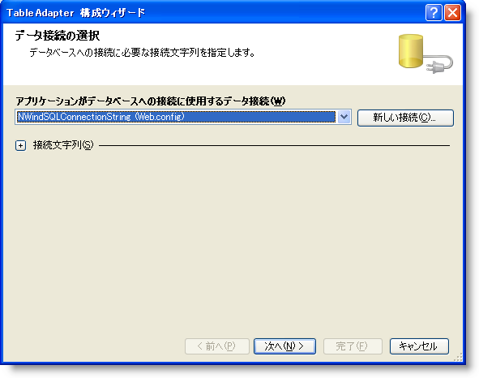
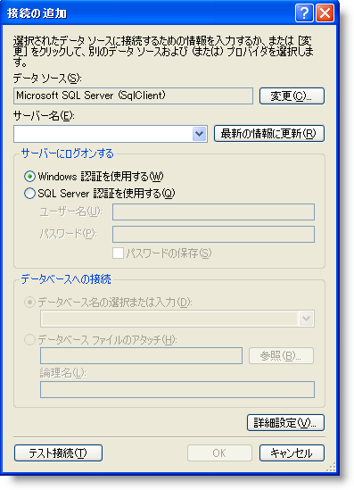
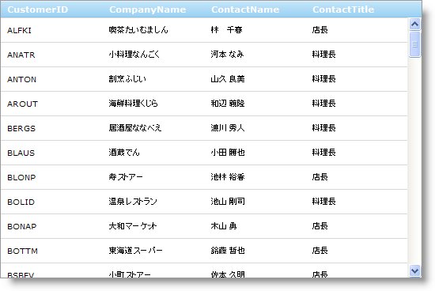

////

|metadata|
{
    "name": "webdatagrid-getting-started-with-webdatagrid",
    "controlName": ["WebDataGrid"],
    "tags": ["Data Binding","Grids"],
    "guid": "{84AA0A4E-A183-4A8A-8B46-3401F1A57D23}",  
    "buildFlags": [],
    "createdOn": "0001-01-01T00:00:00Z"
}
|metadata|
////

= WebDataGrid で開始

== 始める前に

WebDataGrid™ によって複雑な動作や動的操作に対して多くの機能を有効にすることができます。ただし最も一般的に使用するのはデータを表示するためです。WebDataGrid でデータをバインドして表示するのは簡単なプロセスです。

== 達成すること

WebDataGrid を Northwind データベースの顧客テーブルにバインドする方法を学習します。

== 次の手順を実行します

[start=1]
. ASP.NET Web ページを作成します。
[start=2]
. Microsoft® Visual Studio™ ツールボックスからページに ScriptManager コンポーネントをドラッグします。
[start=3]
. WebDataGrid コントロールをページにドラッグします。
[start=4]
. SqlDataSource コンポーネントをページにドラッグします。
[start=5]
. SqlDataSource コンポーネントのスマート タグをクリックして、[データ ソースの構成] を選択します。[データ ソースの構成] ウィザードが表示します。

[start=6]
. [新しい接続] をクリックして接続文字列を構成します。[接続を追加] ダイアログが表示します。

[start=7]
. この場合、使用しているサーバー、.\SQLEXPRESS にサーバー名を指定します。データベースを Northwind に設定します。
[start=8]
. [OK] をクリックします。[接続の構成] 画面に戻ります。
[start=9]
. [次へ] をクリックします。
[start=10]
. [テーブル] または [ビュー] から [列の指定] を選択し以下を実行します:

.. ドロップダウン リストから Customers テーブルを選択します。
.. [列] セクションで、CustomerID、CompanyName、ContactName および ContactTitle を選択してこれらの列を表示します。
.. この時点で、SqlDataSource コンポーネントが取得されたデータの Insert、Update および Delete ステートメントを生成することを指定するために [詳細] ボタンをクリックするオプションがあります。

[start=11]
. [次へ] をクリックします。
[start=12]
. SqlDataSource がデータを取得することを保証するためにクエリをテストします。
[start=13]
. [完了] をクリックして構成ウィザードを閉じます。SqlDataSource は Northwind データベースから Customers データを取得するように設定されます。
[start=14]
. WebDataGrid のプロパティ ウィンドウで、SqlDataSource コンポーネントの ID となるように  pick:[asp-net="link:{ApiPlatform}web{ApiVersion}~infragistics.web.ui.framework.data.flatdataboundcontrol~datasourceid.html[DataSourceID]"]  を設定します。
[start=15]
.  pick:[asp-net="link:{ApiPlatform}web{ApiVersion}~infragistics.web.ui.framework.data.flatdataboundcontrol~datakeyfields.html[DataKeyField]"]  プロパティを CustomerID に設定します。
[start=16]
. アプリケーションを実行します。WebDataGrid は顧客テーブルにバインドしてデータを表示します。

