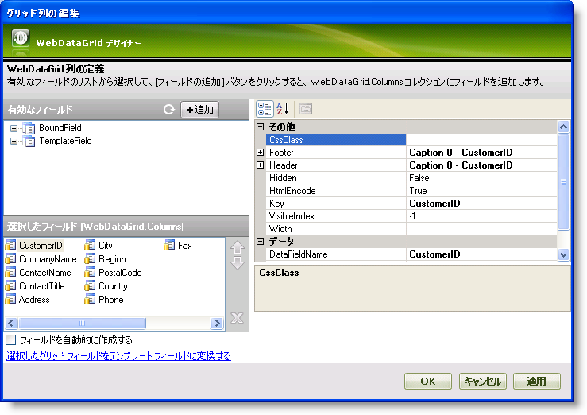
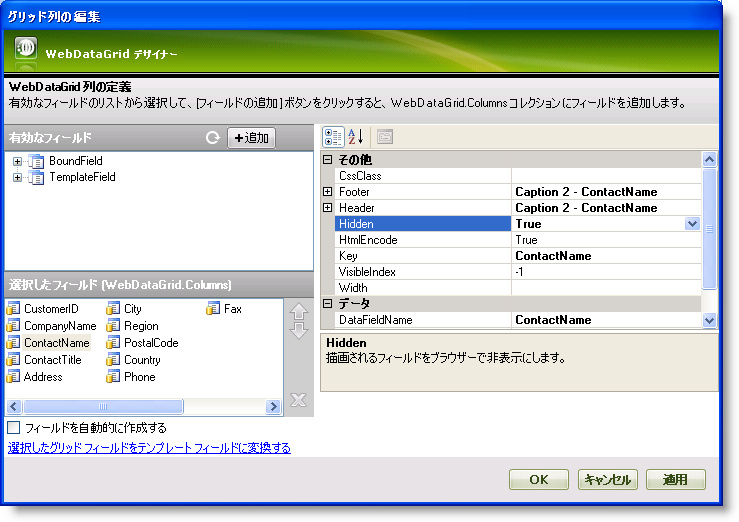

////

|metadata|
{
    "name": "webdatagrid-hiding-a-column",
    "controlName": ["WebDataGrid"],
    "tags": ["Grids"],
    "guid": "{68369569-55AA-4FE2-BDB8-0E2E177C4E7E}",  
    "buildFlags": [],
    "createdOn": "0001-01-01T00:00:00Z"
}
|metadata|
////

= 列の非表示

WebDataGrid™ コントロールによって特定の列をユーザーに非表示にできます。任意のタイプの列で [api link to Hidden] プロパティを True に設定することによってこれを実行できます。Hidden プロパティをサポートするクラスは以下の通りです:

*  pick:[asp-net="link:{ApiPlatform}web{ApiVersion}~infragistics.web.ui.gridcontrols.gridfield.html[GridField]"] 
*  pick:[asp-net="link:{ApiPlatform}web{ApiVersion}~infragistics.web.ui.gridcontrols.bounddatafield.html[BoundDataField]"] 
*  pick:[asp-net="link:{ApiPlatform}web{ApiVersion}~infragistics.web.ui.gridcontrols.boundcheckboxfield.html[BoundCheckBoxField]"] 
*  pick:[asp-net="link:{ApiPlatform}web{ApiVersion}~infragistics.web.ui.gridcontrols.unboundfield.html[UnboundField]"] 
*  pick:[asp-net="link:{ApiPlatform}web{ApiVersion}~infragistics.web.ui.gridcontrols.unboundcheckboxfield.html[UnboundCheckBoxField]"] 
*  pick:[asp-net="link:{ApiPlatform}web{ApiVersion}~infragistics.web.ui.gridcontrols.templatedatafield.html[TemplateDataField]"] 
*  pick:[asp-net="link:{ApiPlatform}web{ApiVersion}~infragistics.web.ui.gridcontrols.autogenerateddatafield.html[AutoGeneratedDataField]"] 

Field オブジェクトの Hidden プロパティを True に設定すると、フィールドが非表示になります。ただし、クライアント側コードによってプログラムで今まで通りに非表示列にアクセスできます。クライアント側のオブジェクト モデルに依然としてあるからです。サーバー側またはクライアント側からフィールドの表示/非表示を起動できます。

== デザイナーで列を非表示にするには:

[start=1]
. Visual Studio™ ツールボックスから、ScriptManager コンポーネントと WebDataGrid コントロールをフォームにドラッグ アンド ドロップします。
[start=2]
. WebDataGrid を SqlDataSource コンポーネントにバインドして、Customers テーブルからデータを取得します。これを実行する詳細は、 link:webdatagrid-getting-started-with-webdatagrid.html[「WebDataGrid で開始」]を参照してください。
[start=3]
. [プロパティ] ウィンドウで、Columns プロパティを指定して、省略記号 (...) ボタンをクリックし、[グリッド列の編集] ダイアログを起動します。

[start=4]
. [選択したフィールド]（WebDataGrid.Columns）セクションから、非表示にしたい列を選択し、Hidden プロパティを True に設定します。この例では、ContactName を選択します。

[start=5]
. [適用] と [OK] をクリックして [グリッド列の編集] ダイアログを閉じます。
[start=6]
. アプリケーションを保存して実行します。列 ContactName が非表示であるのを確認します。

== プログラムで列を非表示にするには:

*Visual Basic の場合:*

----
'インデックス 2 の列を非表示にする
Me.WebDataGrid1.Columns[2].Hidden = true
----

*C# の場合:*

----
//インデックス 2 の列を非表示にする 
this.WebDataGrid1.Columns[2].Hidden = true;
----

*JavaScript の場合:*

----
//インデックス 2 の列を非表示にする 
$find("WebDataGrid1").get_columns().get_column(2).set_hidden(true);
----

== 関連トピック

link:webdatagrid-columns.html[列]