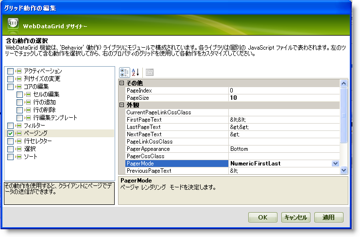
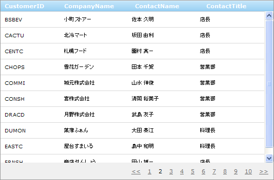

////

|metadata|
{
    "name": "webdatagrid-paging",
    "controlName": ["WebDataGrid"],
    "tags": ["Grids","Paging"],
    "guid": "{E2D0B7D7-481C-4835-B49E-76C3DD468CA8}",  
    "buildFlags": [],
    "createdOn": "2008-12-08T10:46:54Z"
}
|metadata|
////

= ページング

WebDataGrid™ コントロールのページング メカニズムはデータをページに分割し、ロード時間を短縮しパフォーマンスを向上します。ページ数は、ページ サイズとデータ ソースからのレコード合計数によって決定されます。WebDataGrid は、エンドユーザーがページ間をナビゲートする間に各ページの新しいデータを取得します。AJAX を使用して、データはデフォルトで非同期で取得されます。

== ページングを有効にします

[start=1]
. WebDataGrid を SqlDataSource コンポーネントにバインドして、Customers テーブルからデータを取得します。実行についての詳細は、 link:webdatagrid-getting-started-with-webdatagrid.html[WebDataGrid で開始]を参照してください。
[start=2]
. Microsoft® Visual Studio™ プロパティ ウィンドウで、Behaviors プロパティを指定して、省略記号 (...) ボタンをクリックし、[動作エディタ] ダイアログを起動します。
[start=3]
. この動作を追加して有効にするには、左のリストからページャの隣りのチェックボックスをチェックします。
[start=4]
. プロパティで、 pick:[asp-net="link:{ApiPlatform}web{ApiVersion}~infragistics.web.ui.gridcontrols.paging~pagesize.html[PageSize]"]  を 10 に設定し、ページあたりのレコード数を 10 に増やします。
[start=5]
. 最初と最後のページへのリンクが付いた番号にページャ リンクを変更する NumericFirstLast に  pick:[asp-net="link:{ApiPlatform}web{ApiVersion}~infragistics.web.ui.gridcontrols.paging~pagermode.html[PagerMode]"]  を設定します。

[start=6]
. [適用]、そして [OK] をクリックします。デフォルト設定でページングを有効にしました。

以下のマークアップ コードが生成されます。

*HTML の場合:*

----
<Behaviors>
    <ig:Paging PagerMode="NumericFirstLast" PageSize="10">
    </ig:Paging>
</Behaviors>
----

コード ビハインドからページングを追加するには、以下のコードを追加します。

*Visual Basic の場合:*

----
WebDataGrid1.Behaviors.CreateBehavior(Of Infragistics.Web.UI.GridControls.Paging)()
WebDataGrid1.Behaviors.Paging.PageSize = 10
WebDataGrid1.Behaviors.Paging.PagerMode = Infragistics.Web.UI.GridControls.PagerMode.NumericFirstLast
----

*C# の場合:*

[source,csharp]
----
WebDataGrid1.Behaviors.CreateBehavior<Infragistics.Web.UI.GridControls.Paging>();
WebDataGrid1.Behaviors.Paging.PageSize = 10;
WebDataGrid1.Behaviors.Paging.PagerMode = Infragistics.Web.UI.GridControls.PagerMode.NumericFirstLast;
----

[start=7]
. プロパティ ウィンドウで、WebDataGrid の  pick:[asp-net="link:{ApiPlatform}web{ApiVersion}~infragistics.web.ui.gridcontrols.webdatagrid~enableajax.html[EnableAjax]"]  プロパティが True に設定されていることをチェックします。そうでない場合は、True に設定します。WebDataGrid は AJAX を使用してデータをページする準備が整いました。

== 関連トピック

link:webdatagrid-using-custom-paging-template.html[カスタム ページング テンプレートの使用]

link:webdatagrid-using-custom-paging-template-in-code.html[コードでカスタム ページング テンプレートの使用]