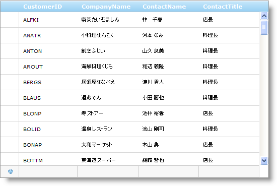

////

|metadata|
{
    "name": "webdatagrid-row-adding",
    "controlName": ["WebDataGrid"],
    "tags": ["Editing","Grids"],
    "guid": "{F7EB50C5-9428-4EAF-92EC-0A847483798B}",  
    "buildFlags": [],
    "createdOn": "0001-01-01T00:00:00Z"
}
|metadata|
////

= 行追加

== 行の追加

WebDataGrid™ によって  pick:[asp-net="link:{ApiPlatform}web{ApiVersion}~infragistics.web.ui.gridcontrols.rowadding.html[Row Adding]"]  動作で行を追加することができます。この動作を有効にすると、データの追加専用の新規行追加テンプレートをコントロールのユーザー インタフェースに配置します。エンドユーザーはこの行のセルに値を入力できます。新規行追加がフォーカスを失うと、行が WebDataGrid に追加され新しいレコードが元になるデータ ソースにコミットされます。行にフォーカスを置くためには、 pick:[asp-net="link:{ApiPlatform}web{ApiVersion}~infragistics.web.ui.gridcontrols.behaviors~activation.html[Activation]"]  動作を有効にする必要があります。

*注：* WebDataGrid は行追加操作を直ちにコミットします。行の挿入によって直ちにポストバックが発生し、データ ソースへの変更を保持します。

== 新規行追加

新規行追加を WebDataGrid の一番下または一番上に配置できます。これは固定された位置で、エンド ユーザーがデータをスクロールしても行は表示されます。

新規行追加は WebDataGrid 列のエディタを使用します。列はどのデータ タイプかを判断して、そのデータ タイプのデフォルトのエディタを使用します。たとえばフィールドのひとつがタイプ String の場合、新規行追加はそのセルの TextBox を使用します。

動作の  pick:[asp-net="link:{ApiPlatform}web{ApiVersion}~infragistics.web.ui.gridcontrols.rowaddingcolumnsetting.html[行追加列設定]"] を追加することによって、セルごとに異なる設定を持つことも可能です。列設定の詳細は、 link:webdatagrid-setting-column-settings-for-a-behavior.html[動作に列設定を設定]を参照してください。

== ナビゲーション

Activation を有効にすると、セルをクリックして新規行追加のセルをアクティブにすることができます。 pick:[asp-net="link:{ApiPlatform}web{ApiVersion}~infragistics.web.ui.gridcontrols.editablebehaviorbase~editmodeactions.html[EditModeActions]"]  によってセルは編集モードになります。行にデータが含まれている場合、行をクリックして放すと WebDataGrid に追加します。キーボードを使用して新規行追加もナビゲートできます。

*タブ* – フォーカスが次のセルに移動します。最後のセルに達した場合はタブ移動は行をコミットします。

*矢印キー* - どの矢印キーが押されたのかに基づいてフォーカスは現在アクティブなセルから別のセルに移動します。

*Enter キー* - データがある場合コミットします。

== *行の追加を有効にします*

== 始める前に

WebDataGrid™ コントロールの新規行追加機能を使用してエンド ユーザーは新しいレコードを追加できます。 pick:[asp-net="link:{ApiPlatform}web{ApiVersion}~infragistics.web.ui.gridcontrols.rowadding.html[Row Adding]"]  動作は、コントロールに常にあるこの空の行を提供します。新しいデータを新規行追加に入力し行のフォーカスを失わせると、その行は WebDataGrid と元となるデータソースに挿入されます。行がフォーカスを取得またはフォーカスを失うには、 pick:[asp-net="link:{ApiPlatform}web{ApiVersion}~infragistics.web.ui.gridcontrols.behaviors~activation.html[Activation]"]  動作を有効にする必要があります。Activation 動作の詳細は、 link:webdatagrid-activation.html[アクティブ化]を参照してください。

*注：* WebDataGrid は行追加操作を直ちにコミットします。行の挿入によって直ちにポストバックが発生し、データ ソースへの変更を保持します。

== 達成すること

新規行追加インタフェースを使用して、エンド ユーザーが新規行を WebDataGrid に追加することを可能にする方法を学習します。

== 次の手順を実行します

[start=1]
. WebDataGrid を SqlDataSource コンポーネントにバインドして、Customers テーブルからデータを取得します。実行についての詳細は、 link:webdatagrid-getting-started-with-webdatagrid.html[WebDataGrid で開始]を参照してください。
[start=2]
. WebDataGrid の Microsoft® Visual Studio™ プロパティ ウィンドウで、WebDataGrid での変更がデータ ソースに更新できるように  pick:[asp-net="link:{ApiPlatform}web{ApiVersion}~infragistics.web.ui.framework.data.flatdataboundcontrol~datakeyfields.html[DataKeyFields]"]  プロパティを CustomerID に設定します。
[start=3]
. 同じウィンドウで、 pick:[asp-net="link:{ApiPlatform}web{ApiVersion}~infragistics.web.ui.gridcontrols.behaviors.html[Behaviors]"]  プロパティを指定して、省略記号 (...) ボタンをクリックし、[動作エディタ] ダイアログを起動します。
[start=4]
. 左側にあるリストから行の追加チェックボックスを選択して動作を追加します。 pick:[asp-net="link:{ApiPlatform}web{ApiVersion}~infragistics.web.ui.gridcontrols.behaviors~editingcore.html[EditingCore]"]  動作もチェックされていることに注意してください。
[start=5]
. プロパティで、 pick:[asp-net="link:{ApiPlatform}web{ApiVersion}~infragistics.web.ui.gridcontrols.rowadding~alignment.html[Alignment]"]  が Bottom に設定されていることをチェックします。これによって [新規追加行] が WebDataGrid の一番下に追加されます。
[start=6]
. [適用] そして [OK] ボタンをクリックしてエディタを閉じます。データを行に入力し行がフォーカスを失う、他の場所をクリックする、またはキーボードの Enter キーを押すことによって、新しい行を WebDataGrid に追加することが可能となりました。

== *コードで行を追加*

クライアント側で行を WebDataGrid™ に追加できます。コードを使用して行を追加するために、 pick:[asp-net="link:{ApiPlatform}web{ApiVersion}~infragistics.web.ui.gridcontrols.rowadding.html[行の追加]"] 動作を有効にする必要はありません。ユーザーにする必要がある唯一の動作は   pick:[asp-net="link:{ApiPlatform}web{ApiVersion}~infragistics.web.ui.gridcontrols.behaviors~editingcore.html[EditingCore]"]  動作で、BatchUpdating を True に設定します。さらに、追加する前に行のためにすべての必要な値を埋める必要があります。

*JavaScript の場合*

----
var grid = $find("WebDataGrid1");
var rows = grid.get_rows();var rowsLength = grid.get_length();
 // null にできないすべての値のためにセル値の配列を作成します
var row = new Array("CustomerID", "CompanyName");
// 行を追加します。
rows.add(row);
var lastRow = rows.get_row(rowsLength);var cell = lastRow.get_cell(1);grid.get_behaviors().get_editingCore().get_behaviors().get_cellEditing().enterEditMode(cell);
----

コードで列を追加するその他の方法として、{ column-key : cell-value } ペアで JSON 表記のオブジェクトを使用する方法があります。この方法は、ColumnMoving 動作が有効な場合に使用することをお勧めします。

*JavaScript の場合:*

----
var grid = $find("WebDataGrid1");
var rows = grid.get_rows();
// Create JSON-notation object
var row = [       { "Value" : new Date().getTime() + 1, "DataKeyField" : "RequiredDate" ) },       { "Value" : true, "DataKeyField" : "Discontinued" ) },
{ "Value" : "Hanari Carnes" , "DataKeyField" : "ShipName" ) },
{ "Value" : 4, "DataKeyField" : "ShipVia" ) },
// Add row.
rows.add(row);
----

== 関連トピック

link:webdatagrid-cell-editing.html[セル編集]

link:webdatagrid-editting.html[編集]

link:webdatagrid-enabling-row-deleting.html[行削除]

link:webdatagrid-row-editing-template.html[行編集テンプレート]