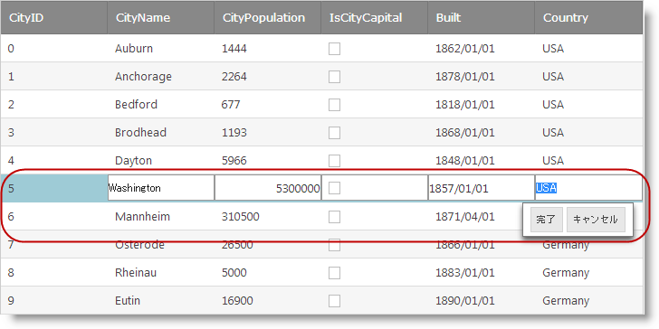

////

|metadata|
{
    "name": "webdatagrid-row-editing-overview",
    "controlName": [],
    "tags": [],
    "guid": "40d3b706-2c75-4ea9-b1a7-9948a3e779fa",  
    "buildFlags": [],
    "createdOn": "2014-03-10T16:13:35.0228476Z"
}
|metadata|
////

= 行編集の概要

== トピックの概要

=== 目的

このトピックでは、 _WebDataGrid_   __™__  の行編集動作の機能の概要を提供します。

=== 前提条件

このトピックをより理解するために、以下のトピックを参照することをお勧めします。

[options="header", cols="a,a"]
|====
|トピック|目的

| link:webdatagrid-behaviors.html[動作]
|このトピックは、 _WebDataGrid_ の動作を説明します。

| link:webdatagrid-editting.html[編集動作の概要]
|このトピックでは、 _WebDataGrid_ の編集機能 (`EditingCore` 動作) の概要を提供します。

|====

[[_Hlk382258485]]

=== このトピックの内容

このトピックは、以下のセクションで構成されます。

* <<_Ref381987238,はじめに>>
* <<_Ref381987250,主要機能>>
* <<_Ref381987257,ユーザー インタラクションと操作性>>
* <<_Ref381987341,行編集動作のイベント>>
* <<_Ref381987348,関連コンテンツ>>

** <<_Ref381987356,トピック>>
** <<_Ref381987361,サンプル>>

[[_Ref381987238]]

== はじめに

=== 行編集の概要

行編集動作は、 _WebDataGrid_  編集モードが向上された機能です。ユーザーに高い編集エクスペリエンスを提供します。行編集を使用すると、編集中の行はすべてのセルにエディターを表示します。編集中の行にダイアログで [完了] および [キャンセル] ボタンは表示されます。このボタンは、保留中の編集を保存するか、キャンセルします。

デフォルトで、行編集は無効に設定されています。 _WebDataGrid_   デザイナー、ASPX マークアップ、またはコード ビハインドで有効できます。詳細は、「 link:webdatagrid-enabling-row-editing.html[行編集の有効化] 」トピックを参照してください。

[[_Ref381987250]]
== 主要機能

=== 主要な機能の概要表

以下の表で、 _WebDataGrid_   の行編集の動作の主要な機能を簡単に説明します。

[options="header", cols="a,a"]
|====
|機能|説明

|行の全体の編集モード
| link:webdatagrid-cell-editing.html[セル編集]の動作と異なり、行編集動作はグリッド行の全体を編集モードに入れます。ユーザーは編集モードにある行を簡単に識別できます。

|[完了] および [キャンセル] ボタン
|このボタンは、編集モードにある行の下のダイアログに表示されます。グリッド コンテナーの右側に相対して配置され、垂直スクロールでこの位置から移動しません。編集中の行の変更を保存するか、キャンセルする方法を提供します。 

* [完了] ボタン – 行値の変更を保存し、編集モードを終了します。 

* [キャンセル] ボタン – 行値の変更を元に戻し、編集モードを終了します。 

|====

[[_Ref381987257]]
== ユーザー インタラクションと操作性

=== ユーザー インタラクションの概要表

以下の表で、 _WebDataGrid_   の行編集の動作のユーザー インタラクション機能を簡単に説明します。

[options="header", cols="a,a,a,a"]
|====
|目的|方法|詳細|構成方法

|行を編集モードに入れます。
|ダブルクリックまたはダブル タップ
|デフォルトで、行編集はダブルクリックまたはダブル タップで編集モードを開始します。
|image::images/workaround.png[] 

編集動作の link:{ApiPlatform}web{ApiVersion}~infragistics.web.ui.gridcontrols.editmodeactions_members.html[EditModeActions] プロパティによって構成できます。

|行の変更を保存し、編集モードを終了します。
|
* クリックまたはタップ 

* [完了] ボタン 

* Enter キー 

|デフォルトで、ユーザーが編集中以外の行をクリックするか、タップすると、編集中の行の変更を保存し、行が編集モードを終了します。 

[完了] ボタンをクリックするか、キーボードの Enter キーを押すと、編集モードで行の変更を保存し、編集モードを終了します。
|image::images/workaround.png[] 

* クリック動作およびタップ動作はイベントを使用して構成できます。 link:{SamplesURL}/samples/webdatagrid/editingandselection/roweditingclientevents/default.aspx?cn=data-grid&sid=ab92894d-bd30-4f45-9462-51b6500cb1e9[行編集のクライアント イベント] サンプルを参照してください。 

* [完了] および [キャンセル] ボタンのダイアログは、編集動作の link:{ApiPlatform}web{ApiVersion}~infragistics.web.ui.gridcontrols.rowediting~enabledialog.html[EnableDialog] プロパティによって非表示できます。 

|行の変更をキャンセルし、編集モードを終了します。
|[キャンセル] ボタン 

Esc キー
|[キャンセル] ボタンをクリックするか、キーボードの Esc キーを押すと、編集モードで行の変更をキャンセルし、編集モードを終了します。
|image::images/workaround.png[] 

[完了] および [キャンセル] ボタンのダイアログは、編集動作の link:{ApiPlatform}web{ApiVersion}~infragistics.web.ui.gridcontrols.rowediting~enabledialog.html[EnableDialog] プロパティによって非表示できます。

|====

[[_Ref381987341]]
== 行編集動作のイベント

=== 行編集の動作イベント参照

行編集の動作は、クライアント側の機能をカスタマイズするために使用される以下のクライアント側イベントがあります。このイベントは、イベント引数によってセル値へのアクセスを提供します。

[options="header", cols="a,a"]
|====
|イベント|説明

|`EnteringEditMode`
|行が編集モードに入る前に発生します。このイベントはキャンセル可能です。

|`EnteredEditMode`
|行が編集モードに入った後に発生します。

|`ExitingEditMode`
|行が編集モードを終了する前に発生します。2 つの方法によってキャンセルできます。`eventArgs.keepEditing(true)` を使用して行が編集モードの終了を回避するか、`eventArgs.set_cancel(true)` を使用して編集モードを終了し、変更をキャンセルします。

|`ExitedEditMode`
|行が編集モードを終了した後に発生します。

|====

==== 関連サンプル

link:{SamplesURL}/samples/webdatagrid/editingandselection/roweditingclientevents/default.aspx?cn=data-grid&sid=ab92894d-bd30-4f45-9462-51b6500cb1e9[行編集のクライアント イベント]

[[_Ref381987348]]
== 関連コンテンツ

[[_Ref381987356]]

=== トピック

このトピックの追加情報については、以下のトピックも合わせてご参照ください。

[options="header", cols="a,a"]
|====
|トピック|目的

| link:webdatagrid-enabling-row-editing.html[行編集を有効にする]
|このトピックは、 _WebDataGrid_ で行編集動作を有効にする方法を説明します。

|====

[[_Ref381987361]]

=== サンプル

このトピックについては、以下のサンプルも参照してください。

[options="header", cols="a,a"]
|====
|サンプル|目的

| link:{SamplesURL}/samples/webhierarchicaldatagrid/editingandselection/roweditingbands/default.aspx?cn=hierarchical-data-grid&sid=3e12caf0-e13c-41b2-8ea4-9aaae176dc46[行の編集動作]
|このサンプルでは、[完了]/[キャンセル] ボタンを使用する行編集動作を表示し、編集中の行の各セルにエディターを表示します。

| link:{SamplesURL}/samples/webdatagrid/style/customizedroweditingappearance/default.aspx?cn=data-grid&sid=68662f24-5cde-4ccf-8bed-4b9c4b0b12d2[カスタム行編集の外観]
|このサンプルでは、[完了]/[キャンセル] ボタンを非表示、またはボタンのカスタム HTML および CSS クラスを提供して、行編集動作の外観をカスタマイズできます。

| link:{SamplesURL}/samples/webdatagrid/editingandselection/roweditingclientevents/default.aspx?cn=data-grid&sid=ab92894d-bd30-4f45-9462-51b6500cb1e9[行編集のクライアント イベント]
|このサンプルでは、行編集動作をカスタマイズするために `EnteringEditMode` および `ExitingEditMode` イベントを使用する方法を紹介します。

|====