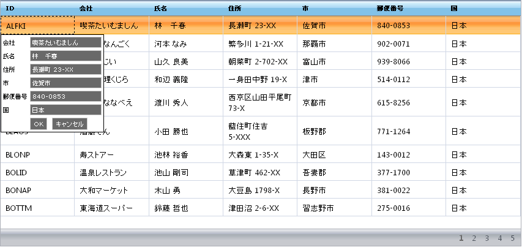

////

|metadata|
{
    "name": "webdatagrid-row-editing-template",
    "controlName": ["WebDataGrid"],
    "tags": ["Editing","Grids","Templating"],
    "guid": "{909EA82B-BEB6-4642-B2E3-74CCCB3A14EF}",  
    "buildFlags": [],
    "createdOn": "2008-12-08T16:10:38Z"
}
|metadata|
////

= 行編集テンプレート

== カスタム編集

pick:[asp-net="link:{ApiPlatform}web{ApiVersion}~infragistics.web.ui.gridcontrols.roweditingtemplate.html[行編集テンプレート]"] は WebDataGrid™ でのデータ編集のためのカスタムインタフェースをエンドユーザーに示すことを可能にする機能です。任意のコントロールをこのテンプレートに移植できます。エンド ユーザーが行を編集しようとするとテンプレートが表示します。 pick:[asp-net="link:{ApiPlatform}web{ApiVersion}~infragistics.web.ui.gridcontrols.roweditingtemplate~editmodeactions.html[EditModeActions]"]  プロパティを使用してテンプレートを表示させるアクションを指定するためのオプションを設定できます。エンド ユーザーはテンプレートを使用してデータを編集します。そしてテンプレートが閉じると、変更が対応する行に適用されます。

== デフォルトのテンプレート生成

行編集テンプレートを初めて有効にする時に、デフォルトの TextBox エディタ コントロールで移植するためのオプションが与えられます。各列の  pick:[asp-net="link:{ApiPlatform}web{ApiVersion}~infragistics.web.ui.gridcontrols.gridfield~header.html[Header]"]  情報は作成された 
 タグ内に記述されます。

== データ バインディング

デフォルトで、WebDataGrid はセルと行編集テンプレートのデフォルト エディタ間の変更を保持します。行編集テンプレートのためにさまざまなエディタを提供したい場合には、これらのエディタをそれぞれの列にバインドして、2 つの間で変更を反映します。

クライアント バインディング エディタを使用してバインディングを指定できます。Javascript 表現を指定することによってより高度なバインディングを実現することができます。カスタム バインディングの詳細は、 link:webdatagrid-using-client-bindings.html[クライアント バインディングの使用]を参照してください。

== 行編集テンプレートを閉じる

行編集テンプレートはデフォルトの OK ボタンとキャンセル ボタンを生成します。いずれのボタンもテンプレートを閉じます。OK ボタンは変更をコミットしますが、キャンセル ボタンは変更を拒否します。

OK ボタンとキャンセル ボタンに異なるコントロールを指定できます。IButtonControl インタフェースを実装する任意のコントロールを使用できます（Button、LinkButton、ImageButton など）。行編集テンプレートの OK ボタンとキャンセル ボタンの設定の詳細は、 link:webdatagrid-using-client-bindings.html[クライアント バインディングの使用]を参照してください。

エンド ユーザーがOK ボタンとキャンセル ボタンを押すまで行編集テンプレートは開かれたままです。ポストバックまたは AJAX が発生する場合もテンプレートが閉じます。クライアント側の閉じるイベントを処理してテンプレートを閉じる動作をキャンセルすることで、サーバーへのコールバックをキャンセルすることができます。

== 関連トピック

link:webdatagrid-enabling-row-editing-template.html[行編集テンプレートを有効]

link:webdatagrid-using-client-bindings.html[クライアント バインディングの使用]