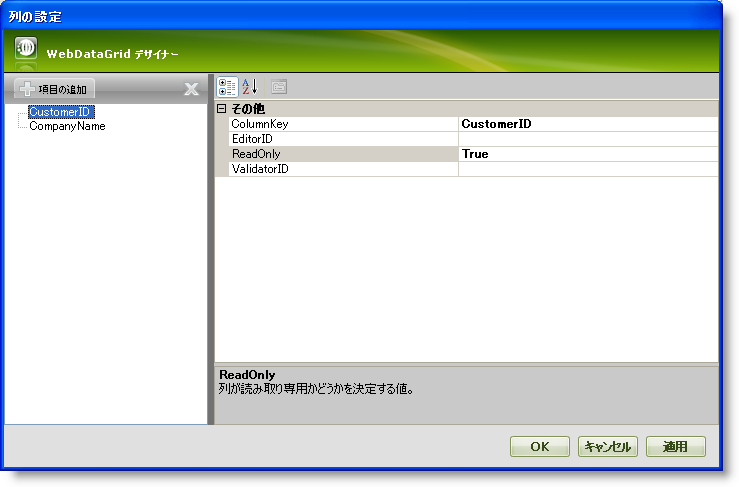
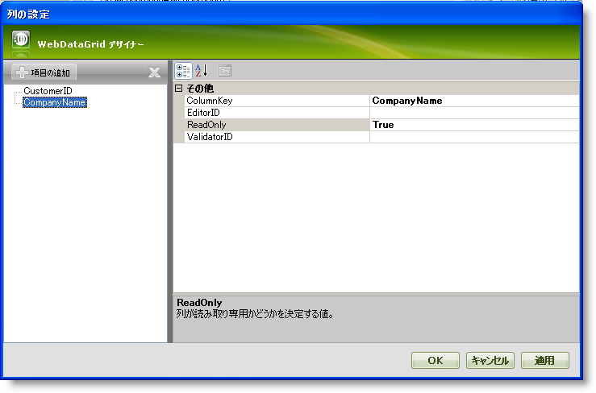

////
|metadata|
{
    "name": "webdatagrid-setting-column-settings-for-a-behavior",
    "controlName": ["WebDataGrid"],
    "tags": ["Grids"],
    "guid": "{BE21A2E2-2E3C-4C65-83DD-E2EB1239E20E}",
    "buildFlags": [],
    "createdOn": "2008-10-09T11:27:13Z"
}
|metadata|
////

= 動作に列設定を設定

== 始める前に

列ごとに特定の動作を設定できます。これによって、WebDataGrid™ で列の選択番号のみに動作を制限することができます。これはプライマリ キー列、またはエンド ユーザーが編集すべきではない列がある時に非常に役に立ちます。

動作エディタで列単位ごとに設定できる各動作に対して、動作を有効にする列を指定するための列設定コレクションがあります。列設定を追加することにより、列のための特定の動作を有効/無効にすることができます。

動作ごとにひとつ、6 つの異なる種類の列設定があります。列設定を以下にリストします。

*  pick:[asp-net="link:{ApiPlatform}web{ApiVersion}~infragistics.web.ui.gridcontrols.columneditsetting.html[ColumnEditSetting]"] 
*  pick:[asp-net="link:{ApiPlatform}web{ApiVersion}~infragistics.web.ui.gridcontrols.columnfilteringsetting.html[ColumnFilteringSetting]"] 
*  pick:[asp-net="link:{ApiPlatform}web{ApiVersion}~infragistics.web.ui.gridcontrols.columnresizesetting.html[ColumnResizeSetting]"] 
*  pick:[asp-net="link:{ApiPlatform}web{ApiVersion}~infragistics.web.ui.gridcontrols.editingcolumnsetting.html[EditingColumnSetting]"] 
*  pick:[asp-net="link:{ApiPlatform}web{ApiVersion}~infragistics.web.ui.gridcontrols.rowaddingcolumnsetting.html[RowAddingColumnSetting]"] 
*  pick:[asp-net="link:{ApiPlatform}web{ApiVersion}~infragistics.web.ui.gridcontrols.sortingcolumnsetting.html[SortingColumnSetting]"] 

列設定を追加するとき、特にマークアップでは、設定が動作に対応することを確認します（たとえば、EditingColumnSetting は Editing 動作に使用するための設定です）。

*注：* コントロール レベルで WebDataGrid に動作を追加してからでなければ列レベルで有効/無効にできません。

== 達成すること

WebDataGrid の動作エディタを使用してデータ編集を 2 列のみに制限します。

== 次の手順を実行します

[start=1]
. WebDataGrid を SqlDataSource コンポーネントにバインドして、Customers テーブルからデータを取得します。列 CustomerID、CompanyName、ContactName および ContactTitle のみを含みます。実行についての詳細は、 link:webdatagrid-getting-started-with-webdatagrid.html[WebDataGrid で開始]を参照してください。
[start=2]
. Microsoft® Visual Studio™ プロパティ ウィンドウで、 pick:[asp-net="link:{ApiPlatform}web{ApiVersion}~infragistics.web.ui.gridcontrols.behaviors.html[Behaviors]"]  プロパティを指定して、省略記号 (...) ボタンをクリックして、[動作エディタ] ダイアログを起動します。
[start=3]
. 有効にするには左のリストの  pick:[asp-net="link:{ApiPlatform}web{ApiVersion}~infragistics.web.ui.gridcontrols.cellediting.html[CellEditing]"]  動作チェックボックスをチェックします。
[start=4]
. セル編集のプロパティで、 pick:[asp-net="link:{ApiPlatform}web{ApiVersion}~infragistics.web.ui.gridcontrols.cellediting~columnsettings.html[ColumnSettings]"]  プロパティを選択して、省略記号 (...) ボタンをクリックし列設定デザイナを起動します。
[start=5]
. CustomerID および CompanyName フィールドの列設定項目を 2 つ追加します。ほとんどの場合これらの列はエンド ユーザーが編集すべきではないため、読み取り専用にします。

.. 最初の列の  pick:[asp-net="link:{ApiPlatform}web{ApiVersion}~infragistics.web.ui.gridcontrols.columnsetting~columnkey.html[ColumnKey]"]  プロパティを CustomerID に設定します。
+

.. 2 番目の ColumnKey プロパティを CompanyName に設定します。
+

.. 両方の ReadOnly プロパティを True に設定します。

[start=6]
. [適用] そして [OK] ボタンをクリックしてエディタを閉じます。
[start=7]
. [適用] そして [OK] ボタンをクリックして動作エディタを閉じます。

*コードで上記の手順を実行することも可能です。*

*Visual Basic の場合：*

----
Me.WebDataGrid1.Behaviors.CreateBehavior(Of EditingCore)()
Me.WebDataGrid1.Behaviors.EditingCore.Behaviors.CreateBehavior(Of CellEditing)()
' 列設定を作成します。 
Dim settingColumn1 As New EditingColumnSetting() 
settingColumn1.ColumnKey = "CustomerID" 
settingColumn1.ReadOnly = True 
Dim settingColumn2 As New EditingColumnSetting() 
settingColumn2.ColumnKey = "CompanyName" 
settingColumn2.ReadOnly = True 
' 列設定を追加します。 
Me.WebDataGrid1.Behaviors.EditingCore.Behaviors.CellEditing.ColumnSettings.Add(settingColumn1) 
Me.WebDataGrid1.Behaviors.EditingCore.Behaviors.CellEditing.ColumnSettings.Add(settingColumn2)
----

*C# の場合：*

----
this.WebDataGrid1.Behaviors.CreateBehavior<EditingCore>();
this.WebDataGrid1.Behaviors.EditingCore.Behaviors.CreateBehavior<CellEditing>();
// 列設定を作成します。
EditingColumnSetting settingColumn1 = new EditingColumnSetting();
settingColumn1.ColumnKey = "CustomerID";
settingColumn1.ReadOnly = true;
EditingColumnSetting settingColumn2 = new EditingColumnSetting();
settingColumn2.ColumnKey = "CompanyName";
settingColumn2.ReadOnly = true;
// 列設定を追加します。
this.WebDataGrid1.Behaviors.EditingCore.Behaviors.CellEditing.ColumnSettings.Add(settingColumn1);
this.WebDataGrid1.Behaviors.EditingCore.Behaviors.CellEditing.ColumnSettings.Add(settingColumn2);
----

[start=8]
. アプリケーションを実行します。エンド ユーザーは、Contactname および ContactTitle 列を編集することだけが許可されています。