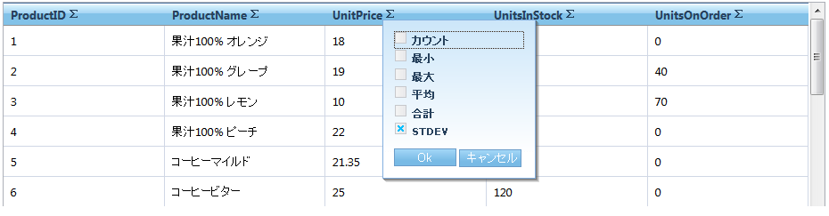
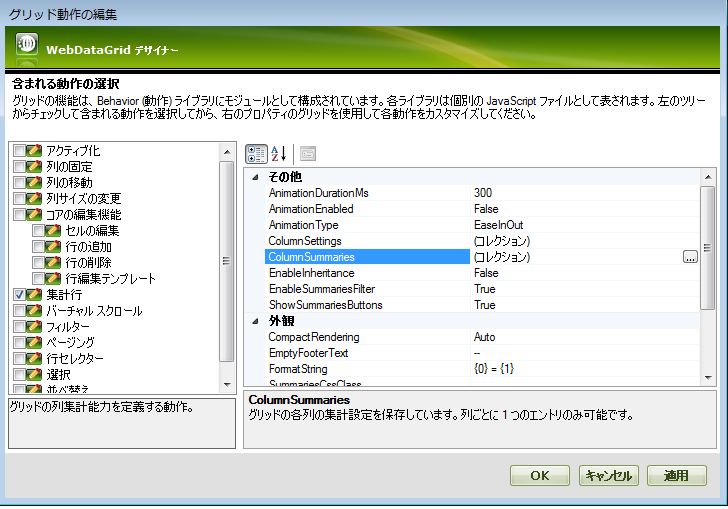
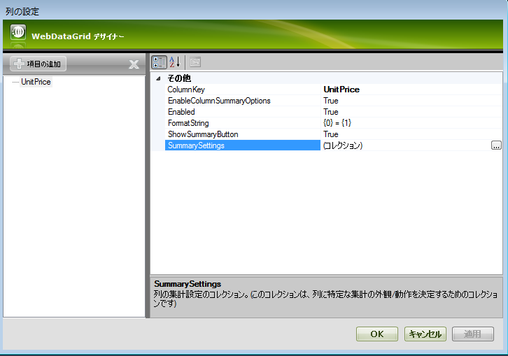
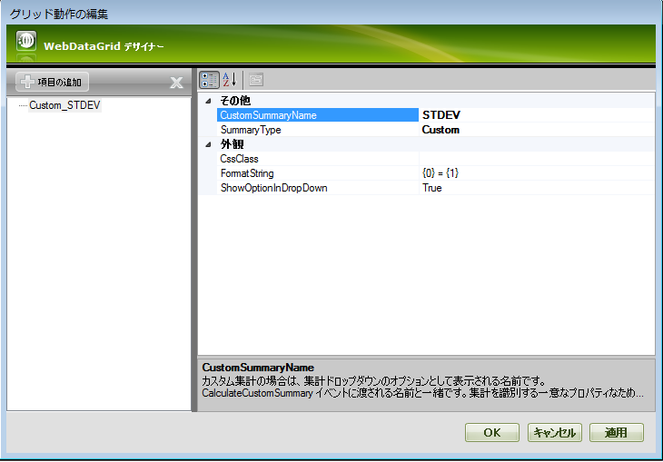
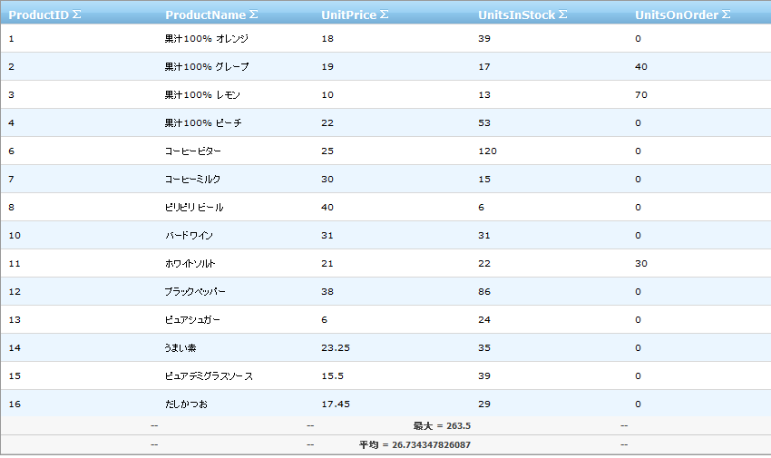

////

|metadata|
{
    "name": "webdatagrid-summary-row",
    "controlName": ["WebDataGrid"],
    "tags": ["Grids","Summaries"],
    "guid": "3ab2661f-cff0-45b4-b050-9f634c898a98",  
    "buildFlags": [],
    "createdOn": "2010-09-30T07:20:01.962929Z"
}
|metadata|
////

= 集計行

WebDataGrid によって、開発者とエンドユーザーは任意の列に数値データの集計を表示できます。以下の集計が可能です。

* 数
* 合計
* 平均値
* 最小値
* 最大値
* カスタム集計

デザイナーを介して、Microsoft® Visual Studio® [プロパティ] ウィンドウ、または以下のコードを使用して WebDataGrid で集計行動作を有効にできます:

*Visual Basic の場合：*

----
WebDataGrid1.Behaviors.CreateBehavior(Of SummaryRow)()
----

*C# の場合：*

----
WebDataGrid1.Behaviors.CreateBehavior();
----

有効の時には、この動作によって集計ボタンが各ヘッダーに追加されます。ボタンが押されると、使用可能な集計を含んだドロップダウンが表示します。

*注：* 標準的な集計が使用できるのは数値データのみです。例外は Count link:{ApiPlatform}web{ApiVersion}~infragistics.web.ui.gridcontrols.summarytype.html[集計タイプ]でこれを常に使用できます。

== 集計行を有効にします

[start=1]
. WebDataGrid を SqlDataSource コンポーネントにバインドして、Products テーブルからデータを取得します。ProductID、ProductName、UnitPrice、UnitsInStock および UnitsOnOrder フィールドを取得します。実行についての詳細は、 link:webdatagrid-getting-started-with-webdatagrid.html[WebDataGrid で開始]を参照してください。
[start=2]
. [プロパティ] ウィンドウで、 link:{ApiPlatform}web{ApiVersion}~infragistics.web.ui.gridcontrols.webdatagrid~behaviors.html[Behaviors] プロパティを指定して、省略記号 (...) ボタンをクリックし、[動作の編集] ダイアログを起動します。
[start=3]
. link:{ApiPlatform}web{ApiVersion}~infragistics.web.ui.gridcontrols.summaryrow.html[集計行]動作をチェックして以下の画像に示すように有効にします:

[start=4]
. link:{ApiPlatform}web{ApiVersion}~infragistics.web.ui.gridcontrols.summaryrow~columnsummaries.html[ColumnSummaries] 省略記号（…）ボタンをクリックして、 link:{ApiPlatform}web{ApiVersion}~infragistics.web.ui.gridcontrols.columnsummaryinfo.html[ColumnSummaryInfo] エディター ダイアログを起動します。
[start=5]
. [追加] ボタンをクリックします。 link:{ApiPlatform}web{ApiVersion}~infragistics.web.ui.gridcontrols.columnsummaryinfo~columnkey.html[ColumnKey] プロパティで "UnitPrice" を選択します。

[start=6]
. link:{ApiPlatform}web{ApiVersion}~infragistics.web.ui.gridcontrols.summaries.html[Summaries] 省略記号 (…) ボタンを選択して [ link:{ApiPlatform}web{ApiVersion}~infragistics.web.ui.gridcontrols.summary.html[Summary] コレクション エディター] ダイアログを起動します。
[start=7]
. [追加] ボタンをクリックします。 link:{ApiPlatform}web{ApiVersion}~infragistics.web.ui.gridcontrols.summary~summarytype.html[SummaryType] ドロップダウン ボタンを開き、Average を選択します。

[start=8]
. 前述の手順を繰り返します。SummaryType ドロップダウンから Max を選択し、[OK] ボタンをクリックしてダイアログを閉じます。以下のマークアップが生成されるはずです。

*HTML の場合:*

----
<Behaviors>
    <ig:SummaryRow AnimationType="Linear">
        <ColumnSummaries>
            <ig:ColumnSummaryInfo ColumnKey="UnitPrice">
                <Summaries>
                    <ig:Summary SummaryType="Average" />
                    <ig:Summary SummaryType="Max" />
                </Summaries>
            </ig:ColumnSummaryInfo>
        </ColumnSummaries>
    </ig:SummaryRow>
</Behaviors>
----

コード ビハインドから集計行を追加するには、以下のコードを追加します。

*Visual Basic の場合：*

----
Dim unitPriceSummary As New ColumnSummaryInfo()
unitPriceSummary.ColumnKey = "UnitPrice"
unitPriceSummary.Summaries.Add(SummaryType.Average)
unitPriceSummary.Summaries.Add(SummaryType.Max)
WebDataGrid1.Behaviors.SummaryRow.ColumnSummaries.Add(unitPriceSummary)
----

*C# の場合：*

----
ColumnSummaryInfo unitPriceSummary = new ColumnSummaryInfo();
unitPriceSummary.ColumnKey = "UnitPrice";
unitPriceSummary.Summaries.Add(SummaryType.Average);
unitPriceSummary.Summaries.Add(SummaryType.Max);
WebDataGrid1.Behaviors.SummaryRow.ColumnSummaries.Add(unitPriceSummary);
----

[start=9]
. アプリケーションを実行します。WebDataGrid は、UnitPrice 列の Average および Max 集計を表示します。列のヘッダーの集計ボタンをクリックし、ドロップダウン オプションから集計タイプを選択することによって追加集計を追加できます。

