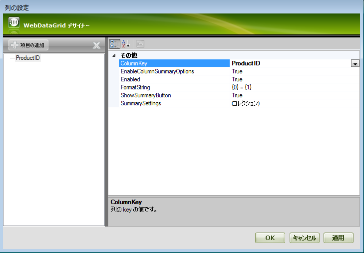
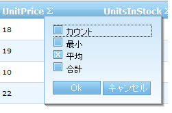
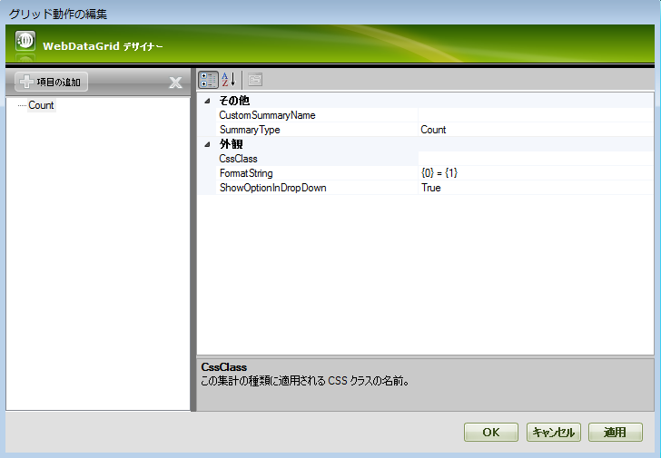
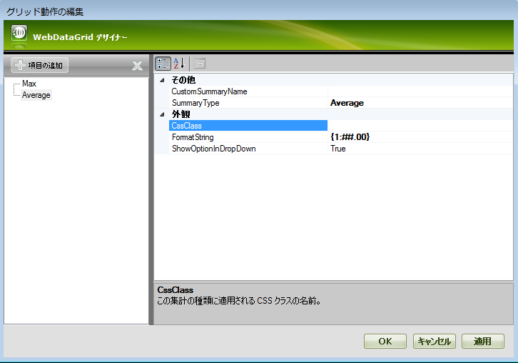
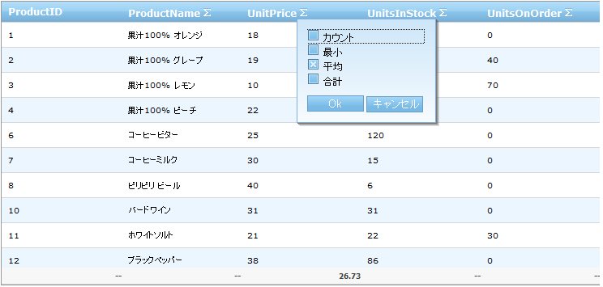

////

|metadata|
{
    "name": "webdatagrid-summary-settings",
    "controlName": ["WebDataGrid"],
    "tags": ["Grids","Summaries"],
    "guid": "405a2f67-a55e-424f-abdb-3d3f25079db2",  
    "buildFlags": [],
    "createdOn": "2010-09-29T12:35:01.7768869Z"
}
|metadata|
////

= 集計の設定

== 始める前に

集計行動作が有効の時、各列のヘッダーに集計ボタンが描画されます。ボタンが押されると、使用可能な集計を含んだドロップダウンが表示します。集計が選択されると、グリッドのフッターに新しい行（集計行）が現れて集計値が表示されます。

== 達成すること

以下のトピックでは特定の列の集計を設定する方法を示します。列の集計ボタンを無効にする、集計オプションから集計を無効にする、集計値の文字列の書式を設定する方法を学習します。

== 次の手順を実行します

[start=1]
. link:webdatagrid-summary-row.html[「集計行」]トピックに示されるように、グリッドをバインドして平均集計を追加します。
[start=2]
. [グリッド動作の編集] ダイアログ ウィンドウで、[集計行] をクリックし、次に link:{ApiPlatform}web{ApiVersion}~infragistics.web.ui.gridcontrols.summaryrow~columnsettings.html[ColumnSettings] 省略記号（...）をクリックして link:{ApiPlatform}web{ApiVersion}~infragistics.web.ui.gridcontrols.columnsetting.html[ColumnSetting] ダイアログを起動します。
[start=3]
. [項目の追加] ボタンをクリックして、 link:{ApiPlatform}web{ApiVersion}~infragistics.web.ui.gridcontrols.columnsetting~columnkey.html[ColumnKey] ドロップダウン から [ProductID] を選択します。

[start=4]
. link:{ApiPlatform}web{ApiVersion}~infragistics.web.ui.gridcontrols.summaryrowsetting~showsummarybutton.html[ShowSummaryButton] を False に設定します。このように、ProductID 列の集計ボタン（集計リストを表示）はヘッダーに表示されません。この階層のその他の使用可能なプロパティは以下の通りです。

** link:{ApiPlatform}web{ApiVersion}~infragistics.web.ui.gridcontrols.summaryrowsetting~enablecolumnsummaryoptions.html[EnableColumnSummaryOptions] - これが False に設定された場合、デフォルトの集計タイプはドロップダウンから使用できなくなります。
** link:{ApiPlatform}web{ApiVersion}~infragistics.web.ui.gridcontrols.summaryrowsetting~enabled.html[Enabled] - これが False に設定された場合、この列の集計は計算できなくなります。

以下のマークアップが生成されます。

*HTML の場合:*

----
<Behaviors>
    <ig:SummaryRow>
        <ColumnSummaries>
            <ig:ColumnSummaryInfo ColumnKey="UnitPrice">
                <Summaries>
                    <ig:Summary SummaryType="Average" />
                </Summaries>
            </ig:ColumnSummaryInfo>
        </ColumnSummaries>
        <ColumnSettings>
            <ig:SummaryRowSetting ColumnKey="ProductID" Enabled=">
            </ig:SummaryRowSetting>
        </ColumnSettings>
    </ig:SummaryRow>
</Behaviors>        
----

コード ビハンドからこれを実行するには、以下のコードを追加します。

*C# の場合：*

----
SummaryRowSetting settings = new SummaryRowSetting(WebDataGrid1, "ProductID");
settings.ShowSummaryButton = false;
this.WebDataGrid1.Behaviors.SummaryRow.ColumnSettings.Add(settings);
----

*Visual Basic の場合：*

----
Dim settings As New SummaryRowSetting(WebDataGrid1, "ProductID")
settings.ShowSummaryButton = False
Me.WebDataGrid1.Behaviors.SummaryRow.ColumnSettings.Add(settings)
----

[start=5]
. [項目の追加] ボタンをクリックして、ColumnKey ドロップダウン から [UnitPrice] を選択します。
[start=6]
. link:{ApiPlatform}web{ApiVersion}~infragistics.web.ui.gridcontrols.summaryrowsetting~summarysettings.html[SummarySettings] コレクション省略記号 (…) をクリックして link:{ApiPlatform}web{ApiVersion}~infragistics.web.ui.gridcontrols.summarysetting.html[SummarySetting] ダイアログを開きます。
[start=7]
. [項目の追加] ボタンをクリックします。以下の画面が表示するはずです。

[start=8]
. SummaryType ドロップダウンから [Max] を選択します。 link:{ApiPlatform}web{ApiVersion}~infragistics.web.ui.gridcontrols.summarysetting~showoptionindropdown.html[ShowOptionInDropDown] を False に設定して [OK] をクリックします。このように集計オプション ドロップダウンで最大値の集計が使用できなくなります。

[start=9]
. [項目の追加] ボタンをクリックして、SummaryType ドロップダウン から [Average] を選択します。 link:{ApiPlatform}web{ApiVersion}~infragistics.web.ui.gridcontrols.summarysetting~formatstring.html[FormatString] を {0} = {1:##.00} に変更します。このように、小数点第二位までしか表示しないように、UnitPrice 列の平均集計の書式を指定します。

[OK] ボタンをクリックします。以下のマークアップが生成されるはずです。

*HTML の場合:*

----
<Behaviors>
    <ig:SummaryRow>
        <ColumnSummaries>
            <ig:ColumnSummaryInfo ColumnKey="UnitPrice">
                <Summaries>
                    <ig:Summary SummaryType="Average" />
                </Summaries>
            </ig:ColumnSummaryInfo>
        </ColumnSummaries>
        <ColumnSettings>
            <ig:SummaryRowSetting ColumnKey="ProductID" ShowSummaryButton=">
            </ig:SummaryRowSetting>
            <ig:SummaryRowSetting ColumnKey="UnitPrice">
                <SummarySettings>
                    <ig:SummarySetting ShowOptionInDropDown=" SummaryType="Max" />
                    <ig:SummarySetting FormatString="{0} = {1:###.00}" 
                        SummaryType="Average" />
                </SummarySettings>
            </ig:SummaryRowSetting>
        </ColumnSettings>
    </ig:SummaryRow>
</Behaviors>
----

コード ビハンドからこれを実行するには、以下のコードを追加します。

*C# の場合：*

----
SummaryRowSetting unitPriceSetting = new SummaryRowSetting(WebDataGrid1, "UnitPrice");
SummarySetting maxSummarySetting = new SummarySetting();
maxSummarySetting.ShowOptionInDropDown = false;
maxSummarySetting.SummaryType = SummaryType.Max;
unitPriceSetting.SummarySettings.Add(maxSummarySetting);
SummarySetting averegeSummarySetting = new SummarySetting();
averegeSummarySetting.FormatString = "{0} = {1:###.00}";
averegeSummarySetting.SummaryType = SummaryType.Average;
unitPriceSetting.SummarySettings.Add(averegeSummarySetting);
this.WebDataGrid1.Behaviors.SummaryRow.ColumnSettings.Add(unitPriceSetting);
----

*Visual Basic の場合：*

----
Dim unitPriceSetting As New SummaryRowSetting(WebDataGrid1, "UnitPrice")
Dim maxSummarySetting As New SummarySetting()
maxSummarySetting.ShowOptionInDropDown = False
maxSummarySetting.SummaryType = SummaryType.Max
unitPriceSetting.SummarySettings.Add(maxSummarySetting)
Dim averegeSummarySetting As New SummarySetting()
averegeSummarySetting.FormatString = "{0} = {1:###.00}"
averegeSummarySetting.SummaryType = SummaryType.Average
unitPriceSetting.SummarySettings.Add(averegeSummarySetting)
Me.WebDataGrid1.Behaviors.SummaryRow.ColumnSettings.Add(unitPriceSetting)
----

[start=10]
. アプリケーションを実行します。UnitPrice 列ヘッダーの集計ボタンをクリックすると、オプションに最大値集計タイプは表示されなくなります。ProductID 列の集計ボタンも表示されず、UnitPrice 列の平均集計は小数点第二位まで表示することを確認します。

