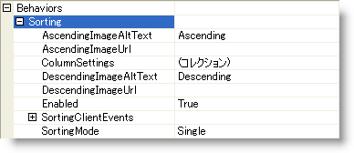
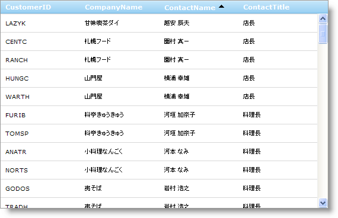

////

|metadata|
{
    "name": "webdatagrid-using-behaviors",
    "controlName": ["WebDataGrid"],
    "tags": ["Grids","Sorting"],
    "guid": "{B665FB6E-6E5F-414E-9186-2907C03B2FE8}",  
    "buildFlags": [],
    "createdOn": "0001-01-01T00:00:00Z"
}
|metadata|
////

= デザインタイムで動作を追加

== 始める前に

WebDataGrid™ で特性や機能を有効にするには、 pick:[asp-net="link:{ApiPlatform}web{ApiVersion}~infragistics.web.ui.gridcontrols.behaviors.html[Behaviors]"]  コレクションを使用します。ソートやページングなどの WebDataGrid のさまざまな機能を有効にするには、このコレクションに動作を追加できます。動作をコレクションに追加すると自動的に有効になります。Enabled プロパティを False に設定することによってコレクションから削除することなく動作を無効にできます。追加された動作は、WebDataGrid の動作コレクションの下の Microsoft® Visual Studio™ プロパティ ウィンドウを通して表示およびアクセスできます。

動作に適用されるプロパティおよびクライアント側イベントは、動作を追加する時にまたは動作を追加した後でプロパティ ウィンドウで調整できます。

== 達成すること

pick:[asp-net="link:{ApiPlatform}web{ApiVersion}~infragistics.web.ui.gridcontrols.sorting.html[Sorting]"]  動作を使用して WebDataGrid のためのソートを有効にする方法を学習します。

== 次の手順を実行します

[start=1]
. WebDataGrid を SqlDataSource コンポーネントにバインドして、Customers テーブルからデータを取得します。実行についての詳細は、 link:webdatagrid-getting-started-with-webdatagrid.html[「WebDataGrid を SQL データ ソースにバインド」]を参照してください。
[start=2]
. プロパティ ウィンドウで、Behaviors プロパティを指定して、省略記号 (...) ボタンをクリックし、[動作エディタ] ダイアログを起動します。
[start=3]
. 動作を有効にするために左側の動作のリストのソートの隣のチェックボックスをチェックします。
[start=4]
. プロパティで  pick:[asp-net="link:{ApiPlatform}web{ApiVersion}~infragistics.web.ui.gridcontrols.sorting~sortingmode.html[SortingMode]"]  を Single のままにしておきます。

image::images/WebDataGrid_Using_Behaviors_01.png[]

[start=5]
. [OK] をクリックしてこのダイアログ ウィンドウを閉じます。
[start=6]
. プロパティ グリッドで Behaviors コレクションを展開して、Sorting が追加されたことを確認します。

[start=7]
. アプリケーションを実行します。WebDataGrid で一度にソート可能なのは 1 列のみです。

== 関連トピック

link:webdatagrid-adding-a-behavior-at-runtime.html[ランタイムで動作を追加]