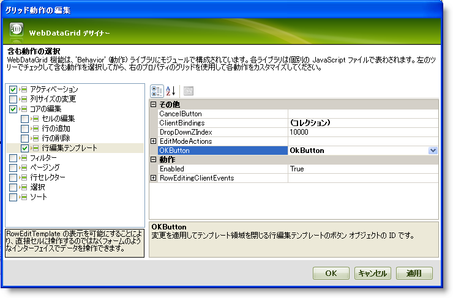
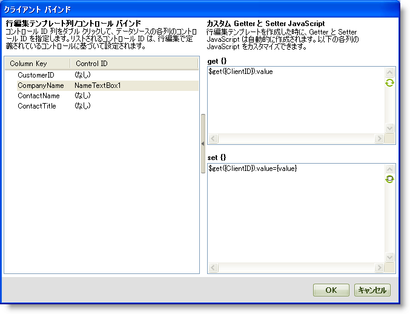

////

|metadata|
{
    "name": "webdatagrid-using-client-bindings",
    "controlName": ["WebDataGrid"],
    "tags": ["Data Binding","Grids"],
    "guid": "{1B10BB72-A36D-44DA-9894-64DF48C876C5}",  
    "buildFlags": [],
    "createdOn": "2008-08-10T15:20:24Z"
}
|metadata|
////

= クライアント バインディングの使用

== 始める前に

初めて pick:[asp-net="link:{ApiPlatform}web{ApiVersion}~infragistics.web.ui.gridcontrols.roweditingtemplate.html[行編集テンプレート]"] を有効にして、テンプレートのデフォルト コントロールを受け入れると、各 TextBox コントロールはすでに WebDataGrid™ にあるフィールドにバインドされています。ただし、行編集テンプレートにコントロールを追加したい場合、またはデフォルト コントロールを受け入れない場合には、コントロールと WebDataGrid 内のフィールド間に自動バインディングはなくなるので、このバインディングを構成する必要があります。

Client Bindings コレクションによって、行編集テンプレート内のコントロールにカスタム バインディングを追加できます。値を取得または設定するためにシンプルな Javascript 文を提供する、またはより複雑なバインディングのためにコードを提供することができます。

== 達成すること

行編集テンプレートの TextBox を WebDataGrid 内のフィールドにバインドする方法を学習します。

== 次の手順を実行します

[start=1]
. WebDataGrid を SqlDataSource コンポーネントにバインドして、Customers テーブルからデータを取得します。実行についての詳細は、 link:webdatagrid-getting-started-with-webdatagrid.html[WebDataGrid で開始]を参照してください。
[start=2]
. ひとつのラベル、TextBox、2 つのボタンが付いた行編集テンプレートを作成します。デザイナで RowEditingTemplate を有効にすることの詳細は、 link:webdatagrid-enabling-row-editing-template.html[行編集テンプレートを有効]を参照してください。

*Visual Basic の場合：*

----
' 行編集テンプレートを有効にします。 
Me.WebDataGrid1.Behaviors.CreateBehavior(Of EditingCore)() 
Me.WebDataGrid1.Behaviors.EditingCore.Behaviors.CreateBehavior(Of RowEditingTemplate)() 
' 編集モード アクションをダブルクリックするように設定します。 
Me.WebDataGrid1.Behaviors.EditingCore.Behaviors.RowEditTemplate.EditModeActions.MouseClick = EditMouseClickAction.[Double] 
' カスタム テンプレートを作成します。 
Me.WebDataGrid1.Behaviors.EditingCore.Behaviors.RowEditTemplate.Template = New CustomRowEditingTemplate() 
Private Class CustomRowEditingTemplate 
    Implements ITemplate 
    #Region "ITemplate Members" 
    Public Sub InstantiateIn(container As Control) Implements System.Web.UI.ITemplate.InstantiateIn
        Dim label1 As New Label() 
        label1.Text = "CompanyName" 
        label1.ID = "NameLabel1" 
        Dim textBox1 As New TextBox() 
        textBox1.ID = "NameTextBox1" 
        Dim b1 As New Button() 
        b1.Text = "OK" 
        b1.ID = "OkButton" 
        b1.UseSubmitBehavior = False 
        b1.OnClientClick = "return" 
        b1.CausesValidation = False 
        Dim b2 As New Button() 
        b2.Text = "Cancel" 
        b2.ID = "CancelButton" 
        b2.UseSubmitBehavior = False 
        b2.OnClientClick = "return" 
        b2.CausesValidation = False 
        container.Controls.Add(label1) 
        container.Controls.Add(textBox1) 
        container.Controls.Add(b1) 
        container.Controls.Add(b2) 
    End Sub 
    #End Region 
End Class
----

*C# の場合：*

----
// 行編集テンプレートを有効にします。
this.WebDataGrid1.Behaviors.CreateBehavior<EditingCore>();
this.WebDataGrid1.Behaviors.EditingCore.Behaviors.CreateBehavior<RowEditingTemplate>();
// 編集モード アクションをダブルクリックするように設定します。
this.WebDataGrid1.Behaviors.EditingCore.Behaviors.RowEditTemplate.EditModeActions.MouseClick = EditMouseClickAction.Double;
// カスタム テンプレートを作成します。
this.WebDataGrid1.Behaviors.EditingCore.Behaviors.RowEditTemplate.Template = new CustomRowEditingTemplate();
private class CustomRowEditingTemplate : ITemplate
{
        #region ITemplate Members
        public void InstantiateIn(Control container)
        {
                Label label1 = new Label();
                label1.Text = "CompanyName";
                label1.ID = "NameLabel1";
                TextBox textBox1 = new TextBox();
                textBox1.ID = "NameTextBox1";
                Button b1 = new Button();
                b1.Text = "OK";
                b1.ID = "OkButton";
                b1.UseSubmitBehavior = false;
                b1.OnClientClick = "return";
                b1.CausesValidation = false;
                Button b2 = new Button();
                b2.Text = "Cancel";
                b2.ID = "CancelButton";
                b2.UseSubmitBehavior = false;
                b2.OnClientClick = "return";
                b2.CausesValidation = false;
                container.Controls.Add(label1);
                container.Controls.Add(textBox1);
                container.Controls.Add(b1);
                container.Controls.Add(b2);
        }
        #endregion
}
----

[start=3]
. デザイナで RowEditingTemplate を作成した場合、以下の下位の手順は TextBox と CompanyName フィールド間でバインディングを設定する方法を示します。コードでこれを実行することを選択する場合、この手順をスキップします。

.. Microsoft® Visual Studio™ プロパティ ウィンドウで、Behaviors プロパティを指定して、省略記号 (...) ボタンをクリックし、[動作エディタ] ダイアログを起動します。
.. 行編集テンプレートを選択します。
.. プロパティで、OkButton および CancelButton プロパティをそれぞれテンプレートに持っている OK ボタンとキャンセル ボタンの ID に設定します。これはこれらのボタンが行編集テンプレートの OK およびキャンセルのアクションを発生させることを WebDataGrid に通知します。

.. プロパティで、 pick:[asp-net="link:{ApiPlatform}web{ApiVersion}~infragistics.web.ui.gridcontrols.roweditingtemplate~clientbindings.html[ClientBindings]"]  プロパティを指定して省略ボタン（...）をクリックしてクライアント バインディング エディタを起動します。
.. Column Key 列で CompanyName を見つけて、行編集テンプレートのテキストボックスの ID である、Control ID を NameTextBox1 に設定します。
.. エディタの端にある右矢印ボタンをクリックして展開します。エディタはより詳細な設定を表示します。ここでカスタムの Javascript コードを提供してコントロールを何かにバインドします。デフォルトで、列の Control ID を選択すると、コントロールの値を取得および設定するためにシンプルな文が提供されます。
.. エディタの取得および設定 セクションの更新ボタンをそれぞれクリックして、Javascript 文を表示してエディタの値を取得および設定します。

[start=4]
. TextBox と CompanyName 列の間のバインディングを指定するために以下のコードを提供します。さらに、行編集テンプレートの OK およびキャンセル アクションを制御するボタンを指定します。デザイナでこれを実行することを選択する場合には、手順 3 に進みます。

*Visual Basic の場合：*

----
' OK およびキャンセル アクションを発生させるボタンを設定します。 
Me.WebDataGrid1.Behaviors.EditingCore.Behaviors.RowEditTemplate.OKButton = "OkButton" 
Me.WebDataGrid1.Behaviors.EditingCore.Behaviors.RowEditTemplate.CancelButton = "CancelButton" 
' クライアント バインディングを作成します。 
Dim item As New RowEditingClientBinding() 
item.ColumnKey = "CompanyName" 
' テキストボックスのクライアント ID 
item.ControlID = "WebDataGrid1_ctl00_NameTextBox1" 
' テキストボックスから値を取得します。 
item.GetValueJavaScript = "$get('WebDataGrid1_ctl00_NameTextBox1').value" 
' バインド先のフィールド内のセルの値にテキストボックスの値を設定します。 
item.SetValueJavaScript = "$get('WebDataGrid1_ctl00_NameTextBox1').value={value};" 
' クライアント バインディングを追加します。 
Me.WebDataGrid1.Behaviors.EditingCore.Behaviors.RowEditTemplate.ClientBindings.Add(item)
----

*C# の場合：*

----
this.WebDataGrid1.Behaviors.EditingCore.Behaviors.RowEditTemplate.OKButton = "OkButton";
this.WebDataGrid1.Behaviors.EditingCore.Behaviors.RowEditTemplate.CancelButton = "CancelButton";
// クライアント バインディングを作成します。
RowEditingClientBinding item = new RowEditingClientBinding();
item.ColumnKey = "CompanyName";
// テキストボックスのクライアント ID
item.ControlID = "WebDataGrid1_ctl00_NameTextBox1";
// テキストボックスから値を取得します。
item.GetValueJavaScript = "$get('WebDataGrid1_ctl00_NameTextBox1').value";
// バインド先のフィールド内のセルの値にテキストボックスの値を設定します。
item.SetValueJavaScript = "$get('WebDataGrid1_ctl00_NameTextBox1').value={value};";
// クライアント バインディングを追加します。
this.WebDataGrid1.Behaviors.EditingCore.Behaviors.RowEditTemplate.ClientBindings.Add(item);
----

[start=5]
. アプリケーションを実行します。セルをダブルクリックします。行編集テンプレートが CompanyName 列のセルを編集するために使用できる TextBox とともに表示します。

image::images/WebDataGrid_Using_Client_Bindings_03.png[]

== 関連トピック

link:webdatagrid-enabling-row-editing-template.html[行編集テンプレートを有効]