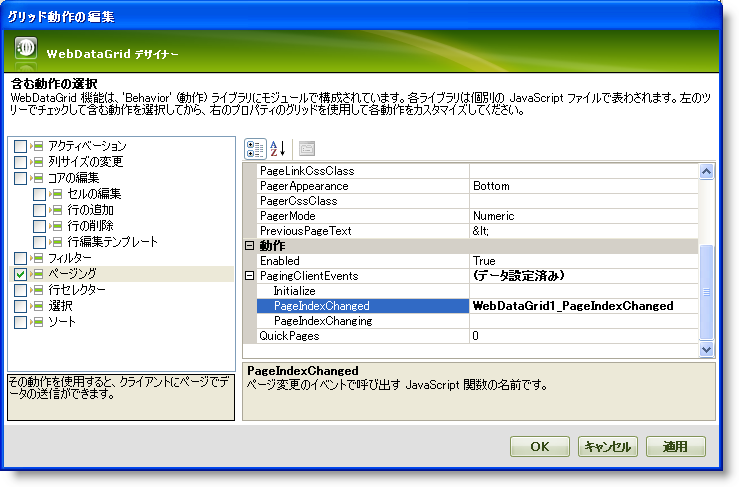
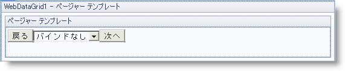

////

|metadata|
{
    "name": "webdatagrid-using-custom-paging-template",
    "controlName": ["WebDataGrid"],
    "tags": ["Grids","Paging"],
    "guid": "{EF2F6FCB-151F-4C9C-86F9-3F3B5D8B4BB7}",  
    "buildFlags": [],
    "createdOn": "0001-01-01T00:00:00Z"
}
|metadata|
////

= カスタム ページング テンプレートの使用

== 始める前に

WebDataGrid™ コントロールのページング テンプレート機能で、ページャーのルック アンド フィールをユーザーの仕様にカスタマイズできます。コントロールをテンプレートに追加できますが、ページャー テンプレートの使用では、ページング メカニズムを手動で操作する必要があります。

== 達成すること

2 つのボタンとひとつのドロップダウン リストを使用して WebDataGrid ページングを設定します。2 つのボタンは前ページと次ページへの移動を処理しますが、ドロップダウン リストは選択したページに移動します。

== 次の手順を実行します

[start=1]
. SqlDataSource コンポーネントを使用して WebDataGrid を Customers テーブルにバインドします。これについての詳細は、 link:webdatagrid-getting-started-with-webdatagrid.html[WebDataGrid で開始]を参照してください。
[start=2]
. Microsoft® Visual Studio™ プロパティ ウィンドウで、Behaviors プロパティを指定して、省略記号 (...) ボタンをクリックし、[動作エディター] ダイアログを起動します。
[start=3]
. この動作を追加して有効にするには、左のリストから  pick:[asp-net="link:{ApiPlatform}web{ApiVersion}~infragistics.web.ui.gridcontrols.paging.html[Paging]"]  の隣りのチェックボックスをチェックします。
[start=4]
. プロパティで、 pick:[asp-net="link:{ApiPlatform}web{ApiVersion}~infragistics.web.ui.gridcontrols.paging~pagingclientevents.html[PagingClientEvents]"]  を展開し、イベント ハンドラ名 WebDataGrid1_PageIndexChanged を入力して  pick:[asp-net="link:{ApiPlatform}web{ApiVersion}~infragistics.web.ui.gridcontrols.pagingclientevents~pageindexchanged.html[PageIndexChanged]"]  イベントを処理します。

[start=5]
. [適用] そして [OK] ボタンをクリックしてエディターを閉じます。
[start=6]
. WebDataGrid を右クリックして編集テンプレートを強調表示します。ページャー テンプレートのオプションが表示されます。

[NOTE]
====
*注：* 複数の動作テンプレートを使用している場合、編集テンプレートのサブメニューのセクションとして動作テンプレートが表示されます。
====

[start=7]
. コンテキスト メニューからページャー テンプレートを選択します。WebDataGrid 表示は、テンプレート編集表示に変わります。

[NOTE]
====
*注：* 追加した動作に基づき、ページャー テンプレートに加えて他のテンプレートが表示されます。
====

[start=8]
. 2 つの HTML ボタンとひとつの ASP.NET DropDownList コントロールをテンプレートに追加します。

.. 2 つのボタンの間にドロップダウン リストを配置します。
.. ドロップダウン リストの前のボタンの値を Prev に設定し、その ID を PrevButton に設定します。
.. 2 番目のボタンの値を Next に設定し、その ID を NextButton に設定します。
.. 各ボタンをダブルクリックしてそれらにイベント ハンドラを追加します。

.. ドロップダウン リストに IndexChanged という名前のクライアント側ハンドラを追加します。ドロップダウンから値を選択する場合、これは WebDataGrid の手動ページングを処理します。ドロップダウン リストの HTML は以下のように表示されるはずです。

*HTML の場合:*

----
<asp:DropDownList ID="DropDownList1" runat="server" onchange="return IndexChanged()">
</asp:DropDownList>
----

[start=9]
. WebDataGrid を再び右クリックして、[テンプレート編集の終了] を選択します。通常のグリッド表示に戻ります。
[start=10]
. ページのロード イベントにデータのページ数を DropDownList コントロールに移植します。

.. ページャー テンプレートでドロップダウン リストへの参照を取得します。これはテンプレート内のコントロールのコンテナである PagerTemplateContainer へのアクセスと、テンプレート内のコントロールを見つける必要があります。
.. ページ数でドロップダウン リストを移植します。91 のレコードを持つ Customers データを取得しているので、デフォルト ページ サイズは 8 で、データは 12 ページ必要です。

*Visual Basic の場合：*

----
If Not Page.IsPostBack Then 
    Dim list1 As DropDownList = DirectCast(Me.WebDataGrid1.Behaviors.Paging.PagerTemplateContainer.FindControl("DropDownList1"), DropDownList) 
    For i As Integer = 1 To 12 
        list1.Items.Add(i.ToString()) 
    Next 
End If
----

*C# の場合：*

----
if (!Page.IsPostBack)
{
        DropDownList list1 = (DropDownList)this.WebDataGrid1.Behaviors.Paging.PagerTemplateContainer.FindControl("DropDownList1");
        for (int i = 1; i $$<=$$ 12; i++)
        {
                list1.Items.Add(i.ToString());
        }
}
----

[start=11]
. ドロップダウン リストの IndexChanged イベント ハンドラに WebDataGrid を手動でページします。

.. WebDataGrid への参照を取得します。
.. ドロップダウン リストから選択した値に基づき WebDataGrid をページします。

*注：* ドロップダウン リストはテンプレート内に組み込まれているので、コントロールへの参照を取得するにはハードコード化されたクライアント側の ID を使用する必要があります。ページのソースから ID を取得できます。

*JavaScript の場合：*

----
function IndexChanged() {
        var dropdownlist = document.getElementById("WebDataGrid1_ctl00_DropDownList1");
        var grid = $find("WebDataGrid1");
        var newValue = dropdownlist.selectedIndex;
        grid.get_behaviors().get_paging().set_pageIndex(newValue);
}
----

[start=12]
. Prev ボタンのクリックのイベント ハンドラで、WebDataGrid を手動でページします。

.. WebDataGrid への参照を取得します。
.. ドロップダウン リストへの参照を取得します。
.. インデックスを少なくしてチェックすれば選択可能なページの境界を超えません。
.. 前ページに移ります。

*JavaScript の場合：*

----
var grid = $find("WebDataGrid1");
var dropdownlist = document.getElementById("WebDataGrid1_ctl00_DropDownList1");
if( grid.get_behaviors().get_paging().get_pageIndex() > 0 ) {
grid.get_behaviors().get_paging().set_pageIndex(grid.get_behaviors().get_paging().get_pageIndex() - 1);
}
----

[start=13]
. ページ インデックスを増すことを除き、Next ボタン イベント ハンドラに同じことを行います。

*JavaScript の場合：*

----
var grid = $find("WebDataGrid1");
var dropdownlist = document.getElementById("WebDataGrid1_ctl00_DropDownList1");
if(grid.get_behaviors().get_paging().get_pageIndex() < grid.get_behaviors().get_paging().get_pageCount() - 1) {
        grid.get_behaviors().get_paging().set_pageIndex(grid.get_behaviors().get_paging().get_pageIndex() + 1);
}
----

[start=14]
. 以前に追加した PageIndexChanged イベントを処理するためにコードを追加します。

*JavaScript の場合：*

----
function WebDataGrid1_PageIndexChanged() {
    var grid = $find("WebDataGrid1");
    var dropdownlist = document.getElementById("WebDataGrid1_ctl00_DropDownList1");
    dropdownlist.options[grid.get_behaviors().get_paging().get_pageIndex()].selected = true;
}
----

[start=15]
. アプリケーションを実行します。WebDataGrid のページャーには 2 つのボタンとひとつのドロップダウン リストで構成され、それぞれはページングで使用できます。

image::images/WebDataGrid_Using_Custom_Paging_Template_01.png[]