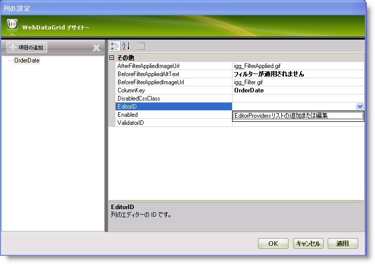
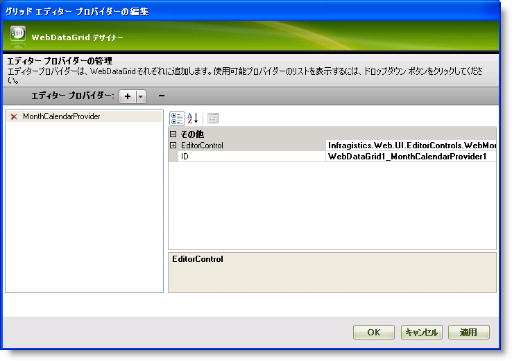
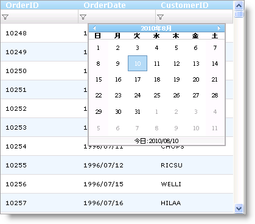

////
|metadata|
{
    "name": "webdatagrid-using-editor-providers-for-the-filter-box-in-webdatagrid",
    "controlName": ["WebDataGrid"],
    "tags": ["Filtering","Grids"],
    "guid": "{76F35C23-DD48-49C3-BFD6-ED893A08478A}",
    "buildFlags": [],
    "createdOn": "2010-04-03T23:47:27Z"
}
|metadata|
////

= WebDataGrid でフィルター ボックスにエディター プロバイダーを使用

== 始める前に

WebDataGrid™ コントロールの  pick:[asp-net="link:{ApiPlatform}web{ApiVersion}~infragistics.web.ui.gridcontrols.filtering.html[Filtering]"]  Behavior を有効にすると、列のデータ型に基づいて自動的に選択されるエディタープロバイダーがフィルター行に含まれます（グリッドが列のデータ型を知っている限り）。データ型と関連づけられたエディターの詳細は、 link:webdatagrid-editor-providers.html[「エディタープロバイダーについて」]を参照してください。WebDataGrid によってデフォルトのエディター プロバイダーではなくアプリケーションに応じて異なるエディター プロバイダーを設定できます。

== 達成すること

WebDataGrid Filtering が有効の時にフィルター行のエディター プロバイダーを設定する方法を学習します。

== 次の手順を実行します

[start=1]
. Microsoft® Visual Studio® ツールボックスから、ScriptManager コンポーネントと WebDataGrid コントロールをフォームにドラッグ アンド ドロップします。
[start=2]
. WebDataGrid を SqlDataSource コンポーネントにバインドして、Northwind データベースの Orders テーブルから OrderID、OrderDate および CustomerID を取得するように構成します。これの実行についての詳細は、 link:webdatagrid-getting-started-with-webdatagrid.html[WebDataGrid で開始]を参照してください。
[start=3]
. [プロパティ] ウィンドウで、WebDataGrid の Behaviors プロパティを指定して、省略記号 (...) ボタンをクリックし、[動作エディター] ダイアログを起動します。
[start=4]
. 有効にするには左のリストのフィルタリング動作のチェックボックスをチェックします。
[start=5]
. pick:[asp-net="link:{ApiPlatform}web{ApiVersion}~infragistics.web.ui.gridcontrols.filtering~columnsettings.html[ColumnSettings]"]  プロパティを指定して、省略記号 (...) ボタンをクリックし、[列設定] ダイアログを起動します。
[start=6]
. [項目の追加] ボタンをクリックして  pick:[asp-net="link:{ApiPlatform}web{ApiVersion}~infragistics.web.ui.gridcontrols.columnsetting.html[ColumnSetting]"]  を追加します。
[start=7]
. pick:[asp-net="link:{ApiPlatform}web{ApiVersion}~infragistics.web.ui.gridcontrols.columnsetting~columnkey.html[ColumnKey]"]  プロパティをドロップダウン リストから [OrderDate] に設定します。
[start=8]
. pick:[asp-net="link:{ApiPlatform}web{ApiVersion}~infragistics.web.ui.gridcontrols.columneditsetting~editorid.html[EditorID]"]  プロパティをクリックして、ドロップダウン リストから [EditorProviders の追加/修正] リストを選択します。

これによって、[グリッド エディター プロバイダーの編集] ダイアログが起動します。
[start=9]
. + ボタンをクリックして、ドロップダウン リストから MonthCalendarProvider を選択します。これによって EditorProvider として MonthCalendarProvider が WebDataGrid コントロールに追加されます。

[start=10]
. [適用] と [OK] をクリックして [グリッド エディター プロバイダーの編集] ダイアログを閉じます。
[start=11]
. [列設定] ダイアログで、EditorID プロパティを WebDataGrid1_MonthCalendarProvider1 に設定します。
[start=12]
. [適用] と [OK] ボタンをクリックして [列設定] ダイアログを閉じます。
[start=13]
. [適用] と [OK] をクリックして [グリッド動作の編集] ダイアログを閉じます。
[start=14]
. アプリケーションを保存して実行します。OrderDate フィルターをクリックして規則を選択するとすぐに、フィルター ボックスで [エディター プロバイダー] として WebMonthCalendar が確認されます。

*Visual Basic の場合：*

----
'フィルタリング動作を作成します。 
Me.WebDataGrid1.Behaviors.CreateBehavior(Of Filtering)() 
'MonthCalendarProvider を作成して、WebDataGridand の EditorProviders に追加します。 
Dim WebDataGrid1_MonthCalendarProvider1 As New MonthCalendarProvider() 
WebDataGrid1_MonthCalendarProvider1.ID = "WebDataGrid1_MonthCalendarProvider1" 
Me.WebDataGrid1.EditorProviders.Add(WebDataGrid1_MonthCalendarProvider1) 
'ColumnFilteringSetting を作成します。 
Dim settingColumn1 As New ColumnFilteringSetting() 
'ColumnKey を設定します。 
settingColumn1.ColumnKey = "OrderDate" 
'EditorID を設定します。 
settingColumn1.EditorID = WebDataGrid1_MonthCalendarProvider1.ID 
'作成された ColumnSetting を追加します。 
Me.WebDataGrid1.Behaviors.Filtering.ColumnSettings.Add(settingColumn1)
----

*C# の場合：*

----
//フィルタリング動作を作成します。
this.WebDataGrid1.Behaviors.CreateBehavior<Filtering>();
//MonthCalendarProvider を作成して、WebDataGridand の EditorProviders に追加します。
MonthCalendarProvider WebDataGrid1_MonthCalendarProvider1 = new MonthCalendarProvider();
WebDataGrid1_MonthCalendarProvider1.ID = "WebDataGrid1_MonthCalendarProvider1";
this.WebDataGrid1.EditorProviders.Add(WebDataGrid1_MonthCalendarProvider1);
//ColumnFilteringSetting を作成します。 
ColumnFilteringSetting settingColumn1 = new ColumnFilteringSetting();
//ColumnKey を設定します。
settingColumn1.ColumnKey = "OrderDate";
//EditorID を設定します。
settingColumn1.EditorID = WebDataGrid1_MonthCalendarProvider1.ID;
//作成された ColumnSetting を追加します。
this.WebDataGrid1.Behaviors.Filtering.ColumnSettings.Add(settingColumn1);
----