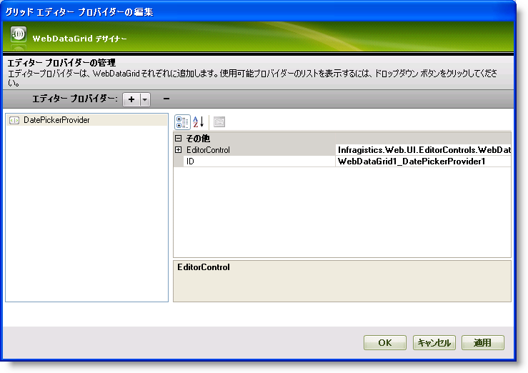
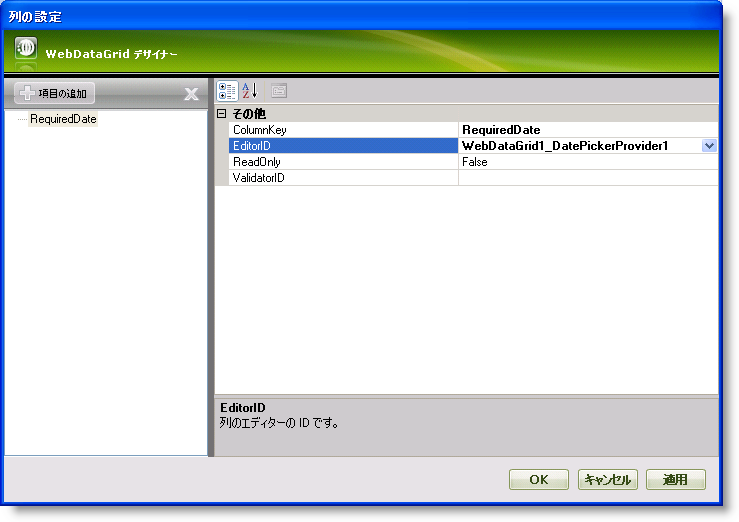
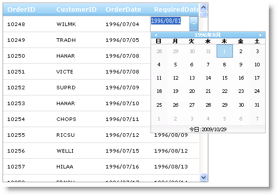

////

|metadata|
{
    "name": "webdatagrid-using-editor-providers",
    "controlName": ["WebDataGrid"],
    "tags": ["Editing","Grids"],
    "guid": "{67AA5F08-A8D1-4287-946E-B0593C78CD64}",  
    "buildFlags": [],
    "createdOn": "0001-01-01T00:00:00Z"
}
|metadata|
////

= DatePicker を WebDataGrid のエディター プロバイダーとして使用する

== 始める前に

WebDataGrid™ のいくつかのデフォルト エディターはアプリケーションで役に立たない場合があります。ただし、 pick:[asp-net="link:{ApiPlatform}web{ApiVersion}~infragistics.web.ui.gridcontrols.editorprovidercollection.html[EditorProviders]"]  コレクションを使用することによって、列に最も役に立つことを証明するエディターを指定できます。

== 達成すること

編集のために DateTime 列で  pick:[asp-net="link:{ApiPlatform}web{ApiVersion}~infragistics.web.ui.gridcontrols.datepickerprovider.html[DatePickerProvider]"]  を使用する方法を学習します。

== 次の手順を実行します

[start=1]
. WebDataGrid を SqlDataSource コンポーネントにバインドして、Orders テーブルからデータを取得します。OrderID、CustomerID、OrderDate、および RequiredDate フィールドを取得します。実行についての詳細は、 link:webdatagrid-getting-started-with-webdatagrid.html[WebDataGrid で開始]を参照してください。
[start=2]
. Microsoft® Visual Studio™ プロパティ ウィンドウで、EditorProviders プロパティを指定して、省略記号 (...) ボタンをクリックし、エディター プロバイダー デザイナーを起動します。
[start=3]
. + ボタンをクリックして、可能なエディターのリストをドロップダウンします。ひとつを選択して、列を設定する時に後で使用可能にします。このために、DatePickerProvider を選択します。
[start=4]
. 右のプロパティ グリッドでエディターの ID を DatePickerProvider1 のままにしておきます。この ID は列のエディターを設定するときに後で必要になります。 pick:[asp-net="link:{ApiPlatform}web{ApiVersion}~infragistics.web.ui.gridcontrols.editorprovider`1~editorcontrol.html[EditorControl]"]  プロパティを展開することによって、エディター コントロールの追加プロパティを設定できます。

[start=5]
. [適用] そして [OK] ボタンをクリックしてデザイナーを閉じます。
[start=6]
. pick:[asp-net="link:{ApiPlatform}web{ApiVersion}~infragistics.web.ui.gridcontrols.behaviors.html[Behaviors]"]  プロパティを指定して、省略記号 (...) ボタンをクリックし、[動作エディター] ダイアログを起動します。
[start=7]
. 編集を有効にするには左のリストで Cell Editing 動作チェックボックスをチェックします。
[start=8]
. 右のプロパティ グリッドで  pick:[asp-net="link:{ApiPlatform}web{ApiVersion}~infragistics.web.ui.gridcontrols.cellediting~columnsettings.html[ColumnSettings]"]  プロパティを指定して、省略記号 (...) ボタンをクリックして、[列設定エディター] ダイアログを起動します。
[start=9]
. WebDataGrid を構成して RequiredDate 列の編集のために DatePickerProvider を使用します。

.. [追加] ボタンをクリックして列設定を追加します。
..  pick:[asp-net="link:{ApiPlatform}web{ApiVersion}~infragistics.web.ui.gridcontrols.columnsetting~columnkey.html[ColumnKey]"]  を RequiredDate として設定します。
.. EditorID プロパティで、ドロップダウン リストをクリックして DatePickerProvider1 を選択します。EditorProviders コレクションに追加したエディターのみがここで使用できます。
.. ReadOnly を False のままにしておきます。
.. [OK] をクリックします。

*注：* ドロップダウン リストで [列の追加/修正] オプションを選択して、[グリッド列の編集] に移動することもできます。

[start=10]
. [適用] そして [OK] をクリックしてダイアログを閉じます。

*コードで上記の手順を実行することも可能です。*

*Visual Basic の場合：*

----
' セル編集を有効にします 
Me.WebDataGrid1.Behaviors.CreateBehavior(Of EditingCore)() 
Me.WebDataGrid1.Behaviors.EditingCore.Behaviors.CreateBehavior(Of CellEditing)() 
' エディター プロバイダーを作成します 
Dim datePickerProvider As New DatePickerProvider() 
datePickerProvider.ID = "DatePickerProvider1" 
' コレクションに追加します 
Me.WebDataGrid1.EditorProviders.Add(datePickerProvider) 
' 列設定を作成してエディター プロバイダーを使用します 
Dim columnSetting As New EditingColumnSetting() 
columnSetting.ColumnKey = "RequiredDate" 
' 使用する列のためのエディターを割り当てます 
columnSetting.EditorID = datePickerProvider.ID
' 列設定を追加します 
Me.WebDataGrid1.Behaviors.EditingCore.Behaviors.CellEditing.ColumnSettings.Add(columnSetting)
----

*C# の場合：*

----
// セル編集を有効にします
this.WebDataGrid1.Behaviors.CreateBehavior<EditingCore>();
this.WebDataGrid1.Behaviors.EditingCore.Behaviors.CreateBehavior<CellEditing>();
// エディター プロバイダーを作成します
DatePickerProvider datePickerProvider = new DatePickerProvider();
datePickerProvider.ID = "DatePickerProvider1";
// コレクションに追加します
this.WebDataGrid1.EditorProviders.Add(datePickerProvider);
// 列設定を作成してエディター プロバイダーを使用します
EditingColumnSetting columnSetting = new EditingColumnSetting();
columnSetting.ColumnKey = "RequiredDate";
// 使用する列のためのエディターを割り当てます
columnSetting.EditorID = datePickerProvider.ID;
// 列設定を追加します
this.WebDataGrid1.Behaviors.EditingCore.Behaviors.CellEditing.ColumnSettings.Add(columnSetting);
----

[start=11]
. アプリケーションを実行します。RequiredDate 列のセルで編集モードになると、DatePickerEditor が表示します。

*注:* DatePicker を使用する場合、バインドされたフィールドが完全な DateTime オブジェクトを渡し DatePicker カレンダーから新しい日付を選択すると、
DateTime オブジェクトの時間部分が新しく選択された日付の開始時刻に変更されます [2016/08/20 午前 00:00:00]。

*完全な DateTime オブジェクト*は値の日付と時間部分を含みます。 例: 2009/0８/19 日曜日 1:48:29

*注:* DateTimeEditorProvider を使用する場合、値を変更した場合もプロバイダーの EditModeFormat 文字列に関係なく、DateTime オブジェクトが保持されます。