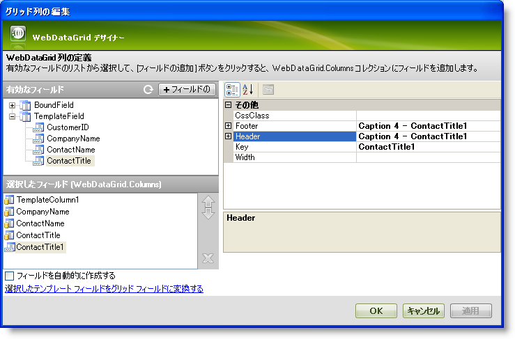
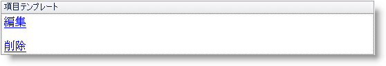
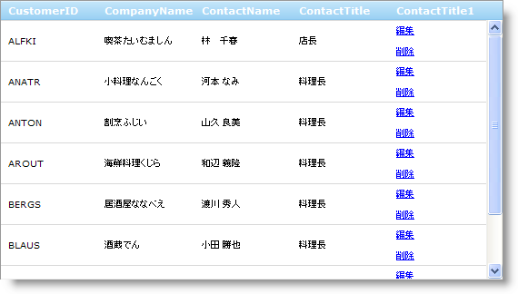

////

|metadata|
{
    "name": "webdatagrid-using-item-template",
    "controlName": ["WebDataGrid"],
    "tags": ["Grids","Templating"],
    "guid": "{3B020AB0-88B4-4AB6-926A-7C646BA0D923}",  
    "buildFlags": [],
    "createdOn": "0001-01-01T00:00:00Z"
}
|metadata|
////

= 項目テンプレートの使用

== 始める前に

列テンプレートを使用すれば、ユニークなルック アンド フィールで列を作成できます。コントロールをテンプレートに追加できます。WebDataGrid™ のテンプレート列は、ヘッダー、フッター、項目、代替え項目テンプレートの 4 つのテンプレートで構成されます。

== 達成すること

WebDataGrid で列に項目テンプレートを設定する方法を学びます。このテンプレートには、行を変更または削除するための 2 つのリンク ボタンが含まれます。

== 次の手順を実行します

[start=1]
. WebDataGrid を SqlDataSource コンポーネントにバインドして、Customers テーブルからデータを取得します。実行についての詳細は、 link:webdatagrid-getting-started-with-webdatagrid.html[WebDataGrid で開始]を参照してください。
[start=2]
. Microsoft® Visual Studio™ プロパティ ウィンドウで、 pick:[asp-net="link:{ApiPlatform}web{ApiVersion}~infragistics.web.ui.gridcontrols.webdatagrid~columns.html[Columns]"]  プロパティを指定して、省略記号 (...) ボタンをクリックして、[列エディタ] ダイアログを起動します。
[start=3]
. TemplateField の下の [有効なフィールド] セクションで列を選択し、[フィールドの追加] ボタンをクリックしてテンプレート列を追加します。 pick:[asp-net="link:{ApiPlatform}web{ApiVersion}~infragistics.web.ui.gridcontrols.controldatafield~key.html[Key]"]  を TemplateColumn1 に、 pick:[asp-net="link:{ApiPlatform}web{ApiVersion}~infragistics.web.ui.gridcontrols.gridfieldcaption.html[Header]"]   pick:[asp-net="link:{ApiPlatform}web{ApiVersion}~infragistics.web.ui.gridcontrols.fieldcaption~text.html[Text]"]  を Edit に設定します。[選択されたフィールド] セクションからテンプレート列として使用したい列を選択し、[選択されたグリッド フィールドをテンプレート フィールドに変換する] リンクをクリックすることも可能です。

*テンプレート列をコードで追加することもできます。* コードは最初のロードでページの Init イベントで実行されます。

*Visual Basic の場合：*

----
Dim field1 As New TemplateDataField() 
field1.Key = "TemplateColumn1" 
field1.Header.Text = "Edit" 
Me.WebDataGrid1.Columns.Add(field1)
----

*C# の場合：*

----
TemplateDataField field1 = new TemplateDataField();
field1.Key = "TemplateColumn1";
field1.Header.Text = "Edit";
this.WebDataGrid1.Columns.Add(field1);
----

[start=4]
. [OK] をクリックしてエディタを終了します。
[start=5]
. WebDataGrid を右クリックします。コンテキスト メニューから [テンプレートの編集] をマウスオーバーし、追加したばかりの列テンプレートを選択します。テンプレートがデザイナに表示されます。
[start=6]
. 2 つの LinkButton コントロールを [項目テンプレート] 領域にドラッグします。
[start=7]
. これらのボタンの Text プロパティを Edit および Delete に設定します。

[start=8]
. OnClientClick プロパティを使用してボタンのクライアント側のクリック イベントにハンドラを設定します。

.. 編集ボタンでは、プロパティを "return editRow()" に等しく設定します。
.. 削除ボタンでは、プロパティを "return deleteRow()" に等しく設定します。

*HTML の場合:*

----
<asp:LinkButton ID="LinkButton1" runat="server" onclientclick="return editRow()">Edit</asp:LinkButton>
 
<asp:LinkButton ID="LinkButton2" runat="server" onclientclick="return deleteRow()">Delete</asp:LinkButton>
----

*ITemplate インタフェースを実装するクラスを作成してコードで上記の手順を実行し、列の ItemTemplate プロパティにそのインスタンスを設定できます。* このサンプルで、テンプレートのインスタンス化はページの PreRender イベントで実行されます。

*注：* : テンプレートをポストバックごとに再作成する必要があります。したがって、ポストバックごとに以下のコードを実行する必要があります。

*Visual Basic の場合：*

----
'テンプレート列への参照を取得します。 
Dim templateColumn1 As TemplateDataField = DirectCast(Me.WebDataGrid1.Columns("TemplateColumn1"), TemplateDataField) 
templateColumn1.ItemTemplate = New CustomItemTemplate()
Private Class CustomItemTemplate 
    Implements ITemplate 
    #Region "ITemplate Members" 
    Public Sub InstantiateIn(ByVal container As Control) Implements ITemplate.InstantiateIn
        Dim edit As New LinkButton()
        edit.ID = "EditButton"   
        edit.Text = "Edit" 
        edit.OnClientClick = "return editRow()" 
        Dim delete As New LinkButton()  
        delete.ID = "DeleteButton" 
        delete.Text = "Delete" 
        delete.OnClientClick = "return deleteRow()" 
        container.Controls.Add(edit) 
        container.Controls.Add(delete) 
    End Sub 
    #End Region 
End Class
----

*C# の場合：*

----
//テンプレート列への参照を取得します。
TemplateDataField templateColumn1 = (TemplateDataField)this.WebDataGrid1.Columns["TemplateColumn1"];
templateColumn1.ItemTemplate = new CustomItemTemplate();
private class CustomItemTemplate : ITemplate
{
        #region ITemplate Members
        public void InstantiateIn(Control container)
        {
        LinkButton edit = new LinkButton();
        edit.CssClass = "LinkButton";
        edit.Text = "Edit";
        edit.OnClientClick = "return editRow()";
        LinkButton delete = new LinkButton();
        delete.CssClass = "LinkButton";
        delete.Text = "Delete";
        delete.OnClientClick = "return deleteRow()";
        container.Controls.Add(edit);
        container.Controls.Add(delete);
        }
        #endregion
}
----

[start=9]
. 編集および削除に関数を追加します。

*JavaScript の場合*

----
function editRow() {
var grid = $find("WebDataGrid1");
// アクティブな行を取得します。
var activeRow = grid.get_behaviors().get_activation().get_activeCell().get_row();
// アクティブな行の最初のセルを編集モードにします。
grid.get_behaviors().get_editingCore().get_behaviors().get_cellEditing().enterEditMode(activeRow.get_cell(0));
// リンク ボタンから自動ポストバックをキャンセルします。
return false;
}
function deleteRow() {
var grid = $find("WebDataGrid1");
// アクティブな行を削除します。
grid.get_rows().remove(grid.get_behaviors().get_activation().get_activeCell().get_row());
// リンク ボタンから自動ポストバックをキャンセルします。
return false;
}
----

*注：* ボタンは WebDataGrid を変更するために機能するので、 pick:[asp-net="link:{ApiPlatform}web{ApiVersion}~infragistics.web.ui.gridcontrols.behaviors~editingcore.html[EditingCore]"]  動作を有効にする必要があります。これを行う詳細は、 link:webdatagrid-editting.html[WebDataGrid を編集] を参照してください。 pick:[asp-net="link:{ApiPlatform}web{ApiVersion}~infragistics.web.ui.gridcontrols.behaviors~activation.html[Activation]"]  動作も必要です。詳細は、 link:webdatagrid-activation.html[アクティブ化]を参照してください。

*注：* 項目テンプレートは項目のセル内では HTML に過ぎないため、HTML の編集を防ぐために列を必ず読み取り専用にします。これを実行することによってエンド ユーザーはテンプレートで任意のエディタを使用して編集することが可能となりますが、テンプレートの実際的なマークアップを編集できません。動作の列設定の追加の詳細は、 link:webdatagrid-setting-column-settings-for-a-behavior.html[動作に列設定を設定] を参照してください。

[start=10]
. アプリケーションを実行します。WebDataGrid には行の編集および削除を処理する 2 つのリンク ボタンが表示される列があります。

== 関連トピック

link:webdatagrid-refrence-a-cell-when-creating-an-item-template.html[項目テンプレートの作成時にセルを参照]