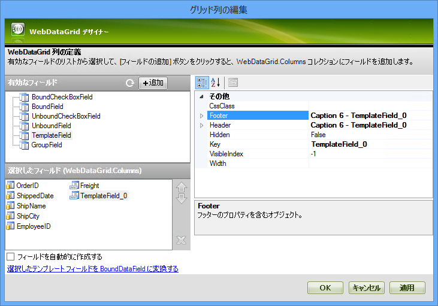
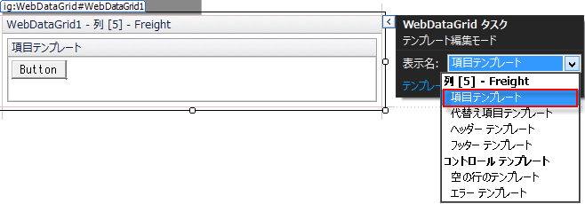
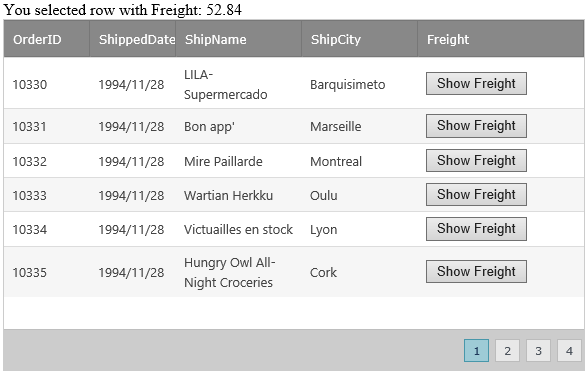

////

|metadata|
{
    "name": "webdatagrid-using-itemcommand-event",
    "controlName": [],
    "tags": [],
    "guid": "0aaae618-060e-4d09-bca3-4116d937500e",  
    "buildFlags": [],
    "createdOn": "2015-02-25T12:55:08.9590417Z"
}
|metadata|
////

= WebDataGrid - ItemCommand イベントの使用

=== 始める前に

WebDataGrid の link:{ApiPlatform}web{ApiVersion}~infragistics.web.ui.gridcontrols.webdatagrid~itemcommand_ev.html[ItemCommand] サーバー サイド イベントでは、 link:{ApiPlatform}web{ApiVersion}~infragistics.web.ui.gridcontrols.templatedatafield.html[TemplateField] 列にあるコントロールから簡単にイベント (ボタン クリックなど) に応答できます。

=== 達成すること

このチュートリアルは、バインドした TemplatedField 列内に ASP.NET ボタンを追加し、ボタンがクリックされたときに情報を表示するために WebDataGrid の ItemCommand サーバー サイド イベントを処理する方法について説明します。

=== 次の手順を実行します

*注:* このチュートリアルは、WebDataGrid を DataSet オブジェクトにデザイン タイムでバインドしていることが前提になります。WebDataGrid コントロールを生成する方法については、このトピックの最後にある

== 関連トピック
クションをご覧ください。

[start=1]
. コーディングを始める前にコード ビハインド内に using/Imports のディレクティブを配置することにより、メンバーの完全修飾名を常に入力する必要がなくなります。

*Visual Basic の場合:*

[source,vb]
----
Imports Infragistics.Web.UI.GridControls
----

*C# の場合:*

[source,csharp]
----
using Infragistics.Web.UI.GridControls;
----

[start=2]
. デザイン ビューで コントロール/コンポーネントを選択し、プロパティを選択します。
[start=3]
. プロパティ ウィンドウで Columns コレクションの省略記号 (…) ボタンをクリックします。
[start=4]
. コレクションに TemplateField を追加します。

.. 利用可能なセクションから TemplateField を選択し、フィールド ボタンの追加をクリックします。
.. タイプ TemplateField の新しい列が列コレクションに追加されます。

.. TemplateField を追加する他の方法として、Grid フィールドを Template フィールドへ変換します。 グリッド フィールドを選択し、選択したグリッド フィールドをテンプレート フィールドへ押します。

image::images/Using_ItemCommand_Event_2.png[]
.. [OK] ボタンをクリックして列コレクション エディターを閉じます。

[start=5]
. ASP.NET Button コントロールをページに追加します。

.. ページのデザイン ビューから WebDataGrid のスマート タグを選択し、 [テンプレートの編集]をクリックします。
.. テンプレート編集モードを開いた後にテンプレート フィールド Freight を検索します。

.. ツールボックスから標準 ASP.NET ボタン コントロールを ItemTemplate へドラッグします。
.. 編集を終了するために “テンプレート編集の終了” を選択します。

[start=6]
. サーバー サイド イベント ハンドラーを ItemCommand イベント (コード ビハインド) に追加します。

*Visual Basic の場合:*

[source,vb]
----
Protected Sub WebDataGrid1_ItemCommand(sender As Object, e As HandleCommandEventArgs) 
End Sub
----

*C# の場合:*

[source,csharp]
----
protected void WebDataGrid1_ItemCommand(object sender, HandleCommandEventArgs e){ }
----

[start=7]
. ItemCommand イベントにコードを追加し、行情報を取得します。コントロールがイベントを送り返す際に、サーバーはそのイベントに応答する必要があります。ItemCommand イベントは、コントロールによってスローされるイベントをキャプチャし、HandleCommandEventArgs オブジェクトを介してイベントを公開します。

*ASPX の場合:*

----
<ig:TemplateDataField Key="Freight"><ItemTemplate>
      <asp:Button ID="Button1" runat="server" 
            Text="Button" 
            CommandArgument='<%# Eval("Freight") %>' 
            CommandName="Button1Click" />
      </ItemTemplate>
      <Header Text="Freight">
      </Header>
</ig:TemplateDataField>
----

*Visual Basic の場合:*

[source,vb]
----
Protected Sub WebDataGrid1_ItemCommand(sender As Object, e As HandleCommandEventArgs)
    'e.CommandArgument は、対応するボタンの CommandArgument 属性から値を提供します。
    Dim commandArgument As Object = e.CommandArgument
    ' Freight フィールド値で計算を実行し、それを Label へ渡します。
    FreightValueLbl.Text = commandArgument.ToString()
End Sub
----

*C# の場合:*

[source,csharp]
----
protected void WebDataGrid1_ItemCommand(object sender, HandleCommandEventArgs e)
{
    // e.CommandArgument は CommandArgument からの値を提供します。
      attribute of the corresponding button
    object commandArgument = e.CommandArgument;
    // Freight フィールド値で計算を実行し、それを Label へ渡します。
    FreightValueLbl.Text = commandArgument.ToString();
}
----

[start=8]
. アプリケーションを実行します。 ボタンの 1 つをクリックし、以下のイメージのように Freight フィールド値が WebDataGrid の上に表示されます。

*注:* ボタン キャプションは、デザイン タイムでテンプレート列を開き、ボタンの Text プロパティで変更できます。更に列を選択し列コレクション エディターを使用することにより、その Header の Caption プロパティを選択して Template Field にヘッダー キャプションを追加できます。

関連トピック

link:webdatagrid-using-item-template.html[項目テンプレートの使用]

link:webdatagrid-column-templates.html[列テンプレート]

link:webhierarchicaldatagrid-data-binding.html[WebHierarchicalDataGrid データ バインディング]

link:webhierarchicaldatagrid-binding-to-xml-data-source.html[WHDG を XMLA データ ソースにバインド]