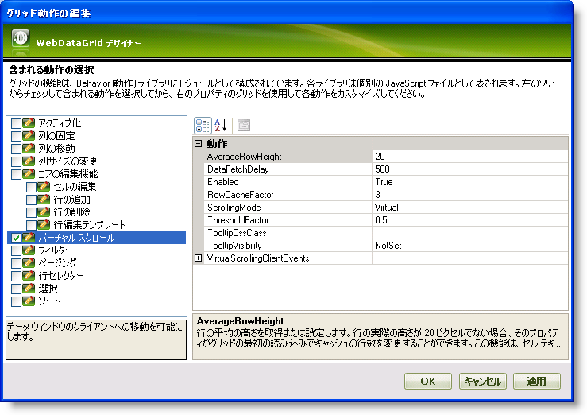

////

|metadata|
{
    "name": "webdatagrid-virtual-scrolling",
    "controlName": ["WebDataGrid"],
    "tags": ["Grids","Virtualization"],
    "guid": "{1AC37B0D-DE85-429D-A595-C7969BFAAFAD}",  
    "buildFlags": [],
    "createdOn": "0001-01-01T00:00:00Z"
}
|metadata|
////

= 仮想スクロール

WebDataGrid™ は、エンドユーザーがコントロールをスクロールした時に、データレコードの一部をクライアントに送信し、オンデマンドで追加のデータレコードを要求することを可能にする仮想スクロールをサポートします。したがって、データソース全体をクライアントに送信することなくエンドユーザーが大量のデータをナビゲートすることを可能にすることによって、仮想スクロールの動作はパフォーマンスを多大に向上します。

== 行キャッシュとロードしきい値

WebDataGrid では、 pick:[asp-net="link:{ApiPlatform}web{ApiVersion}~infragistics.web.ui.gridcontrols.virtualscrolling.html[VirtualScrolling]"]  オブジェクトの  pick:[asp-net="link:{ApiPlatform}web{ApiVersion}~infragistics.web.ui.gridcontrols.virtualscrolling~rowcachefactor.html[RowCacheFactor]"]  プロパティを設定することで行キャッシュのサイズを構成できます。キャッシュの行数は RowCacheFactor で乗算した表示行に等しいです。行キャッシュの特定のポイントに達しており追加行が必要であることをグリッドに通知するしきい値を構成することも可能です。この機能は  pick:[asp-net="link:{ApiPlatform}web{ApiVersion}~infragistics.web.ui.gridcontrols.virtualscrolling~thresholdfactor.html[ThresholdFactor]"]  プロパティで設定できます。

たとえば、WebDataGrid に RowCacheFactor を 3 に設定された 10 行のビュー ポートがある場合、行のキャッシュは 30 行に等しいです。行 101 にスクロールする場合、ビュー ポートの行 101 から 110 までが表示されます。ビューからの追加のキャッシュされた行は行 91 から 100 と行 111-120 です。ThresholdFactor が .5 でビュー ポートが 10 行含む場合、しきい値は行キャッシュの終わりから 5 行になります。したがって、この例では、しきい値は行 95 と 行 115 になります。これらの行のいずれかにスクロールする場合、WebDataGrid は追加行のリクエストを行います。

WebDataGrid は、行の実際の高さが 20 ピクセルと異なる時にグリッドの初期ロード時にキャッシュの行数を調整するためのオプションを提供します。セルのテキストが長い状況でこれは役に立ちます。ブラウザの自動折り返し機能のために行の高さが増えるからです。AverageRowHeight プロパティを設定するだけで初期ロード時のキャッシュの行の平均的な高さを設定できます。デフォルトでこのプロパティは 20 に設定されます。

*注：* AverageRowHeight プロパティの値が行の実際の高さと大幅に異なる場合、スクロール動作は壊れます。値が大きすぎると、グリッドは新しい行に対する非同期要求を頻繁に発生させるか、グリッドは一部の行しかを表示しない場合があります。値が小さすぎると、スクロールが移動する時にグリッドは応答に失敗する場合があります。

== スクロール モード

VirtualScrolling オブジェクトの  pick:[asp-net="link:{ApiPlatform}web{ApiVersion}~infragistics.web.ui.gridcontrols.virtualscrolling~scrollingmode.html[ScrollingMode]"]  プロパティを設定するだけで、仮想スクロールメカニズムは以下の 2 つの異なるモードで動作できます:

* *Virtual* -- このモードでは、エンドユーザーはグリッド内にすでにキャッシュされている行をすぐにスクロールできます。キャッシュされたレコードを越えてスクロールしようとすると、その範囲内に属するレコードの次のバッチを検索するための AJAX 要求が行われます。
* *Deferred* -- このモードでは、エンドユーザーは仮想スクロールバーをクリック アンド ドラッグすることによってデータをスクロールできます。ただし、エンドユーザーがスクロールバーでマウス キャプチャを放すと、そのスクロールバーの位置にあるレコードにしかジャンプしません。エンドユーザーがスクロールする間、最初の表示行のインデックスがツールチップとして表示されます。グリッドはグリッド内の一番上の表示行として選択した行を使用し、その行に基づいてキャッシュをリセットします。

行キャッシュ内のデータでスクロールすることは円滑なプロセスです。スクロールの結果データ要求になる場合、WebDataGrid は若干の休止を生じます。エンドユーザーがスクロールバーを押して不規則のドラッグすることは可能であるため、データ フェッチ遅延として知られている概念が WebDataGrid に追加され、構成可能なプロパティとして公開されます。 pick:[asp-net="link:{ApiPlatform}web{ApiVersion}~infragistics.web.ui.gridcontrols.virtualscrolling~datafetchdelay.html[DataFetchDelay]"]  プロパティによって、エンドユーザーがスクロールを中止した後で経過しなければならない時間を指定できます。この時間が経過すると、WebDataGrid は追加行をフェッチするリクエストを起動します。WebDataGrid が追加行を要求する時を詳細に制御および調整できます。

デザイナーを介して、または Microsoft® Visual Studio® [プロパティ] ウィンドウを使用する、または以下のコードを使用して WebDataGrid で仮想スクロール動作を有効にできます:

*Visual Basic の場合：*

----
WebDataGrid1.Behaviors.VirtualScrolling.Enabled = true
----

*C# の場合：*

----
WebDataGrid1.Behaviors.VirtualScrolling.Enabled = true;
----

== 仮想スクロールとページング

WebDataGrid によって、 pick:[asp-net="link:{ApiPlatform}web{ApiVersion}~infragistics.web.ui.gridcontrols.behaviors~paging.html[Paging]"]  動作が有効な時でさえ仮想スクロールを使用できます。たとえば、PageSize が 500 に設定され、WebDataGrid に 表示行が 10 行あり RowCacheFactor を 3 に設定されている場合、エンドユーザーが行インデックス 30 を超えた行にスクロールする、または仮想スクロールのしきい値を超えた行にスクロールすると、サーバーからより多くの行を要求するために仮想スクロールが起動されます。ただし、行キャッシュ サイズがページ サイズより大きい場合、すべての行が WebDataGrid の現在のページにすでにロードされているので、仮想スクロールは発生しません。

== ツールチップの表示/非表示

WebDataGrid によって、TooltipVisibility プロパティを True または False などの DefaultableBoolean 列挙体に設定するだけで、VirtualScrolling 動作が有効な時にツールチップの表示/非表示を構成できます。ただし、デフォルトでこのプロパティは NotSet に設定されます。これはツールチップが仮想スクロール モードではなく遅延スクロール モードで表示されることを意味します。

*Visual Basic の場合：*

----
WebDataGrid1.Behaviors.VirtualScrolling.TooltipVisibility = Infragistics.Web.UI.DefaultableBoolean.True
----

*C# の場合：*

----
WebDataGrid1.Behaviors.VirtualScrolling.TooltipVisibility = Infragistics.Web.UI.DefaultableBoolean.True;
----

== 仮想スクロールを有効にします

[start=1]
. Microsoft® Visual Studio® ツールボックスから、ScriptManager コンポーネントと WebDataGrid コントロールをフォームにドラッグ アンド ドロップします。
[start=2]
. WebDataGrid を SqlDataSource コンポーネントにバインドして、Customers テーブルからデータを取得するように構成します。実行についての詳細は、 link:webdatagrid-getting-started-with-webdatagrid.html[WebDataGrid で開始]を参照してください。
[start=3]
. [プロパティ] ウィンドウで、 pick:[asp-net="link:{ApiPlatform}web{ApiVersion}~infragistics.web.ui.gridcontrols.webdatagrid~behaviors.html[Behaviors]"]  プロパティを指定して、省略記号 (...) ボタンをクリックし、[動作の編集] ダイアログを起動します。
[start=4]
. [仮想スクロール動作] をチェックして以下の画像に示すように有効にします:

[start=5]
. [適用] と [OK] をクリックして [グリッド動作の編集] ダイアログを閉じます。以下のマークアップが生成されます。

*HTML の場合:*

----
<Behaviors>
    <ig:VirtualScrolling>
    </ig:VirtualScrolling>
</Behaviors>
----

コード ビハインドからソート動作を追加するには、以下のコードを追加します。

*Visual Basic の場合:*

----
WebDataGrid1.Behaviors.CreateBehavior(Of Infragistics.Web.UI.GridControls.VirtualScrolling)()
----

*C# の場合:*

----
WebDataGrid1.Behaviors.CreateBehavior<Infragistics.Web.UI.GridControls.VirtualScrolling>();
----

[start=6]
. アプリケーションを保存して実行します。グリッド内にすでにキャッシュされている行ですぐにスクロールできることを確認します。そしてキャッシュされたレコードを超えてスクロールしようとする時には  pick:[asp-net="link:{ApiPlatform}web{ApiVersion}~infragistics.web.ui.gridcontrols.virtualscrolling~datafetchdelay.html[DataFetchDelay]"]  プロパティに基づいて時間設定された遅延が発生します。

バーチャル スクロールの制限

*注：*バーチャル スクロールは、添付されたイベントを持つ要素 (ボタンなど) を含むテンプレート列で使用できません。