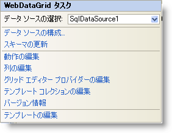

////

|metadata|
{
    "name": "webdatagrid-webdatagrid-smart-tag",
    "controlName": ["WebDataGrid"],
    "tags": ["Grids"],
    "guid": "{238D9D77-C699-486E-A6DB-A6772C614FE8}",  
    "buildFlags": [],
    "createdOn": "0001-01-01T00:00:00Z"
}
|metadata|
////

= WebDataGrid スマート タグ

Visual Studio 2005/2008/2010 (.NET Framework 2.0/3.5) では、{ProductName} の個々のコントロール/コンポーネントにはスマート タグがあります。コントロールやコンポーネントを選択することで、スマート タグのアンカーが表示されます。このアンカーをクリックするとポップアップ パネルが表示され、そこからコントロール/コンポーネントの最もよく使うプロパティや設定にすばやく簡単にアクセスできます。

WebDataGrid™ のスマート タグには次の項目が含まれています。

* [データ ソースの選択] -- 既存のデータ ソースを選択する、または WebDataGrid にバインドするようににデータ ソースを構成できます。

項目の説明と、プロパティ グリッドの各項目が対応するプロパティについては、以下の表を参照してください。

WebDataGrid のスマート タグには次のリンクが含まれています。

* データ ソースの構成 - データ ソース構成ウィザードへのリンクによって、WebDataGrid にバインドするようにデータ ソースを構成できます。
* スキーマの更新 - これをクリックして WebDataGrid を更新すれば、データ ソースまたはスキーマへの変更はデザイナーに表示されます。
* 動作の編集 - WebDataGrid の動作を追加、削除および構成するために動作エディターを起動します。
* 列の編集 - 列エディターを起動することで、列の追加や削除、または列設定の調整ができます。
* テンプレート コレクションの編集 - WebDataGrid で使用できるテンプレートを追加/削除できるテンプレート コレクション エディターにリンクします。
* グリッド エディター プロバイダーの編集 - WebDataGrid で使用するためにエディター プロバイダー プロバイダー
* バージョン情報 -- これをクリックすると WebDataGrid 製品の情報を開きます。状態、バージョン、有効期限、製品キーなどの情報を含みます。
* テンプレートの編集 - これをクリックして、編集できるすべての使用可能なテンプレートを表示します。必要に応じてテンプレートにコントロールをドラッグ アンド ドロップして、コントロールを編集できます。

[options="header", cols="a,a,a"]
|====
|項目|説明|対応するプロパティ

|データ ソースの選択
|ドロップダウン リストによって、既存のデータ ソースを選択したり、新しいデータ ソースを構成できます。
|*DataSourceID*

|====