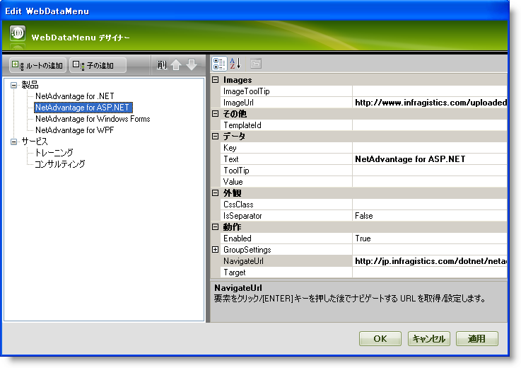
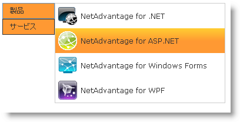

////

|metadata|
{
    "name": "webdatamenu-adding-images-and-navigation-urls-to-menu-items",
    "controlName": ["WebDataMenu"],
    "tags": [],
    "guid": "{9D139506-17A8-4FE6-B4B3-3D9566B488F9}",  
    "buildFlags": [],
    "createdOn": "0001-01-01T00:00:00Z"
}
|metadata|
////

= 画像およびナビゲーション URL をメニュー項目に追加

== 始める前に

WebDataMenu™ によってコードを一切記述することなく、画像とナビゲーション URL をメニュー項目に追加することが可能となります。メニュー項目の  pick:[asp-net="link:{ApiPlatform}web{ApiVersion}~infragistics.web.ui.navigationcontrols.navitem~imageurl.html[ImageUrl]"]  プロパティと  pick:[asp-net="link:{ApiPlatform}web{ApiVersion}~infragistics.web.ui.navigationcontrols.navitem~navigateurl.html[NavigateUrl]"]  プロパティを設定することによって画像とナビゲーション URL を簡単に追加できます。

== 達成すること

デザイナーを使用して画像とナビゲーション URL をメニュー項目に追加する方法を学習します。

== 次の手順を実行します

[start=1]
. Visual Studio™ ツールボックスから、ScriptManager コンポーネントと WebDataMenu コントロールをフォームにドラッグ アンド ドロップします。
[start=2]
. WebDataMenu デザイナーを使用して 2 つのルート項目を追加し、 pick:[asp-net="link:{ApiPlatform}web{ApiVersion}~infragistics.web.ui.navigationcontrols.navitem~text.html[Text]"]  プロパティを「製品」と「サービス」に設定します。4 つの子項目を「製品」ルート項目に追加し、以下に示すように Text プロパティ、NavigateUrl プロパティおよび ImageUrl プロパティを設定します:

[options="header", cols="a,a,a"]
|====
|Text|NavigateUrl|ImageUrl

|{ProductName}
|http://jp.infragistics.com/dotnet/netadvantage.aspx
|http://jp.infragistics.com/uploadedImages/Shared/nadotnet.gif

|{ProductName}
|http://jp.infragistics.com/dotnet/netadvantage/aspnet.aspx
|http://jp.infragistics.com/uploadedImages/Shared/aspNet.gif

|Infragistics Windows Forms
|http://jp.infragistics.com/dotnet/netadvantage/winforms.aspx
|http://jp.infragistics.com/uploadedImages/Shared/winforms.gif

|Infragistics WPF
|http://jp.infragistics.com/dotnet/netadvantage/wpf.aspx#Overview
|http://jp.infragistics.com/uploadedImages/Shared/nawpf.gif

|====

同様に、2 つの子項目を「サービス」ルート項目に追加し以下のプロパティを設定します:

[options="header", cols="a,a"]
|====
|Text|NavigateUrl

|トレーニング
|http://jp.infragistics.com/services/training.aspx

|コンサルティング
|http://jp.infragistics.com/services/consulting.aspx

|====

デザイナーを使用して項目を WebDataMenu に追加する方法の詳細は、 link:webdatamenu-getting-started-with-webdatamenu.html[WebDataMenu で開始]を参照してください。
[start=3]
. この時点で、WebDataMenu デザイナーは以下の画像のようになります：

[start=4]
. [適用] と [OK] をクリックして WebDataMenu デザイナーを閉じます。
[start=5]
. アプリケーションを保存して実行します。「製品」項目上にマウスをホバーすると、WebDataMenu は以下の画像のようになるはずです。

