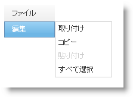

////

|metadata|
{
    "name": "webdatamenu-disabling-menu-items",
    "controlName": ["WebDataMenu"],
    "tags": [],
    "guid": "{A37E1F99-6690-4048-8111-3571EE3BA5E1}",  
    "buildFlags": [],
    "createdOn": "0001-01-01T00:00:00Z"
}
|metadata|
////

= メニュー項目を無効にする

WebDataMenu™ によって個々の項目を無効にできます。たとえば、エンドユーザーが特定のメニュー項目を選択またはアクティブ化しないようにしたい場合があります。 pick:[asp-net="link:{ApiPlatform}web{ApiVersion}~infragistics.web.ui.navigationcontrols.navitem.html[NavItem]"]  オブジェクトの  pick:[asp-net="link:{ApiPlatform}web{ApiVersion}~infragistics.web.ui.navigationcontrols.navitem~enabled.html[Enabled]"]  プロパティを設定することでこの機能を達成できます。

== 個々のメニュー項目を無効にするには:

[start=1]
. ScriptManger コンポーネントと WebDataMenu コントロールを WebForm に配置します。
[start=2]
. link:webdatamenu-getting-started-with-webdatamenu.html[WebDataMenu で開始]に示されているように項目を WebDataMenu に追加します。
[start=3]
. [編集] 項目の [貼り付け] 項目を選択し、[動作] の Enabled プロパティを False に設定します。XAML またはコード ビハインドで設定できます。

*HTML の場合:*

----
    <ig:WebDataMenu ID="WebDataMenu1" runat="server">
        <Items>
            <ig:DataMenuItem Text="File" Key="File">
                <Items>
                    <ig:DataMenuItem Text="New">
                    </ig:DataMenuItem>
                    <ig:DataMenuItem Text="Open">
                    </ig:DataMenuItem>
                    <ig:DataMenuItem Text="Save">
                    </ig:DataMenuItem>
                    <ig:DataMenuItem Text="Exit">
                    </ig:DataMenuItem>
                </Items>
            </ig:DataMenuItem>
            <ig:DataMenuItem Text="Edit" Key="Edit">
                <Items>
                    <ig:DataMenuItem Text="Cut">
                    </ig:DataMenuItem>
                    <ig:DataMenuItem Text="Copy">
                    </ig:DataMenuItem>
                    <ig:DataMenuItem Text="Paste" Key="Paste" Enabled=">
                    </ig:DataMenuItem>
                    <ig:DataMenuItem Text="Select All">
                    </ig:DataMenuItem>
                </Items>
            </ig:DataMenuItem>
        </Items>
    </ig:WebDataMenu>
----

*C# の場合:*

----
WebDataMenu1.Items.FindDataMenuItemByKey("Edit").Items.FindDataMenuItemByKey("Paste").Enabled = false;
----

*Visual Basic の場合:*

----
WebDataMenu1.Items.FindDataMenuItemByKey("Edit").Items.FindDataMenuItemByKey("Paste").Enabled = False;
----

[start=4]
. アプリケーションを保存して実行します。[編集] 項目を選択またはアクティブ化できないことを確認します。

