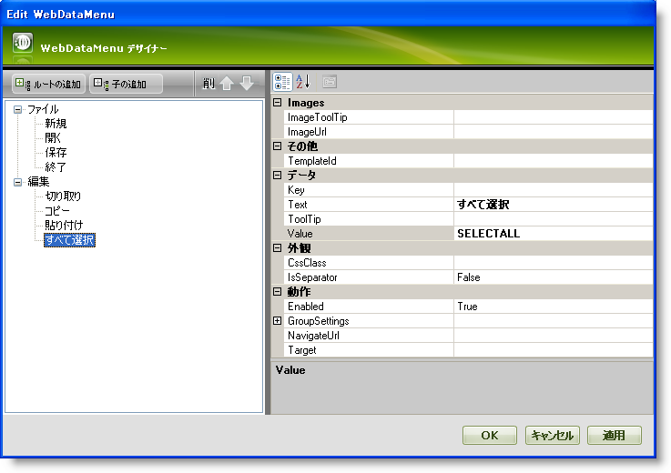
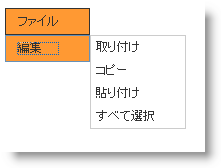

////

|metadata|
{
    "name": "webdatamenu-getting-started-with-webdatamenu",
    "controlName": ["WebDataMenu"],
    "tags": ["Getting Started","Navigation"],
    "guid": "{A1F29E0D-EC26-4028-8223-3E3641DC2F9D}",  
    "buildFlags": [],
    "createdOn": "0001-01-01T00:00:00Z"
}
|metadata|
////

= WebDataMenu で開始

WebDataMenu™ によってリッチなユーザー インタフェース デザイナーを使用して項目を手動で追加できます。外観、動作およびさまざまなその他のプロパティを設定する WebDataMenu デザイナーを使用して各項目をカスタマイズできます。

== デザイナーを使用して項目を WebDataMenu に追加するには:

[start=1]
. Visual Studio™ ツールボックスから、ScriptManager コンポーネントと WebDataMenu コントロールを WebForm にドラッグ アンド ドロップします。
[start=2]
. [プロパティ] ウィンドウで、WebDataMenu コントロールの Items プロパティを指定して、省略記号（...）ボタンをクリックして WebDataMenu デザイナーを起動します。WebDataMenu スマート タグで [項目の編集] をクリックすることによってもデザイナーを起動できます。
[start=3]
. [WebDataMenu の編集] ダイアログで、[ルートを追加] ボタンをクリックします。これによって新しいルート項目が項目コレクションに追加されます。以下のプロパティを設定します。

[cols="a,a"]
|====
|テキスト|値

|ファイル
|FILE

|====

[start=4]
. 作成したばかりの項目を選択し、[子の追加] ボタンをクリックします。これにより子項目がルート項目に追加されます。以下のプロパティを設定します。

[cols="a,a"]
|====
|テキスト|値

|新規
|NEW

|====

以下を子項目として追加するために同じ作業を繰り返します:

[options="header", cols="a,a"]
|====
|テキスト|値

|開く
|OPEN

|保存
|SAVE

|終了
|EXIT

|====

[start=5]
. 手順 3 と 4 で示すように以下をルート項目と子項目として追加します。

*ルート項目:*

[cols="a,a"]
|====
|テキスト|値

|編集
|EDIT

|====

*子項目:*

[options="header", cols="a,a"]
|====
|テキスト|値

|切り取り
|CUT

|コピー
|COPY

|貼り付け
|PASTE

|すべて選択
|SELECTALL

|====

[start=6]
. この時点で、[WebDataMenu の編集] ダイアログは次のように表示されます。

[start=7]
. [適用] と [OK] をクリックして WebDataMenu デザイナーを閉じます。
[start=8]
. アプリケーションを保存して実行します。WebDataMenu は以下の画像のようになるはずです。

