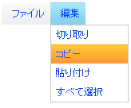

////

|metadata|
{
    "name": "webdatamenu-menu-item-states",
    "controlName": ["WebDataMenu"],
    "tags": [],
    "guid": "{37F8BF49-D4CE-4BAA-8C04-333C74312284}",  
    "buildFlags": [],
    "createdOn": "0001-01-01T00:00:00Z"
}
|metadata|
////

= メニュー項目の状態

WebDataMenu™ はさまざまな視覚的なスタイルによって示され、Infragistics® Application Styling Framework を使用して個々にカスタマイズ可能なさまざまな状態の項目を持つことができます。以下は単一のメニュー項目がなることができるさまざまな状態です:

* *フォーカスが置かれた/アクティブ化された項目 :* -- エンドユーザーが項目をクリックするまたはキーボードを使用してナビゲートし Enter キーを押すと、メニュー項目がアクティブになります。クリックすると、メニュー項目はアクティブ化されるだけでなく選択されます。キーボードを使用して Enter キーを押すことでエンドユーザーによってメニュー項目がアクティブ化される場合、項目は選択された状態になります。メニュー項目の対応するイベントが発生します。
* *選択された項目:* -- エンドユーザーがメニュー項目をクリックすると、メニューは選択された状態になります。ただし項目上で Enter キーが押される場合、項目は選択およびアクティブ化されます。キーボードを使用してナビゲーションが実行されスペースバーが押されると、項目は選択された状態になりますがアクティブにはなりません。
* *ホバーされた項目（ホット トラッキング）:* -- エンドユーザーが項目の上にマウスをホバーすると、ホバー スタイルがその項目に適用されます。この状態で、項目は選択された状態でもアクティブ化された状態でもありません。
* *無効化された項目:* -- エンドユーザーが無効化された項目にナビゲートしようとする場合、ナビゲーションはその項目をスキップします。ホバー、選択、またはアクティブ化のいずれのスタイルもその項目に適用されません。

*注:* 無効化された項目は選択もアクティブ化もできません。

以下の画像は状態を表示します。選択状態の項目は青いです。ホバー状態の項目はオレンジ色です。

