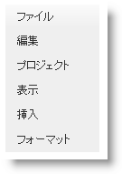
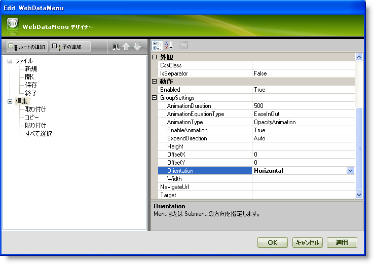
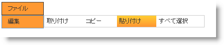

////

|metadata|
{
    "name": "webdatamenu-orientation",
    "controlName": ["WebDataMenu"],
    "tags": [],
    "guid": "{40985087-F1F8-465B-ADF1-628C081673EF}",  
    "buildFlags": [],
    "createdOn": "0001-01-01T00:00:00Z"
}
|metadata|
////

= 方向

pick:[asp-net="link:{ApiPlatform}web{ApiVersion}~infragistics.web.ui.navigationcontrols.datamenugroupsettings.html[DataMenuGroupSettings]"]  オブジェクトの  pick:[asp-net="link:{ApiPlatform}web{ApiVersion}~infragistics.web.ui.navigationcontrols.datamenugroupsettings~orientation.html[Orientation]"]  プロパティを Vertical または Horizontal に設定することによって、WebDataMenu™ の方向を水平または垂直に設定することができます。デフォルトでは、このプロパティは Vertical に設定されます。

Orientation プロパティは Microsoft® Visual Studio® [プロパティ] ウィンドウ（Orientation プロパティを設定するために  pick:[asp-net="link:{ApiPlatform}web{ApiVersion}~infragistics.web.ui.navigationcontrols.webdatamenu~groupsettings.html[GroupSettings]"]  プロパティを展開）、または以下のコードを使用することによって設定できます:

*Visual Basic の場合：*

----
WebDataMenu1.GroupSettings.Orientation = Infragistics.Web.UI.NavigationControls.Orientation.Horizontal
----

*C# の場合：*

----
WebDataMenu1.GroupSettings.Orientation = Infragistics.Web.UI.NavigationControls.Orientation.Horizontal;
----

*水平方向:*

*垂直方向:*

ただし、複雑な方向を持つように WebDataMenu を構成することも可能です。これはひとつの項目の方向が水平になり、もうひとつの項目が垂直になるように設定できることを意味します。

以下の手順は、項目レベルで  pick:[asp-net="link:{ApiPlatform}web{ApiVersion}~infragistics.web.ui.navigationcontrols.datamenugroupsettings~orientation.html[Orientation]"]  プロパティを設定することによって、WebDataMenu でさまざまな項目に異なる方向を設定する方法を紹介します。これはコントロール レベルで設定される Orientation プロパティをオーバーライドします。

[start=1]
. Visual Studio™ ツールボックスから、ScriptManager コンポーネントと WebDataMenu コントロールをフォームにドラッグ アンド ドロップします。
[start=2]
. link:webdatamenu-getting-started-with-webdatamenu.html[WebDataMenu で開始]に示されているように項目を WebDataMenu に追加します。
[start=3]
. WebDataMenu デザイナーで [項目の編集] を選択して  pick:[asp-net="link:{ApiPlatform}web{ApiVersion}~infragistics.web.ui.navigationcontrols.webdatamenu~groupsettings.html[GroupSettings]"]  プロパティを展開します。Orientation プロパティをドロップダウン リストから [Horizontal] に設定します。WebDataMenu デザイナーは以下の画像のようになります。

[start=4]
. [適用] と [OK] をクリックして WebDataMenu デザイナーを閉じます。
[start=5]
. アプリケーションを保存して実行します。以下の画像のように [ファイル] 項目のルート項目と子項目の方向は垂直なのに、[編集] 項目の子項目の方向は水平であることを確認します。

