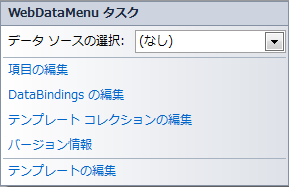
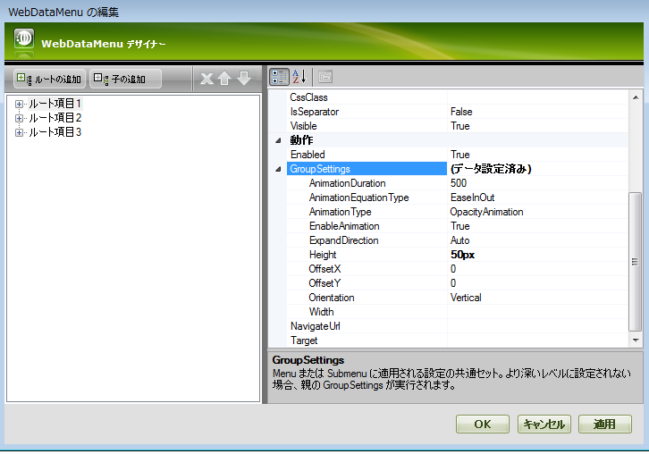
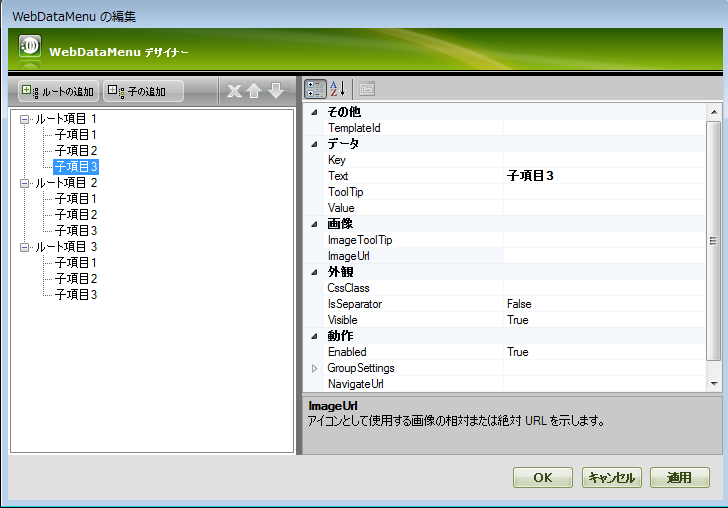
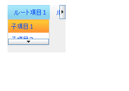

////

|metadata|
{
    "name": "webdatamenu-scrolling-about",
    "controlName": ["WebDataMenu"],
    "tags": ["Getting Started"],
    "guid": "5df496be-498e-4b92-91f8-221000b8fae7",  
    "buildFlags": [],
    "createdOn": "2010-10-01T15:11:21.6862135Z"
}
|metadata|
////

= スクロール

link:{ApiPlatform}web{ApiVersion}~infragistics.web.ui.navigationcontrols.webdatamenu.html[WebDataMenu] では今回スクロールがサポートされます。これにより、ブラウザーのビューポートに収まらない時にメニュー項目をスクロールできます。スクロールは水平メニューと垂直メニューの両方でサポートされます。この機能は、デフォルトで常に有効になっています。無効にしたい場合、 link:{ApiPlatform}web{ApiVersion}~infragistics.web.ui.navigationcontrols.webdatamenu~enablescrolling.html[EnableScrolling] プロパティを False に設定します。

以下の使用事例は link:{ApiPlatform}web{ApiVersion}~infragistics.web.ui.navigationcontrols.webdatamenu~enablescrolling.html[EnableScrolling] プロパティで対象とすることができます。

* link:{ApiPlatform}web{ApiVersion}~infragistics.web.ui.navigationcontrols.webdatamenu~enablescrolling.html[EnableScrolling] - False

** 高さ/幅が設定されている場合には、スクロール コンテナーは領域の外側にあるコンテンツをクリップし、ボタンは表示されません。コンテンツが画面より大きい場合には、そのまま表示されページにスクロールバーが表示されます。

* link:{ApiPlatform}web{ApiVersion}~infragistics.web.ui.navigationcontrols.webdatamenu~enablescrolling.html[EnableScrolling] - True

** link:{ApiPlatform}web{ApiVersion}~infragistics.web.ui.navigationcontrols.webdatamenu~groupsettings.html[GroupSettings] で高さ/幅が設定されている場合にはこれに従い、コンテンツが指定された高さ/幅よりも大きい場合にはスクロール ボタンが表示されます。高さ/幅が画面のサイズよりも大きい場合、コンテンツはページに収まります。メニュー グループが水平方向の場合に限り幅が適用されます。メニュー グループが垂直方向の場合に限り高さが適用されます。
** メニュー項目のグループに対して高さまたは幅が設定されていない場合、またはコンテンツが画面領域よりも大きい場合には、コンテンツはページに収まり、スクロール ボタンが表示されます。

スクロール可能な領域をどの位の速さで移動するかを制御するために、 link:{ApiPlatform}web{ApiVersion}~infragistics.web.ui.navigationcontrols.webdatamenu~scrollingspeed.html[ScrollingSpeed] プロパティを使用できます。開発者が指定できる値は 5 つあります。スクロール ボタンをスクロール中にクリックすると速くなります。ScrollingSpeed のデフォルト値は Normal です。スクロール速度は以下のいくつかの変数に基づいて計算されます。
** スクロールするピクセル - 一定の時間に何ピクセル移動するのかを指定します。
** 一定時間当たりのスクロール - 一定時間（ミリ秒）にスクロールする速度を定義します。
** 項目計数当たり - 項目数に基づいて速度が調整します。たとえば、100 項目の通常速度は、1000 項目の通常速度よりも実際には遅くなります。

10.2 では、ホバーするとコントロールはメニュー項目を開き、ホバーを止めるとメニュー項目を閉じます。たとえば、コントロールはアクティブではなく、入力フィールドからフォーカスを奪いません。

10.3 では、新しいプロパティ、 link:{ApiPlatform}web{ApiVersion}~infragistics.web.ui.navigationcontrols.webdatamenu~activateonhover.html[ActivateOnHover] が追加されました。コントロールがホバーされると、フォーカスを受け取り、メニュー項目を開きます。コントロールのホバーを止めると、フォーカスを元々持っていたページの要素にフォーカスが戻ります。

このプロパティを使用すると、以下のシナリオを達成できます。

*** link:{ApiPlatform}web{ApiVersion}~infragistics.web.ui.navigationcontrols.webdatamenu~activateonhover.html[ActivateOnHover] が True - メニューは現在フォーカスを取得している要素を追跡します。メニューにホバーされると、そのメニューがフォーカスを取得して展開します。この時点でキーボード ナビゲーションも可能です。どのメニュー項目もクリックされず、マウスがメニューから移動する（ホバーを解除）と、メニューは縮小して以前のフォーカスを取得していた要素にフォーカスを戻します。展開後にメニューがクリックされた場合、マウスが移動されると、メニューは縮小してフォーカスはページの本文に移動します。
*** link:{ApiPlatform}web{ApiVersion}~infragistics.web.ui.navigationcontrols.webdatamenu~activateonhover.html[ActivateOnHover] が False - ホバーされると展開せずに、最上位のメニュー項目のみが強調表示されます。メニューにフォーカスを設定し、1 番目の階層のサブメニューを展開するためには、マウス クリックまたはタブ操作が必要です。これでキーボード ナビゲーションが可能になります。マウスがメニューから移動される（ホバーを解除）と、ユーザーが外側をクリックするか Esc キーを押すまでメニューは開いたままです。デスクトップ メニューとしてメニューを機能させたい時にこのシナリオは役立ちます。通常、デスクトップ メニューはフォーカスを取得し開くためにクリックを必要とします。EnableScrolling が False に設定された項目がメニューに多数ある時も役に立ちます。このようにメニューは開いたままになるため、ページのスクロールバーでページをスクロールして、表示可能な画面領域の外側にある項目にアクセスできます。

WebDataMenu コントロールが追加された Web サイトを作成し、スクロールを有効に設定します。このトピックではユーザーができるだけ早く操作に慣れることができるよう、WebDataMenu のスクロール機能を実行するために必要な基本手順について説明します。コンピューターに Infragistics 2010.3 がインストールされていることを確認します。

[start=1]
. Visual Studio を起動し、[新規作成] から [Webサイト] を開きます。
[start=2]
. 新しい aspx ページを追加します。
[start=3]
. Visual Studio のツールボックスから、ページ サーフェイスに WebDataMenu コントロールをドラッグ アンド ドロップします。
[start=4]
. 再度ツールボックスから、ページに ASP.NET ScriptManager をドラッグ アンド ドロップします。
[start=5]
. デザイン ビューに切り替えます。
[start=6]
. WebDataMenu のツールチップをクリックして [項目の編集] を選択できます。

[start=7]
. 次のウィンドウで、メニューのルート項目を追加する必要があります。ルート項目を 3 つ追加して、Text プロパティを、First Root Item、Second Root Item、Third Root Item に変更します。

[start=8]
. すべてのルート項目で、GroupSettings で、Height プロパティを 50px に設定します。
[start=9]
. ルート項目ごとに、3 つの子を追加し、名前を Child Item1、Child Item2 および Child Item3 に指定します。

[start=10]
. *[OK]* をクリックします。
[start=11]
. 以下の画像に示すように、 を追加します。この幅を設定すると、スクロール可能な領域が正確に 150 ピクセルになるように修正されます。これは、メニュー項目の幅が 150 ピクセルよりも大きくなると（横向きのメニューで）、スクロール ボタンが表示することを意味します。
[start=12]
. ソース ビューに切り替えると、以下のマークアップが生成されるのが分かります。

*HTML の場合:*

----
        <ig:WebDataMenu ID="WebDataMenu1" runat="server">
            <GroupSettings Orientation="Horizontal" Width="150px" />
            <Items>
                <ig:DataMenuItem Text="First Root Item ">
                    <Items>
                        <ig:DataMenuItem Text="Child Item 1">
                        </ig:DataMenuItem>
                        <ig:DataMenuItem Text="Child Item 2">
                        </ig:DataMenuItem>
                        <ig:DataMenuItem Text="Child Item 3">
                        </ig:DataMenuItem>
                    </Items>
                    <GroupSettings Height="50px" />
                </ig:DataMenuItem>
                <ig:DataMenuItem Text="Second Root Item">
                    <Items>
                        <ig:DataMenuItem Text="Child Item 1">
                        </ig:DataMenuItem>
                        <ig:DataMenuItem Text="Child Item 2">
                        </ig:DataMenuItem>
                        <ig:DataMenuItem Text="Child Item 3">
                        </ig:DataMenuItem>
                    </Items>
                    <GroupSettings Height="50px" />
                </ig:DataMenuItem>
                <ig:DataMenuItem Text="Third Root Item">
                    <Items>
                        <ig:DataMenuItem Text="Child Item 1">
                        </ig:DataMenuItem>
                        <ig:DataMenuItem Text="Child Item 2">
                        </ig:DataMenuItem>
                        <ig:DataMenuItem Text="Child Item 3">
                        </ig:DataMenuItem>
                    </Items>
                    <GroupSettings Height="50px" />
                </ig:DataMenuItem>
            </Items>
        </ig:WebDataMenu>
----

[start=13]
. Web サイトを実行して、「First Root Item」にホバーすると、以下のメニューが表示されます。

高さ 50px を「First Root Item」でグループ設定オブジェクトに追加したために、「First Root Item」の子が正確に 50 ピクセルとなり、スクロールが機能するのを確認できます。幅 150 ピクセルに設定したルート レベル項目でも同じようになります。