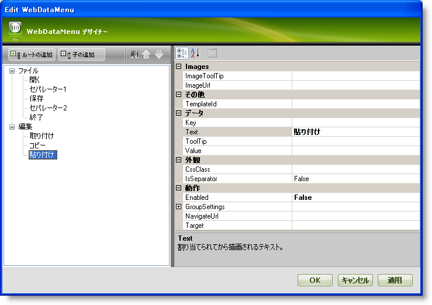
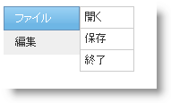

////

|metadata|
{
    "name": "webdatamenu-separators",
    "controlName": ["WebDataMenu"],
    "tags": [],
    "guid": "{BCD3BCF7-5B1C-4341-B35B-C7C82D4FD4AF}",  
    "buildFlags": [],
    "createdOn": "0001-01-01T00:00:00Z"
}
|metadata|
////

= セパレーター

WebDataMenu™ は  pick:[asp-net="link:{ApiPlatform}web{ApiVersion}~infragistics.web.ui.navigationcontrols.datamenuitem.html[DataMenuItem]"]  オブジェクトの  pick:[asp-net="link:{ApiPlatform}web{ApiVersion}~infragistics.web.ui.navigationcontrols.datamenuitem~isseparator.html[IsSeparator]"]  プロパティを True に設定するだけでセパレーターとして描画できるメニュー項目を持つことができます。

*注:* メニュー項目の IsSeparator プロパティが True に設定されると、その他すべてのプロパティは無視され項目はセパレーターとして描画されます。

== メニュー項目をセパレーターとして描画するには:

[start=1]
. Visual Studio™ ツールボックスから、ScriptManager コンポーネントと WebDataMenu コントロールを WebForm にドラッグ アンド ドロップします。
[start=2]
. 以下の画像に示すようにデザイナーを介してメニュー項目を WebDataMenu に追加します:

メニュー項目を WebDataMenu に追加する方法の詳細は、 link:webdatamenu-getting-started-with-webdatamenu.html[WebDataMenu で開始]を参照してください。
[start=3]
. Separator1 および Separator2 項目の IsSeparator プロパティを True に設定します。
[start=4]
. [適用] と [OK] をクリックしてデザイナーを閉じます。
[start=5]
. 以下のマークアップが生成されるはずです。

*HTML の場合:*

----
   <ig:WebDataMenu ID="WebDataMenu1" runat="server">
        <Items>
            <ig:DataMenuItem Text="File">
                <Items>
                    <ig:DataMenuItem Text="Open">
                    </ig:DataMenuItem>
                    <ig:DataMenuItem IsSeparator="True">
                    </ig:DataMenuItem>
                    <ig:DataMenuItem Text="Save">
                    </ig:DataMenuItem>
                    <ig:DataMenuItem IsSeparator="True">
                    </ig:DataMenuItem>
                    <ig:DataMenuItem Text="Exit">
                    </ig:DataMenuItem>
                </Items>
            </ig:DataMenuItem>
            <ig:DataMenuItem Text="Edit">
                <Items>
                    <ig:DataMenuItem Text="Cut">
                    </ig:DataMenuItem>
                    <ig:DataMenuItem Text="Copy">
                    </ig:DataMenuItem>
                    <ig:DataMenuItem Text="Paste">
                    </ig:DataMenuItem>
                </Items>
            </ig:DataMenuItem>
        </Items>
    </ig:WebDataMenu>
----

[start=6]
. アプリケーションを保存して実行します。以下の画像のように、[開く] と [保存] の間、また [保存] と [終了] の間にもセパレーターが表示されます:

