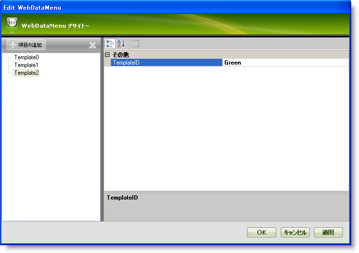
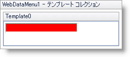
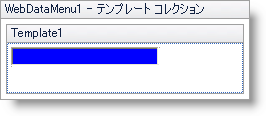
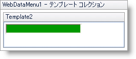
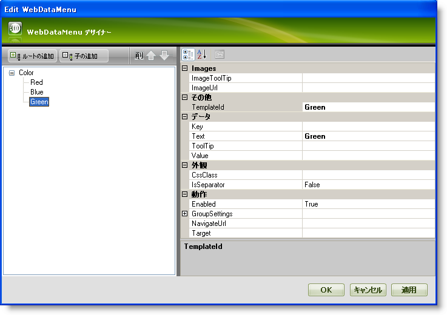

////

|metadata|
{
    "name": "webdatamenu-templating",
    "controlName": ["WebDataMenu"],
    "tags": ["Templating"],
    "guid": "{EE59BDFC-1ABD-45FB-A0A9-EBA1E6461B3E}",  
    "buildFlags": [],
    "createdOn": "0001-01-01T00:00:00Z"
}
|metadata|
////

= テンプレート化

WebDataMenu™ はテンプレート化をサポートします。これによりメニュー項目の外観をカスタマイズするために使用できる項目テンプレートを定義することが可能となります。項目テンプレートは  pick:[asp-net="link:{ApiPlatform}web{ApiVersion}~infragistics.web.ui.navigationcontrols.navcontrol~itemtemplate.html[ItemTemplate]"]  プロパティを使用して定義できます。以下のテンプレートメソッドがサポートされます:

* 個々の項目は関連付けられた特定のテンプレートを持つことができます。
* テンプレートのコレクションを作成でき、このコレクションから個々の項目にテンプレートを指定することができます。
* WebDataMenu で各項目に適用される基本のテンプレートを作成できます。

テンプレート コレクションを使用してテンプレートを個々の項目に指定する方法を学習します。WebDataMenu™ によって高度な UI デザイナーを介してテンプレートを個々の項目に簡単に指定することができます。テンプレートを使用すると、要件に応じて個々の項目のルック アンドフィールをカスタマイズできます。

[start=1]
. Visual Studio™ ツールボックスから、ScriptManager コンポーネントと WebDataMenu コントロールをフォームにドラッグ アンド ドロップします。
[start=2]
. WebDataMenu コントロールのスマート タグをクリックして、[テンプレート コレクションの編集] を選択します。これによって WebDataMenu デザイナーが開かれ、ここで新しいテンプレートを追加できます。
[start=3]
. [項目の追加] をクリックして新しいテンプレートをテンプレート コレクションに追加します。4 つのテンプレート Template0、Template1、Template2 を追加します。それらの  pick:[asp-net="link:{ApiPlatform}web{ApiVersion}~infragistics.web.ui.itemtemplate~templateid.html[TemplateID]"]  プロパティを Red、Blue および Green にそれぞれ設定します。WebDataMenu は以下の画像のようになるはずです。

[start=4]
. [適用] と [OK] をクリックして WebDataMenu デザイナーを閉じます。
[start=5]
. この手順で、テンプレートは以下に示すように編集されます:

** WebDataMenu コントロールのスマート タグをクリックして、[テンプレートの編集] を選択します。これによりテンプレート編集モードで WebDataMenu を表示します。
** WebDataMenu コントロールのスマート タグをクリックして Template0 を編集するためにドロップダウン リストから Template0 を選択します。
** ツールボックスから標準的な TextBox を Template0 領域にドラッグ アンド ドロップして BackColor プロパティを Red に設定します。
** WebDataMenu はデザイン モードで以下の画像のようになるはずです。

同様に、以下の画像で示すように BackColor プロパティがそれぞれ Blue と Green に設定された標準的な TextBox を持つようにテンプレート Template1 と Template2 を編集します:

*Template1 :*

*Template2 :*

[start=6]
. 今度はスマート タグをクリックし、［テンプレート編集の終了］を選択して WebDataMenu のテンプレート編集モードを閉じます。
[start=7]
. ルート項目を追加して、その Text プロパティを Color に設定します。同様に 3 つの子項目を追加して、 pick:[asp-net="link:{ApiPlatform}web{ApiVersion}~infragistics.web.ui.navigationcontrols.navitem~text.html[Text]"]  プロパティを Red、Blue および Green に設定します。項目の追加方法の詳細は、 link:webdatamenu-getting-started-with-webdatamenu.html[WebDataMenu で開始]を参照してください。Red、Blue および Green 項目の  pick:[asp-net="link:{ApiPlatform}web{ApiVersion}~infragistics.web.ui.navigationcontrols.navitem~templateid.html[TemplateId]"]  プロパティを Red、Blue および Green にそれぞれ設定します。
[start=8]
. WebDataMenu デザイナーは以下の画像のようになります。

[start=9]
. [適用] と [OK] をクリックして WebDataMenu デザイナーを閉じます。
[start=10]
. アプリケーションを保存して実行します。Color 項目上にマウスをホバーすると、WebDataMenu は以下の画像のようになります。

image::images/WebDataMenu_Assigning_templates_to_individual_items_using_the_templates_collection_06.png[]