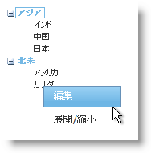

////

|metadata|
{
    "name": "webdatamenu-using-webdatamenu-as-context-menu-on-webdatatree-node",
    "controlName": ["WebDataMenu"],
    "tags": [],
    "guid": "{70C58367-9CA9-4145-95D9-19C6DA3ED035}",  
    "buildFlags": [],
    "createdOn": "0001-01-01T00:00:00Z"
}
|metadata|
////

= WebDataTree ノードでコンテキスト メニューとして WebDataMenu を使用

== 始める前に

ページのコンテンツを右クリックするだけで、またはその他のあるコントロールをクリックすることによって、エンドユーザーにカスタマイズされたポップアップ メニューが表示されるように WebDataMenu™ をコンテキスト メニューとして使用することも可能です。コントロールの  pick:[asp-net="link:{ApiPlatform}web{ApiVersion}~infragistics.web.ui.navigationcontrols.webdatamenu~iscontextmenu.html[IsContextMenu]"]  プロパティを True に設定するだけでこの機能を WebDataMenu で有効にできます。

この詳細なガイドでは、WebDataMenu は WebDataTree™ コントロールのノードでポップアップメニューとして使用され、ノードを編集、展開、縮小するオプションを提供します。

== 達成すること

WebDataTree ノードでコンテキスト メニューとして WebDataMenu を使用する方法を学習します。

== 次の手順を実行します

[start=1]
. Visual Studio™ ツールボックスから、ScriptManager コンポーネント、WebDataMenu コントロールおよび WebDataTree コントロールをフォームにドラッグ アンド ドロップします。
[start=2]
. 以下のプロパティで 2 つの項目を WebDataMenu に追加します。

[options="header", cols="a,a"]
|====
|テキスト|キー

|編集
|EDIT

|展開/縮小
|ExpandCollapse

|====

項目を WebDataMenu に追加する方法の詳細は、 link:webdatamenu-getting-started-with-webdatamenu.html[WebDataMenu で開始]を参照してください。
[start=3]
. link:webdatamenu-getting-started-with-webdatamenu.html[WebDataMenu で開始]に示されているようにノードを WebDataTree に追加します。
[start=4]
. WebDataMenu の ItemClick クライアント側イベントおよび WebDataTree の NodeClick クライアント側イベントに対して以下の javascript 関数 "WebDataMenu1_ItemClick"および"WebDataTree1_NodeClick" をそれぞれ追加します。

*JavaScript の場合：*

----
        //最後にクリックされたノードを保持するためのグローバル変数   
        var lastNode = null;
        // クライアント イベント 'ItemClick' は 2 つのパラメーター sender と e を取得します
        // sender はイベントを発生させているオブジェクトです
        // e は DataMenuItemCancelEventArgs です 
        function WebDataMenu1_ItemClick(sender, e) {
           //クリックされたメニュー項目の Key を取得します
            switch (e.getItem().get_key()) {
                case "EDIT":
                    if (lastNode != null) {
                        // WebDataTree への参照を取得します
                        var tree = $find("WebDataTree1");
                        if (tree != null) {
                            // nodeEditing オブジェクトを取得します
                            var nodeEditing = tree.getNodeEditing();
                            //ノード編集モードを開始します
                            nodeEditing.enterNodeEditing(lastNode);
                        }
                    }
                    break;
                case "ExpandCollapse":
                    if (lastNode != null)
                        //ノードの Expanded 状態を現在の状態から
                        // 反対の値に変更します。ノードが展開されている場合には
                        //縮小されます。ノードが縮小されている場合には展開されます。 
                        lastNode.toggle(true, true);
                    break;
            }
        }
        // クライアント イベント 'ValueChanging' は 2 つのパラメーター sender と e を取得します
        // sender はイベントを発生させているオブジェクトです
        // e は DataTreeNodeEventArgs です 
        function WebDataTree1_NodeClick(sender, e) {
            lastNode = e.getNode();
            // WebDataMenu への参照を取得します
            var menu = $find("WebDataMenu1");
            if (menu != null && e.get_browserEvent() != null && e.get_browserEvent().button == 2)
            //showAt メソッドは 3 つのパラメーター、x、y、browserEvent（オプション）を取得します
            //x -- メニューの絶対位置のための X 軸位置
            //y -- メニューの絶対位置のための Y 軸位置
            //browserEvent --  ブラウザ イベントに基づく自動配置   
            menu.showAt(null, null, e.get_browserEvent());
        }
----

上記のコードで、ノードが右クリックされると、WebDataTree1_NodeClick イベントが発生してポップアップ メニューが表示します。これでメニューの項目がクリックされると、WebDataMenu1_ItemClick イベントが発生し、クリックされたメニュー項目のキーに応じてノードで適切なアクションを取ります。
[start=5]
. アプリケーションを保存して実行します。以下の画像のように、ノードを右クリックするとすぐにポップアップ メニューが表示します。

