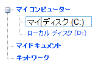

////

|metadata|
{
    "name": "webdatatree-node-editing",
    "controlName": ["WebDataTree"],
    "tags": [],
    "guid": "{A80BA311-D39B-4183-962B-BA4612680A20}",  
    "buildFlags": [],
    "createdOn": "0001-01-01T00:00:00Z"
}
|metadata|
////

= ノード編集

WebDataTree™ によってノード編集機能が有効な場合にエンドユーザーがノードを編集することが可能となります。エンドユーザーがキーボードで F2 を押す、またはエンドユーザーがノードをダブルクリックする場合、選択されたノードは編集モードになります。Enter キーを押すと編集は終了し、新しい値を確認します。一方、Esc キーを押すとノードのすべての変更を破棄します。デフォルトで、ノード編集機能は WebDataTree では無効です。

pick:[asp-net="link:{ApiPlatform}web{ApiVersion}~infragistics.web.ui.navigationcontrols.datatreenodeediting.html[DataTreeNodeEditing]"]  オブジェクトの  pick:[asp-net="link:{ApiPlatform}web{ApiVersion}~infragistics.web.ui.navigationcontrols.datatreenodeediting~enabled.html[Enabled]"]  プロパティを True に設定することで WebDataTree のノード編集機能を有効にできます。DataTreeNodeEditing オブジェクトの  pick:[asp-net="link:{ApiPlatform}web{ApiVersion}~infragistics.web.ui.navigationcontrols.datatreenodeediting~enableondoubleclick.html[EnableOnDoubleClick]"]  プロパティと  pick:[asp-net="link:{ApiPlatform}web{ApiVersion}~infragistics.web.ui.navigationcontrols.datatreenodeediting~enableonf2.html[EnableOnF2]"]  プロパティを設定することによってツリーノードをダブルクリックして F2 キーを押すことによって編集モードを開始することができます。Visual Studio® [プロパティ] ウィンドウで WebDataTree コントロールの  pick:[asp-net="link:{ApiPlatform}web{ApiVersion}~infragistics.web.ui.navigationcontrols.webdatatree~nodeediting.html[NodeEditing]"]  プロパティを展開する、または以下のコードを使用してこれらのプロパティを設定できます :

*Visual Basic の場合：*

----
         WebDataTree1.NodeEditing.Enabled = True
        WebDataTree1.NodeEditing.EnableOnDoubleClick = True
        WebDataTree1.NodeEditing.EnableOnF2 = True
----

*C# の場合：*

----
         WebDataTree1.NodeEditing.Enabled = True;
        WebDataTree1.NodeEditing.EnableOnDoubleClick = True;
        WebDataTree1.NodeEditing.EnableOnF2 = True;
----

*In Javascript:*

----
    var treeNodeEditing = $util.findControl("WebDataTree1").getNodeEditing();
    treeNodeEditing.set_enabled(true);
    treeNodeEditing.set_enableOnF2(true);
    treeNodeEditing.set_enableOnDoubleClick(true);
----

さらに各ノード オブジェクトはコントロールのグローバル編集プロパティをオーバーライドするように設定可能な  pick:[asp-net="link:{ApiPlatform}web{ApiVersion}~infragistics.web.ui.navigationcontrols.datatreenode~editable.html[Editable]"]  プロパティを持っています。親ツリーノード編集設定を無効にする/有効にする/使用するためにこのプロパティは Off/On/Auto に設定でき、Enabled プロパティよりも優先されます。デフォルトでは、このプロパティは Auto に設定されます。

*In HTML:*

----
   <ig:WebDataTree ID="WebDataTree1" runat="server" Height="500px" Width="300px" 
        EnableConnectorLines="true">
        <Nodes>
            <ig:DataTreeNode Text="My Computer">
                <Nodes>
                    <ig:DataTreeNode Editable="On" Text="Local Disk C:">
                    </ig:DataTreeNode>
                    <ig:DataTreeNode Editable="On" Text="Local Disk D:">
                    </ig:DataTreeNode>
                </Nodes>
            </ig:DataTreeNode>
            <ig:DataTreeNode Text="My documents">
            </ig:DataTreeNode>
            <ig:DataTreeNode Text="My network places">
            </ig:DataTreeNode>
        </Nodes>
        <NodeEditing EnableOnDoubleClick="true" EnableOnF2="true" />
    </ig:WebDataTree>
----

