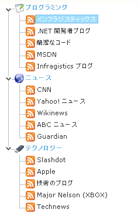
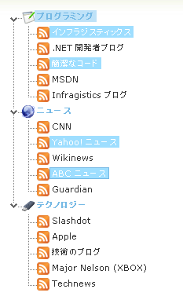

////

|metadata|
{
    "name": "webdatatree-node-selection",
    "controlName": ["WebDataTree"],
    "tags": ["Selection"],
    "guid": "{AB2C00CF-A016-4BDF-A768-B6296C45BF5D}",  
    "buildFlags": [],
    "createdOn": "0001-01-01T00:00:00Z"
}
|metadata|
////

= ノード選択

WebDataTree™ コントロールはさまざまなタイプのノード選択をサポートします。キーボードとマウスの両方またはいずれか一方を使用して選択を行うことができます。コントロールの  pick:[asp-net="link:{ApiPlatform}web{ApiVersion}~infragistics.web.ui.navigationcontrols.webdatatree~selectiontype.html[SelectionType]"]  プロパティを設定することにより、WebDataTree で選択のタイプを決定できます。以下は SelectionType プロパティを使用して設定できるさまざまなタイプの選択です:

* *None* -- UI を使用してノードを選択できません。
* *Single* -- 選択できるノードはひとつだけです。
* *Multiple* -- 複数のノードを選択できます。

*注:* デフォルトで、SelectionType プロパティは None に設定できます。

Microsoft® Visual Studio® [プロパティ] ウィンドウを使用する、または以下のコードを使用することによって、SelectionType プロパティを設定できます:

*Visual Basic の場合：*

----
WebDataTree1.SelectionType = Infragistics.Web.UI.NavigationControls.NodeSelectionTypes.Multiple
----

*C# の場合：*

----
WebDataTree1.SelectionType = Infragistics.Web.UI.NavigationControls.NodeSelectionTypes.Multiple;
----

*HTML の場合：*

----
       <ig:WebDataTree ID="WebDataTree1" runat="server" Height="500px" Width="300px" 
                SelectionType="Multiple">
       </ig:WebDataTree>
----

*In Javascript:*

----
// 0-None, 1-Single, 2-multiple selection
$util.findControl("WebDataTree1").set_selectionType(2);
----

== 単一選択

単一選択を使用すると、選択できるツリーノードはひとつだけです。マウスを使用する時には、エンドユーザーはツリーノードでマウスの左ボタンをクリックするだけでノードを選択できます。この動作によりアクティブかつ選択された状態になります。キーボードを使用する時には、エンドユーザーは矢印キーを使用してノードをアクティブ化して選択します。

== 複数選択

WebDataTree での複数選択は以下の 2 つのサブタイプに分けられます:

* *Continuous* -- このタイプでは、広範なノードが選択されます。Shift キーを押しながら開始ノードを選択し次に終了ノードを選択することでエンドユーザーによって範囲が選択されます。開始ノードと終了ノードの間のすべてのノードが選択されたノード コレクションに追加されます。Shift キーを押しながら矢印キーでノードを選択することによって、キーボードを使用してこの選択を実行することも可能です。

image::images/WebDataTree_Selection_Continuous_01.png[]

* *Extended* -- このタイプでは、非連続のツリー ノードが選択されます。Ctrl キーを押しながら左マウス ボタンでノードをクリックすることによってエンドユーザーはノードを選択します。すでに選択したノードをクリックするとノードの選択が解除されます。キーボードを使用してこの選択を実行することも可能です。矢印キーを使用してノードをナビゲートして Ctrl キーを押しながらスペースキーを押すことによってノードを選択/選択を解除することができます。

